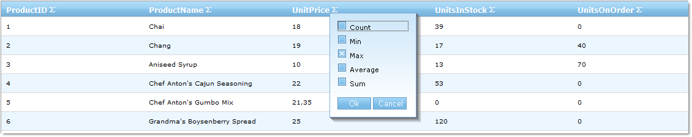
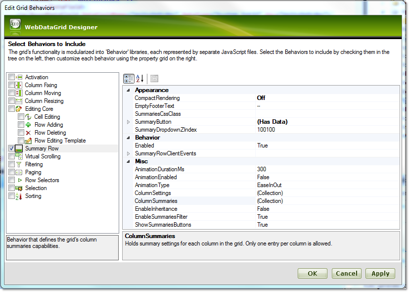
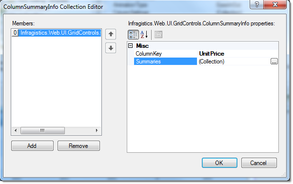
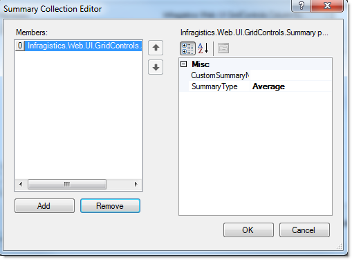
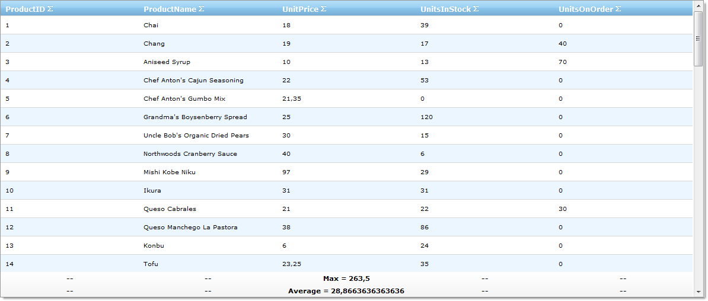

////

|metadata|
{
    "name": "webdatagrid-summary-row",
    "controlName": ["WebDataGrid"],
    "tags": ["Grids","Summaries"],
    "guid": "3ab2661f-cff0-45b4-b050-9f634c898a98",  
    "buildFlags": [],
    "createdOn": "2010-09-30T07:20:01.962929Z"
}
|metadata|
////

= Summary Row

WebDataGrid allows you and your end users to display a summary of the numeric data in any column. The summaries can be:

* Count
* Sum
* Average
* Min
* Max
* Custom summaries

You can enable summary row behavior on WebDataGrid through the designer, Microsoft® Visual Studio® Property Window or by using the following code:

*In Visual Basic:*

----
WebDataGrid1.Behaviors.CreateBehavior(Of SummaryRow)()
----

*In C#:*

----
WebDataGrid1.Behaviors.CreateBehavior<SummaryRow>();
----

When enabled, the behavior adds a summary button to each header. When the button is pressed, a drop-down with available summaries appears.

.Note:
[NOTE]
====
The standard summaries are available for numeric data only. An exception is Count link:{ApiPlatform}web{ApiVersion}~infragistics.web.ui.gridcontrols.summarytype.html[SummaryType], which is always available.
====

== Enabling Summary Row

[start=1]
. Bind WebDataGrid to a SqlDataSource component retrieving data from the Products table. Retrieve the ProductID, ProductName, UnitPrice, UnitsInStock and UnitsOnOrder fields. For more information on doing this, see link:webdatagrid-getting-started-with-webdatagrid.html[Getting Started with WebDataGrid] topic.
[start=2]
. In the property window, locate the link:{ApiPlatform}web{ApiVersion}~infragistics.web.ui.gridcontrols.webdatagrid~behaviors.html[Behaviors] property and click the ellipsis (…) button to launch the Edit Behaviors Dialog.
[start=3]
. Check the link:{ApiPlatform}web{ApiVersion}~infragistics.web.ui.gridcontrols.summaryrow.html[Summary Row] behavior to enable it, as shown in the following image:

[start=4]
. Click on link:{ApiPlatform}web{ApiVersion}~infragistics.web.ui.gridcontrols.summaryrow~columnsummaries.html[ColumnSummaries] ellipsis(…) button to launch the link:{ApiPlatform}web{ApiVersion}~infragistics.web.ui.gridcontrols.columnsummaryinfo.html[ColumnSummaryInfo] Editor Dialog.
[start=5]
. Click on the Add button. Choose “UnitPrice” in the link:{ApiPlatform}web{ApiVersion}~infragistics.web.ui.gridcontrols.columnsummaryinfo~columnkey.html[ColumnKey] property.

[start=6]
. Click on the link:{ApiPlatform}web{ApiVersion}~infragistics.web.ui.gridcontrols.summaries.html[Summaries] ellipsis(…) button to launch the link:{ApiPlatform}web{ApiVersion}~infragistics.web.ui.gridcontrols.summary.html[Summary] Collection Editor Dialog.
[start=7]
. Click on the Add button. Open the link:{ApiPlatform}web{ApiVersion}~infragistics.web.ui.gridcontrols.summary~summarytype.html[SummaryType] drop down button and choose Average.

[start=8]
. Repeat the previous step. Choose Max from the SummaryType drop-down step and click on the ok button to close the dialog. The following markup should be generated:

*In HTML:*

----
<Behaviors>
    <ig:SummaryRow AnimationType="Linear">
        <ColumnSummaries>
            <ig:ColumnSummaryInfo ColumnKey="UnitPrice">
                <Summaries>
                    <ig:Summary SummaryType="Average" />
                    <ig:Summary SummaryType="Max" />
                </Summaries>
            </ig:ColumnSummaryInfo>
        </ColumnSummaries>
    </ig:SummaryRow>
</Behaviors>
----

To add a summary row from the code-behind, add the following code:

*In Visual Basic:*

----
Dim unitPriceSummary As New ColumnSummaryInfo()
unitPriceSummary.ColumnKey = "UnitPrice"
unitPriceSummary.Summaries.Add(SummaryType.Average)
unitPriceSummary.Summaries.Add(SummaryType.Max)
WebDataGrid1.Behaviors.SummaryRow.ColumnSummaries.Add(unitPriceSummary)
----

*In C#:*

----
ColumnSummaryInfo unitPriceSummary = new ColumnSummaryInfo();
unitPriceSummary.ColumnKey = "UnitPrice";
unitPriceSummary.Summaries.Add(SummaryType.Average);
unitPriceSummary.Summaries.Add(SummaryType.Max);
WebDataGrid1.Behaviors.SummaryRow.ColumnSummaries.Add(unitPriceSummary);
----

[start=9]
. Run the application. WebDataGrid displays Average and Max summary for the UnitPrice column. You can add additional summaries by clicking the summary button at the header of the columns and choosing a summary type from the drop down options.

