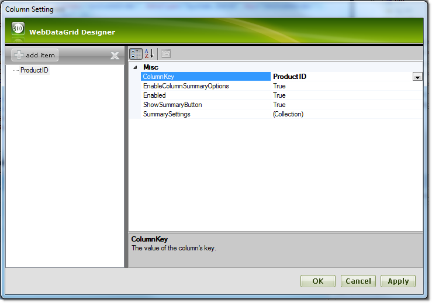
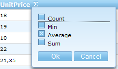
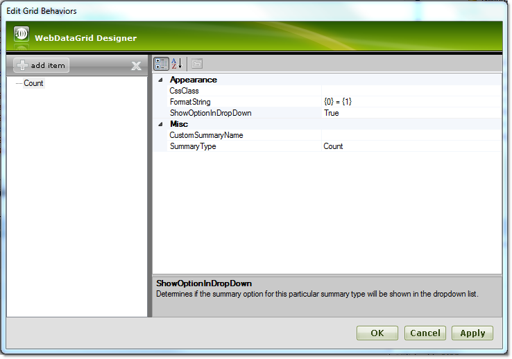
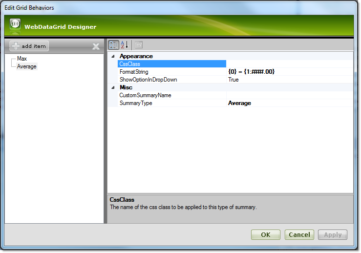
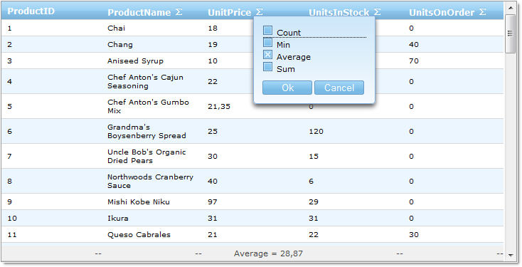

////

|metadata|
{
    "name": "webdatagrid-summary-settings",
    "controlName": ["WebDataGrid"],
    "tags": ["Grids","Summaries"],
    "guid": "405a2f67-a55e-424f-abdb-3d3f25079db2",  
    "buildFlags": [],
    "createdOn": "2010-09-29T12:35:01.7768869Z"
}
|metadata|
////

= Summary Settings

== Before You Begin

When Summary Row behavior is enabled, a summary button is rendered at the header of every column. When the button is pressed, a drop-down with the available summaries occurs. When a summary is chosen, a new row (summary row) appears at the footer of the grid and the summary value is shown.

== What You Will Accomplish

The following topic will show you how to set up the summaries for a specific column. You will learn how to disable a summary button for a column, disable a summary from the summary options, and format the string of the summary value.

== Follow these Steps

[start=1]
. Bind the grid and add average summary as shown in the link:webdatagrid-summary-row.html[Summary Row] topic.
[start=2]
. From the Edit Grid Behavior dialog, click on Summary Row and then click on the link:infragistics4.web.v{ProductVersion}~infragistics.web.ui.gridcontrols.summaryrow~columnsettings.html[ColumnSettings] ellipsis (...) to launch the link:infragistics4.web.v{ProductVersion}~infragistics.web.ui.gridcontrols.columnsetting.html[ColumnSetting] dialog.
[start=3]
. Click on the add item button and choose ProductID from the link:infragistics4.web.v{ProductVersion}~infragistics.web.ui.gridcontrols.columnsetting~columnkey.html[ColumnKey] drop-down.

[start=4]
. Set link:infragistics4.web.v{ProductVersion}~infragistics.web.ui.gridcontrols.summaryrowsetting~showsummarybutton.html[ShowSummaryButton] to False. This way the summary button (showing the list of the summaries) for the ProductID column will not be shown at the header. Other available properties from this level are:

** link:infragistics4.web.v{ProductVersion}~infragistics.web.ui.gridcontrols.summaryrowsetting~enablecolumnsummaryoptions.html[EnableColumnSummaryOptions] – if this is set to False, the default summary types won’t be available via the drop-down.
** link:infragistics4.web.v{ProductVersion}~infragistics.web.ui.gridcontrols.summaryrowsetting~enabled.html[Enabled] – if this is set to False, the user will not be able to calculate any summaries for this column.

The following markup gets generated:

*In HTML:*

----
<Behaviors>
    <ig:SummaryRow>
        <ColumnSummaries>
            <ig:ColumnSummaryInfo ColumnKey="UnitPrice">
                <Summaries>
                    <ig:Summary SummaryType="Average" />
                </Summaries>
            </ig:ColumnSummaryInfo>
        </ColumnSummaries>
        <ColumnSettings>
            <ig:SummaryRowSetting ColumnKey="ProductID" Enabled=">
            </ig:SummaryRowSetting>
        </ColumnSettings>
    </ig:SummaryRow>
</Behaviors>        
----

To do that from the code-behind, you should add the following code:

*In C#:*

----
SummaryRowSetting settings = new SummaryRowSetting(WebDataGrid1, "ProductID");
settings.ShowSummaryButton = false;
this.WebDataGrid1.Behaviors.SummaryRow.ColumnSettings.Add(settings);
----

*In Visual Basic:*

----
Dim settings As New SummaryRowSetting(WebDataGrid1, "ProductID")
settings.ShowSummaryButton = False
Me.WebDataGrid1.Behaviors.SummaryRow.ColumnSettings.Add(settings)
----

[start=5]
. Click on the add item button and choose UnitPrice from the ColumnKey drop-down.
[start=6]
. Click on the link:infragistics4.web.v{ProductVersion}~infragistics.web.ui.gridcontrols.summaryrowsetting~summarysettings.html[SummarySettings] Collection ellipsis(…) to open the link:infragistics4.web.v{ProductVersion}~infragistics.web.ui.gridcontrols.summarysetting.html[SummarySetting] Dialog.
[start=7]
. Click on the add item button. The following screen should appear:

[start=8]
. Choose Max from the SummaryType drop-down. Set link:infragistics4.web.v{ProductVersion}~infragistics.web.ui.gridcontrols.summarysetting~showoptionindropdown.html[ShowOptionInDropDown] to False and click ok. This way the Max summary will not be available at the summary options drop down.

[start=9]
. Click on the add item button and choose Average from the SummaryType drop-down. Change the link:infragistics4.web.v{ProductVersion}~infragistics.web.ui.gridcontrols.summarysetting~formatstring.html[FormatString] to {0} = {1:##.00}. This will format the Average summary for the UnitPrice column to show only two decimal places.

Click the ok button. The following mark-up should be generated:

*In HTML:*

----
<Behaviors>
    <ig:SummaryRow>
        <ColumnSummaries>
            <ig:ColumnSummaryInfo ColumnKey="UnitPrice">
                <Summaries>
                    <ig:Summary SummaryType="Average" />
                </Summaries>
            </ig:ColumnSummaryInfo>
        </ColumnSummaries>
        <ColumnSettings>
            <ig:SummaryRowSetting ColumnKey="ProductID" ShowSummaryButton=">
            </ig:SummaryRowSetting>
            <ig:SummaryRowSetting ColumnKey="UnitPrice">
                <SummarySettings>
                    <ig:SummarySetting ShowOptionInDropDown=" SummaryType="Max" />
                    <ig:SummarySetting FormatString="{0} = {1:###.00}" 
                        SummaryType="Average" />
                </SummarySettings>
            </ig:SummaryRowSetting>
        </ColumnSettings>
    </ig:SummaryRow>
</Behaviors>
----

To do that from the code-behind, you should add the following code:

*In C#:*

----
SummaryRowSetting unitPriceSetting = new SummaryRowSetting(WebDataGrid1, "UnitPrice");
SummarySetting maxSummarySetting = new SummarySetting();
maxSummarySetting.ShowOptionInDropDown = false;
maxSummarySetting.SummaryType = SummaryType.Max;
unitPriceSetting.SummarySettings.Add(maxSummarySetting);
SummarySetting averegeSummarySetting = new SummarySetting();
averegeSummarySetting.FormatString = "{0} = {1:###.00}";
averegeSummarySetting.SummaryType = SummaryType.Average;
unitPriceSetting.SummarySettings.Add(averegeSummarySetting);
this.WebDataGrid1.Behaviors.SummaryRow.ColumnSettings.Add(unitPriceSetting);
----

*In Visual Basic:*

----
Dim unitPriceSetting As New SummaryRowSetting(WebDataGrid1, "UnitPrice")
Dim maxSummarySetting As New SummarySetting()
maxSummarySetting.ShowOptionInDropDown = False
maxSummarySetting.SummaryType = SummaryType.Max
unitPriceSetting.SummarySettings.Add(maxSummarySetting)
Dim averegeSummarySetting As New SummarySetting()
averegeSummarySetting.FormatString = "{0} = {1:###.00}"
averegeSummarySetting.SummaryType = SummaryType.Average
unitPriceSetting.SummarySettings.Add(averegeSummarySetting)
Me.WebDataGrid1.Behaviors.SummaryRow.ColumnSettings.Add(unitPriceSetting)
----

[start=10]
. Run your application. If you click the summary button at the UnitPrice column header, you will see that Max summary type is not shown at the options. Note that the summary button for the ProductID column also is not shown, and the Average summary for the UnitPrice column is showing two decimal places.

