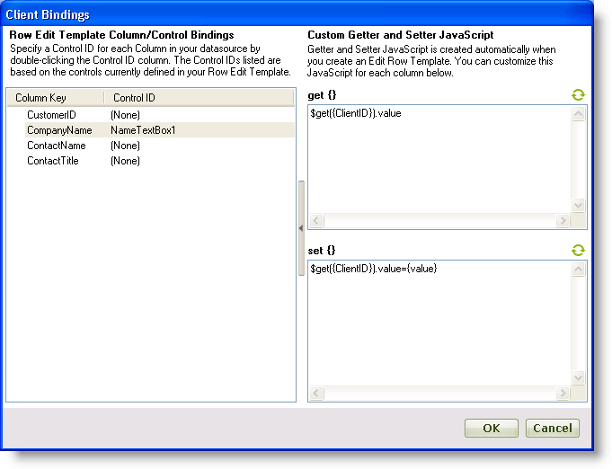

////

|metadata|
{
    "name": "webdatagrid-using-client-bindings",
    "controlName": ["WebDataGrid"],
    "tags": ["Data Binding","Grids"],
    "guid": "{1B10BB72-A36D-44DA-9894-64DF48C876C5}",  
    "buildFlags": [],
    "createdOn": "2008-08-10T15:20:24Z"
}
|metadata|
////

= Using Client Bindings

== Before You Begin

When you enable the  pick:[asp-net="link:{ApiPlatform}web{ApiVersion}~infragistics.web.ui.gridcontrols.roweditingtemplate.html[Row Editing Template]"]  for the first time and accept the default controls for the template, each TextBox control is already bound to a field in WebDataGrid™. However, if you want to add controls to the Row Editing Template or you do not accept the default controls, you will not have automatic bindings between the controls and any fields in WebDataGrid; you have to configure this binding.

The Client Bindings collection allows you to add custom bindings to controls in the Row Editing Template. You can provide a simple Javascript statement to get or set a value or supply a code fragment for more complex bindings.

== What You Will Accomplish

You will learn how to bind a TextBox in the Row Editing Template to a field in WebDataGrid.

== Follow these Steps

[start=1]
. Bind WebDataGrid to a SqlDataSource component retrieving data from the Customers table. For more information on doing this, see link:webdatagrid-getting-started-with-webdatagrid.html[Getting Started with WebDataGrid].
[start=2]
. Create a Row Editing Template with a label, a TextBox, and two buttons. For more information on enabling a RowEditingTemplate in the designer, see link:webdatagrid-enabling-row-editing-template.html[Enabling Row Editing Template].

*In Visual Basic:*

----
' Enable Row Editing Template 
Me.WebDataGrid1.Behaviors.CreateBehavior(Of EditingCore)() 
Me.WebDataGrid1.Behaviors.EditingCore.Behaviors.CreateBehavior(Of RowEditingTemplate)() 
' Set edit mode action to double-click 
Me.WebDataGrid1.Behaviors.EditingCore.Behaviors.RowEditTemplate.EditModeActions.MouseClick = EditMouseClickAction.[Double] 
' Create custom template 
Me.WebDataGrid1.Behaviors.EditingCore.Behaviors.RowEditTemplate.Template = New CustomRowEditingTemplate() 
Private Class CustomRowEditingTemplate 
    Implements ITemplate 
    #Region "ITemplate Members" 
    Public Sub InstantiateIn(container As Control) Implements System.Web.UI.ITemplate.InstantiateIn
        Dim label1 As New Label() 
        label1.Text = "CompanyName" 
        label1.ID = "NameLabel1" 
        Dim textBox1 As New TextBox() 
        textBox1.ID = "NameTextBox1" 
        Dim b1 As New Button() 
        b1.Text = "OK" 
        b1.ID = "OkButton" 
        b1.UseSubmitBehavior = False 
        b1.OnClientClick = "return" 
        b1.CausesValidation = False 
        Dim b2 As New Button() 
        b2.Text = "Cancel" 
        b2.ID = "CancelButton" 
        b2.UseSubmitBehavior = False 
        b2.OnClientClick = "return" 
        b2.CausesValidation = False 
        container.Controls.Add(label1) 
        container.Controls.Add(textBox1) 
        container.Controls.Add(b1) 
        container.Controls.Add(b2) 
    End Sub 
    #End Region 
End Class
----

*In C#:*

----
// Enable Row Editing Template
this.WebDataGrid1.Behaviors.CreateBehavior<EditingCore>();
this.WebDataGrid1.Behaviors.EditingCore.Behaviors.CreateBehavior<RowEditingTemplate>();
// Set edit mode action to double-click
this.WebDataGrid1.Behaviors.EditingCore.Behaviors.RowEditTemplate.EditModeActions.MouseClick = EditMouseClickAction.Double;
// Create custom template
this.WebDataGrid1.Behaviors.EditingCore.Behaviors.RowEditTemplate.Template = new CustomRowEditingTemplate();
private class CustomRowEditingTemplate : ITemplate
{
        #region ITemplate Members
        public void InstantiateIn(Control container)
        {
                Label label1 = new Label();
                label1.Text = "CompanyName";
                label1.ID = "NameLabel1";
                TextBox textBox1 = new TextBox();
                textBox1.ID = "NameTextBox1";
                Button b1 = new Button();
                b1.Text = "OK";
                b1.ID = "OkButton";
                b1.UseSubmitBehavior = false;
                b1.OnClientClick = "return";
                b1.CausesValidation = false;
                Button b2 = new Button();
                b2.Text = "Cancel";
                b2.ID = "CancelButton";
                b2.UseSubmitBehavior = false;
                b2.OnClientClick = "return";
                b2.CausesValidation = false;
                container.Controls.Add(label1);
                container.Controls.Add(textBox1);
                container.Controls.Add(b1);
                container.Controls.Add(b2);
        }
        #endregion
}
----

[start=3]
. If you have created the RowEditingTemplate in the designer, the following sub-steps will show you how to set up the bindings between the TextBox and the CompanyName field. If you choose to do this in code, skip this step.

.. In the Microsoft® Visual Studio™ property window, locate the Behaviors property and click the ellipsis (...) button to launch the Behaviors Editor Dialog.
.. Select Row Editing Template.
.. In the properties, set the OkButton and CancelButton properties to the ids of the Ok and Cancel buttons you have in the template, respectively. This notifies WebDataGrid that these buttons will cause the ok and cancel actions of the Row Editing Template.

.. In the properties, locate the  pick:[asp-net="link:{ApiPlatform}web{ApiVersion}~infragistics.web.ui.gridcontrols.roweditingtemplate~clientbindings.html[ClientBindings]"]  property and click the ellipsis (…) button to launch the Client Bindings editor.
.. Find the CompanyName in the Column Key column and set its Control ID to NameTextBox1, the id of the textbox in the Row Editing Template.
.. Click the right arrow button at the edge of the editor to expand it. The editor shows more advanced settings. Here you can provide custom Javascript code fragments to bind a control to something. By default, when you select a Control ID for a column, simple statements are provided to get and set the value for the control.
.. Click the each of the refresh buttons in the get and set sections of the editor to see the Javascript statements to get and set the editor's value.

[start=4]
. Provide the following code to specify binding between the TextBox and the CompanyName column. Further, you will designate the buttons that controls the Ok and Cancel actions of the Row Editing Template. If you choose to do this in the designer, go to step 3.

*In Visual Basic:*

----
' Set buttons that cause ok and cancel actions 
Me.WebDataGrid1.Behaviors.EditingCore.Behaviors.RowEditTemplate.OKButton = "OkButton" 
Me.WebDataGrid1.Behaviors.EditingCore.Behaviors.RowEditTemplate.CancelButton = "CancelButton" 
' Create client bindings 
Dim item As New RowEditingClientBinding() 
item.ColumnKey = "CompanyName" 
' Client ID of textbox 
item.ControlID = "WebDataGrid1_ctl00_NameTextBox1" 
' Get value from textbox 
item.GetValueJavaScript = "$get('WebDataGrid1_ctl00_NameTextBox1').value" 
' Set value of textbox to value of a cell in the field it is bound to. 
item.SetValueJavaScript = "$get('WebDataGrid1_ctl00_NameTextBox1').value={value};" 
' Add client binding 
Me.WebDataGrid1.Behaviors.EditingCore.Behaviors.RowEditTemplate.ClientBindings.Add(item)
----

*In C#:*

----
this.WebDataGrid1.Behaviors.EditingCore.Behaviors.RowEditTemplate.OKButton = "OkButton";
this.WebDataGrid1.Behaviors.EditingCore.Behaviors.RowEditTemplate.CancelButton = "CancelButton";
// Create client bindings
RowEditingClientBinding item = new RowEditingClientBinding();
item.ColumnKey = "CompanyName";
// Client ID of textbox
item.ControlID = "WebDataGrid1_ctl00_NameTextBox1";
// Get value from textbox
item.GetValueJavaScript = "$get('WebDataGrid1_ctl00_NameTextBox1').value";
// Set value of textbox to value of a cell in the field it is bound to.
item.SetValueJavaScript = "$get('WebDataGrid1_ctl00_NameTextBox1').value={value};";
// Add client binding
this.WebDataGrid1.Behaviors.EditingCore.Behaviors.RowEditTemplate.ClientBindings.Add(item);
----

[start=5]
. Run the application. Double-click in a cell. The Row Editing Template appears with a TextBox that you can use to edit cells in the CompanyName column.

== Related Topic

link:webdatagrid-enabling-row-editing-template.html[Enabling Row Editing Template]