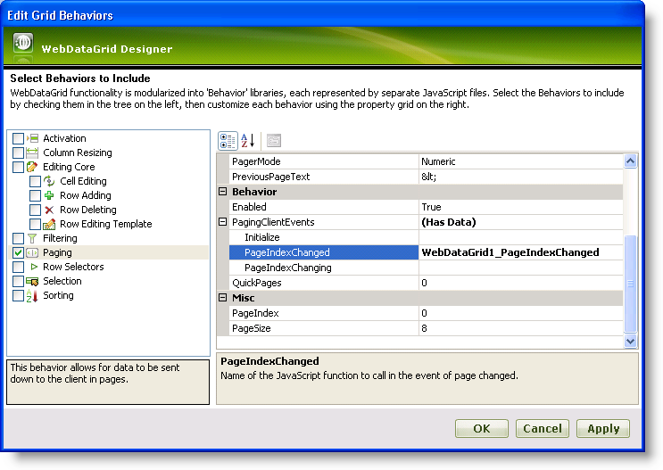
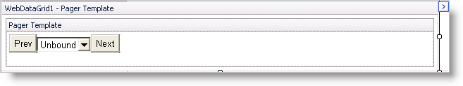
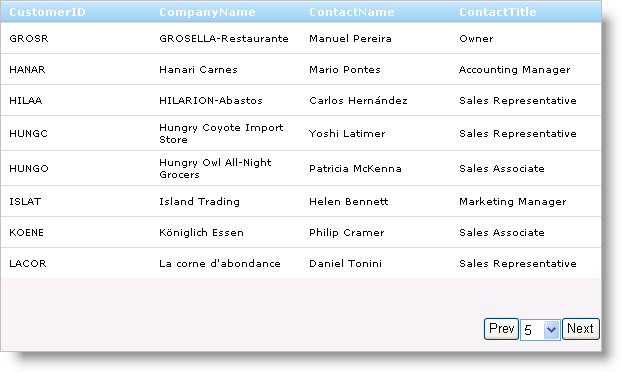

////

|metadata|
{
    "name": "webdatagrid-using-custom-paging-template",
    "controlName": ["WebDataGrid"],
    "tags": ["Grids","Paging"],
    "guid": "{EF2F6FCB-151F-4C9C-86F9-3F3B5D8B4BB7}",  
    "buildFlags": [],
    "createdOn": "0001-01-01T00:00:00Z"
}
|metadata|
////

= Using Custom Paging Template

== Before You Begin

With the WebDataGrid™ control’s paging template feature, you can customize the look and feel of the pager to your specifications. You can add any control to the template; however, using the pager template requires you handle the paging mechanism manually.

== What You Will Accomplish

You will set up WebDataGrid paging using two buttons and a dropdown list. The two buttons handle moving to the previous and next pages while the dropdown list moves to the selected page.

== Follow these Steps

[start=1]
. Bind WebDataGrid to the Customers table using a SqlDataSource component. For more information on this, see link:webdatagrid-getting-started-with-webdatagrid.html[Getting Started with WebDataGrid].
[start=2]
. In the Microsoft® Visual Studio™ property window, locate the Behaviors property and click the ellipsis (...) button to launch the Behaviors Editor Dialog.
[start=3]
. Check the CheckBox next to  pick:[asp-net="link:infragistics4.web.v{ProductVersion}~infragistics.web.ui.gridcontrols.paging.html[Paging]"]  from the list on the left to add and enable the behavior.
[start=4]
. In the properties, expand  pick:[asp-net="link:infragistics4.web.v{ProductVersion}~infragistics.web.ui.gridcontrols.paging~pagingclientevents.html[PagingClientEvents]"]  and handle the  pick:[asp-net="link:infragistics4.web.v{ProductVersion}~infragistics.web.ui.gridcontrols.pagingclientevents~pageindexchanged.html[PageIndexChanged]"]  event by inputting an event handler name: WebDataGrid1_PageIndexChanged.

[start=5]
. Click Apply then Ok to close the editor.
[start=6]
. Right-click on WebDataGrid and highlight Edit Template. You will see an option for Pager Template.

.Note:
[NOTE]
====
If you are using more than one behavior template, you will see Behavior Templates as a selection in the Edit Template submenu.
====

[start=7]
. Select Pager Template from the context menu. The WebDataGrid view changes to the template editing view.

.Note:
[NOTE]
====
Depending on what behaviors you have added, you will see other templates in addition to the pager template.
====

[start=8]
. Add two HTML buttons and an ASP.NET DropDownList control to the template.

.. Position the dropdown list between the two buttons.
.. Set the value of the button before the dropdown list to Prev and set its id to PrevButton.
.. Set the value of the second button to Next and set its id to NextButton.
.. Double-click each button to add event handlers for them.

.. Add a client-side handler named IndexChanged for the dropdown list. This will handle the manual paging of WebDataGrid when values are selected from the dropdown. The HTML for the dropdown list should look like the following:

*In HTML:*

----
<asp:DropDownList ID="DropDownList1" runat="server" onchange="return IndexChanged()">
</asp:DropDownList>
----

[start=9]
. Right-click WebDataGrid again and select End Template Editing. You are returned to the normal grid display.
[start=10]
. Populate the DropDownList control with the page numbers for your data in the load event of your page.

.. Obtain a reference to the dropdown list in your pager template. This requires accessing the PagerTemplateContainer—the container of controls inside the template—and finding the control inside.
.. Populate the dropdown list with the numbers of pages. Since we are retrieving the Customers data which has 91 records, and the default page size is 8, we need 12 pages of data.

*In Visual Basic:*

----
If Not Page.IsPostBack Then 
    Dim list1 As DropDownList = DirectCast(Me.WebDataGrid1.Behaviors.Paging.PagerTemplateContainer.FindControl("DropDownList1"), DropDownList) 
    For i As Integer = 1 To 12 
        list1.Items.Add(i.ToString()) 
    Next 
End If
----

*In C#:*

----
if (!Page.IsPostBack)
{
        DropDownList list1 = (DropDownList)this.WebDataGrid1.Behaviors.Paging.PagerTemplateContainer.FindControl("DropDownList1");
        for (int i = 1; i $$<=$$ 12; i++)
        {
                list1.Items.Add(i.ToString());
        }
}
----

[start=11]
. Manually page WebDataGrid in the dropdown list's IndexChanged event handler.

.. Get a reference to WebDataGrid.
.. Page WebDataGrid based on the value selected from the dropdown list.

.Note:
[NOTE]
====
Since the dropwdown list is embedded within a template, you need to use a hard-coded client-side id to get reference to the control. You can get the id from the source of the page.
====

*In JavaScript:*

----
function IndexChanged() {
        var dropdownlist = document.getElementById("WebDataGrid1_ctl00_DropDownList1");
        var grid = $find("WebDataGrid1");
        var newValue = dropdownlist.selectedIndex;
        grid.get_behaviors().get_paging().set_pageIndex(newValue);
}
----

[start=12]
. In the event handler for the Prev button click, manually page WebDataGrid.

.. Get a reference to WebDataGrid.
.. Get a reference to the dropdown list.
.. Check that by decreasing the index, you do not exceed the bounds of the selectable pages.
.. Go to the previous page.

*In JavaScript:*

----
var grid = $find("WebDataGrid1");
var dropdownlist = document.getElementById("WebDataGrid1_ctl00_DropDownList1");
if( grid.get_behaviors().get_paging().get_pageIndex() > 0 ) {
grid.get_behaviors().get_paging().set_pageIndex(grid.get_behaviors().get_paging().get_pageIndex() - 1);
}
----

[start=13]
. Do the same thing for the Next button event handler except that you are increasing the page index.

*In JavaScript:*

----
var grid = $find("WebDataGrid1");
var dropdownlist = document.getElementById("WebDataGrid1_ctl00_DropDownList1");
if(grid.get_behaviors().get_paging().get_pageIndex() < grid.get_behaviors().get_paging().get_pageCount() - 1) {
        grid.get_behaviors().get_paging().set_pageIndex(grid.get_behaviors().get_paging().get_pageIndex() + 1);
}
----

[start=14]
. Add code to handle the PageIndexChanged event you added earlier.

*In JavaScript:*

----
function WebDataGrid1_PageIndexChanged() {
    var grid = $find("WebDataGrid1");
    var dropdownlist = document.getElementById("WebDataGrid1_ctl00_DropDownList1");
    dropdownlist.options[grid.get_behaviors().get_paging().get_pageIndex()].selected = true;
}
----

[start=15]
. Run the application. WebDataGrid’s pager consists of two buttons and a dropdown list, each of which can be used for paging.

