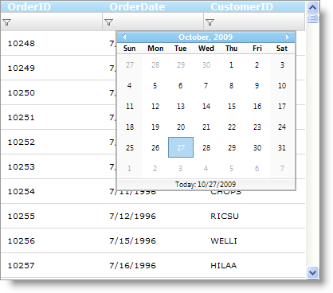

////
|metadata|
{
    "name": "webdatagrid-using-editor-providers-for-the-filter-box-in-webdatagrid",
    "controlName": ["WebDataGrid"],
    "tags": ["Filtering","Grids"],
    "guid": "{76F35C23-DD48-49C3-BFD6-ED893A08478A}",
    "buildFlags": [],
    "createdOn": "2010-04-03T23:47:27Z"
}
|metadata|
////

= Using Editor Providers for the Filter Box in WebDataGrid

== Before You Begin

When you enable the WebDataGrid™ control’s  pick:[asp-net="link:infragistics4.web.v{ProductVersion}~infragistics.web.ui.gridcontrols.filtering.html[Filtering]"]  Behavior, the filter row contains an editor provider which is automatically chosen depending on the column’s data type (as long as the grid knows the column’s data type). For more information on the data types and their associated editors see link:webdatagrid-editor-providers.html[About Editor Providers]. WebDataGrid allows you to set a different editor provider rather than the default one depending on your application.

== What You Will Accomplish

You will learn how to set an editor provider for the filter row when WebDataGrid Filtering is enabled.

== Follow these Steps

[start=1]
. From the Microsoft® Visual Studio® Toolbox, drag and drop a ScriptManager component and a WebDataGrid control onto the form.
[start=2]
. Bind WebDataGrid to a SqlDataSource component and configure it to retrieve OrderID , OrderDate and CustomerID from the Orders table of the Northwind database. For more information on doing this, see the link:webdatagrid-getting-started-with-webdatagrid.html[Getting Started with WebDataGrid] topic.
[start=3]
. From the properties window, locate the Behaviors property of the WebDataGrid and click the ellipsis (…) button to launch the Behaviors Editor Dialog.
[start=4]
. Check the checkbox for the Filtering behavior from the list on the left to enable it.
[start=5]
. Locate the  pick:[asp-net="link:infragistics4.web.v{ProductVersion}~infragistics.web.ui.gridcontrols.filtering~columnsettings.html[ColumnSettings]"]  property and click the ellipsis (…) button to launch the Column Setting dialog.
[start=6]
. Add a  pick:[asp-net="link:infragistics4.web.v{ProductVersion}~infragistics.web.ui.gridcontrols.columnsetting.html[ColumnSetting]"]  by clicking the add item button.
[start=7]
. Set the  pick:[asp-net="link:infragistics4.web.v{ProductVersion}~infragistics.web.ui.gridcontrols.columnsetting~columnkey.html[ColumnKey]"]  property to OrderDate from the drop-down list.
[start=8]
. Click the  pick:[asp-net="link:infragistics4.web.v{ProductVersion}~infragistics.web.ui.gridcontrols.columneditsetting~editorid.html[EditorID]"]  property and select Add/Modify EditorProviders list from the drop-down list.

This will launch the Edit Grid Editor Providers dialog.
[start=9]
. Click the + button and select the MonthCalendarProvider from the drop-down list. This will add the MonthCalendarProvider as an EditorProvider to the WebDataGrid control.

[start=10]
. Click Apply and OK to close the Edit Grid Editor Providers dialog.
[start=11]
. In the Column Setting dialog set the EditorID property to WebDataGrid1_MonthCalendarProvider1.
[start=12]
. Click Apply and OK to close the Column Setting dialog.
[start=13]
. Click Apply and OK to close the Edit Grid Behaviors dialog.
[start=14]
. Save and run your application. As soon as you click the OrderDate filter and select a rule, you will observe WebMonthCalendar as an Editor Provider for the filter box.

*In Visual Basic:*

----
'Create a Filtering Behavior 
Me.WebDataGrid1.Behaviors.CreateBehavior(Of Filtering)() 
'Create a MonthCalendarProvider and add it to the EditorProviders of the     WebDataGrid 
Dim WebDataGrid1_MonthCalendarProvider1 As New MonthCalendarProvider() 
WebDataGrid1_MonthCalendarProvider1.ID = "WebDataGrid1_MonthCalendarProvider1" 
Me.WebDataGrid1.EditorProviders.Add(WebDataGrid1_MonthCalendarProvider1) 
'Create a ColumnFilteringSetting 
Dim settingColumn1 As New ColumnFilteringSetting() 
'Set the ColumnKey 
settingColumn1.ColumnKey = "OrderDate" 
'Set the EditorID 
settingColumn1.EditorID = WebDataGrid1_MonthCalendarProvider1.ID 
'Add the created ColumnSetting 
Me.WebDataGrid1.Behaviors.Filtering.ColumnSettings.Add(settingColumn1)
----

*In C#:*

----
//Create a Filtering Behavior
this.WebDataGrid1.Behaviors.CreateBehavior<Filtering>();
//Create a MonthCalendarProvider and add it to the EditorProviders of the WebDataGrid
MonthCalendarProvider WebDataGrid1_MonthCalendarProvider1 = new MonthCalendarProvider();
WebDataGrid1_MonthCalendarProvider1.ID = "WebDataGrid1_MonthCalendarProvider1";
this.WebDataGrid1.EditorProviders.Add(WebDataGrid1_MonthCalendarProvider1);
//Create a ColumnFilteringSetting 
ColumnFilteringSetting settingColumn1 = new ColumnFilteringSetting();
//Set the ColumnKey
settingColumn1.ColumnKey = "OrderDate";
//Set the EditorID
settingColumn1.EditorID = WebDataGrid1_MonthCalendarProvider1.ID;
//Add the created ColumnSetting
this.WebDataGrid1.Behaviors.Filtering.ColumnSettings.Add(settingColumn1);
----