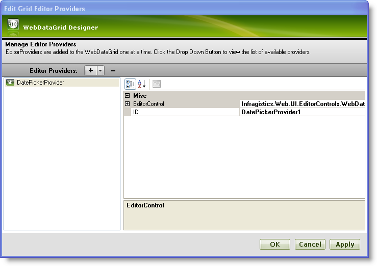
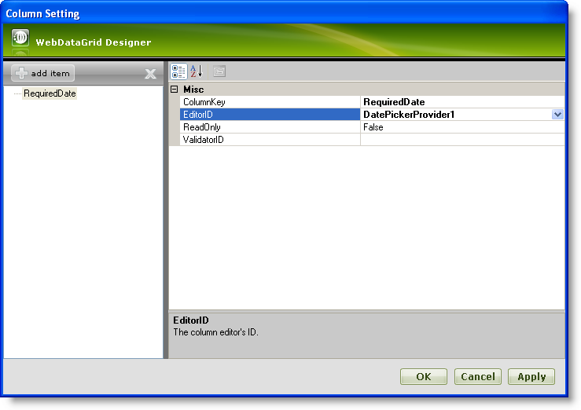
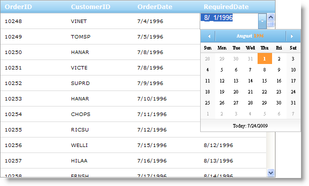

////

|metadata|
{
    "name": "webdatagrid-using-editor-providers",
    "controlName": ["WebDataGrid"],
    "tags": ["Editing","Grids"],
    "guid": "{67AA5F08-A8D1-4287-946E-B0593C78CD64}",
    "buildFlags": [],
    "createdOn": "0001-01-01T00:00:00Z"
}
|metadata|
////

= Using DatePicker as an editor provider for WebDataGrid

== Before You Begin

Some default editors in WebDataGrid™ may not be useful in your application. However, you can specify the editor that proves most useful for a column by using the  pick:[asp-net="link:infragistics4.web.v{ProductVersion}~infragistics.web.ui.gridcontrols.editorprovidercollection.html[EditorProviders]"]  collection.

== What You Will Accomplish

You will learn how to use the  pick:[asp-net="link:infragistics4.web.v{ProductVersion}~infragistics.web.ui.gridcontrols.datepickerprovider.html[DatePickerProvider]"]  in a DateTime column for editing.

== Follow these Steps

[start=1]
. Bind WebDataGrid to a SqlDataSource component retrieving data from the Orders table. Retrieve the OrdersID, CustomerID, OrderDate, and RequiredDate fields. For more information on doing this, see link:webdatagrid-getting-started-with-webdatagrid.html[Getting Started with WebDataGrid].
[start=2]
. In the Microsoft® Visual Studio™ property window, locate the EditorProviders property and click the ellipsis (...) button to launch the Editor Providers Designer.
[start=3]
. Click the + button to drop-down a list of possible editors. Select one to make it available later when you are setting up columns. For our purposes, select the DatePickerProvider.
[start=4]
. Leave the ID for the editor as DatePickerProvider1 in the property grid on the right. You will need this ID later when setting the editor for a column. You can set any additional properties for the editor control by expanding the  pick:[asp-net="link:infragistics4.web.v{ProductVersion}~infragistics.web.ui.gridcontrols.editorprovider`1~editorcontrol.html[EditorControl]"]  property.

[start=5]
. Click Apply then OK to close the designer.
[start=6]
. Locate the  pick:[asp-net="link:infragistics4.web.v{ProductVersion}~infragistics.web.ui.gridcontrols.behaviors.html[Behaviors]"]  property and click the ellipsis (...) button to launch the Behaviors Editor Dialog.
[start=7]
. Check the Cell Editing behavior in the list on the left to enable editing.
[start=8]
. Locate the  pick:[asp-net="link:infragistics4.web.v{ProductVersion}~infragistics.web.ui.gridcontrols.cellediting~columnsettings.html[ColumnSettings]"]  property in the property grid on the right and click the ellipsis (...) button to launch the Column Settings Editor Dialog.
[start=9]
. Configure WebDataGrid to use the DatePickerProvider for editing of the RequiredDate column.

.. Add a column setting by clicking the Add button.
.. Set the  pick:[asp-net="link:infragistics4.web.v{ProductVersion}~infragistics.web.ui.gridcontrols.columnsetting~columnkey.html[ColumnKey]"]  as RequiredDate.
.. For the EditorID property, click the dropdown list and select DatePickerProvider1. Only editors that are added to the EditorProviders collection are available here.
.. Leave ReadOnly as False.
.. Click OK.

.Note:
[NOTE]
====
You can also select the Add/Modify Columns option in the dropdown list to go to the Edit Grid Columns dialog.
====

[start=10]
. Click Apply then OK to close the dialog.

*You can also do the above steps in code.*

*In Visual Basic:*

----
' Enable cell editing
Me.WebDataGrid1.Behaviors.CreateBehavior(Of EditingCore)()
Me.WebDataGrid1.Behaviors.EditingCore.Behaviors.CreateBehavior(Of CellEditing)()
' Create an editor provider
Dim datePickerProvider As New DatePickerProvider()
datePickerProvider.ID = "DatePickerProvider1"
' Add to collection
Me.WebDataGrid1.EditorProviders.Add(datePickerProvider)
' Create a column setting to use the editor provider
Dim columnSetting As New EditingColumnSetting()
columnSetting.ColumnKey = "RequiredDate"
' Assign editor for column to use
columnSetting.EditorID = datePickerProvider.ID
' Add column setting
Me.WebDataGrid1.Behaviors.EditingCore.Behaviors.CellEditing.ColumnSettings.Add(columnSetting)
----

*In C#:*

----
// Enable cell editing
this.WebDataGrid1.Behaviors.CreateBehavior<EditingCore>();
this.WebDataGrid1.Behaviors.EditingCore.Behaviors.CreateBehavior<CellEditing>();
// Create an editor provider
DatePickerProvider datePickerProvider = new DatePickerProvider();
datePickerProvider.ID = "DatePickerProvider1";
// Add to collection
this.WebDataGrid1.EditorProviders.Add(datePickerProvider);
// Create a column setting to use the editor provider
EditingColumnSetting columnSetting = new EditingColumnSetting();
columnSetting.ColumnKey = "RequiredDate";
// Assign editor for column to use
columnSetting.EditorID = datePickerProvider.ID;
// Add column setting
this.WebDataGrid1.Behaviors.EditingCore.Behaviors.CellEditing.ColumnSettings.Add(columnSetting);
----

[start=11]
. Run your application. When you enter edit mode in a cell of the RequiredDate column, the DatePickerEditor displays.

.Note:
[NOTE]
====
When DatePicker is used, if the bound field is passing a full DateTime object and if different date from the DatePicker calendar is selected,
====
the time part of the DateTime object will change to the start of the new Day that was selected [8/20/2016 12:00:00 AM]

*Full DateTime object* contains the date and time part of the value. Example: [8/19/2016 1:48:29]

.Note:
[NOTE]
====
When DateTimeEditorProvider is used, if the value is changed, the whole DateTime object will be persisted despite of the provider EditModeFormat string.
====
