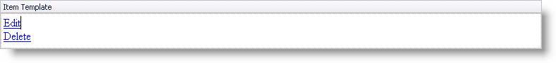

////

|metadata|
{
    "name": "webdatagrid-using-item-template",
    "controlName": ["WebDataGrid"],
    "tags": ["Grids","Templating"],
    "guid": "{3B020AB0-88B4-4AB6-926A-7C646BA0D923}",  
    "buildFlags": [],
    "createdOn": "0001-01-01T00:00:00Z"
}
|metadata|
////

= Using Item Template

== Before You Begin

Using a column template allows you to create a column with a unique look-and-feel. You can add any control to the template. A template column in WebDataGrid™ consists of 4 templates: header, footer, item, and alternate item templates.

== What You Will Accomplish

You will learn how to set up an item template for a column in WebDataGrid. This template will contain 2 link buttons to modify or delete a row.

== Follow these Steps

[start=1]
. Bind WebDataGrid to a SqlDataSource component retrieving data from the Customers table. For more information on doing this, see link:webdatagrid-getting-started-with-webdatagrid.html[Getting Started with WebDataGrid].
[start=2]
. In the Microsoft® Visual Studio™ property window, locate the  pick:[asp-net="link:{ApiPlatform}web{ApiVersion}~infragistics.web.ui.gridcontrols.webdatagrid~columns.html[Columns]"]  property and click the ellipsis (...) button to launch the Columns Editor Dialog.
[start=3]
. Select a column in the Available Fields section, under TemplateField, and click the Add Field button to add a template column. Set the  pick:[asp-net="link:{ApiPlatform}web{ApiVersion}~infragistics.web.ui.gridcontrols.controldatafield~key.html[Key]"]  to TemplateColumn1 and  pick:[asp-net="link:{ApiPlatform}web{ApiVersion}~infragistics.web.ui.gridcontrols.gridfieldcaption.html[Header]"]   pick:[asp-net="link:{ApiPlatform}web{ApiVersion}~infragistics.web.ui.gridcontrols.fieldcaption~text.html[Text]"]  to Edit. You can also select the column you intend to use as a template column from the Selected Fields section and click the Convert Selected Grid Field into a Template Field link.

*You can also add a template column in code.* The code should be performed in the Init event of the page, on first load.

*In Visual Basic:*

----
Dim field1 As New TemplateDataField() 
field1.Key = "TemplateColumn1" 
field1.Header.Text = "Edit" 
Me.WebDataGrid1.Columns.Add(field1)
----

*In C#:*

----
TemplateDataField field1 = new TemplateDataField();
field1.Key = "TemplateColumn1";
field1.Header.Text = "Edit";
this.WebDataGrid1.Columns.Add(field1);
----

[start=4]
. Click Ok to close the editor.
[start=5]
. Right-click WebDataGrid. Mouse over Edit Template from the context menu and select the column template you have just added. The template is shown in the designer.
[start=6]
. Drag 2 LinkButton controls onto the Item Template area.
[start=7]
. Set the Text property of these buttons to Edit and Delete.

[start=8]
. Set a handler for the client-side click event of the buttons by using the OnClientClick property.

.. For the Edit button, set the property equal to "return editRow()."
.. For the Delete button, set the property equal to "return deleteRow()."

*In HTML:*

----
<asp:LinkButton ID="LinkButton1" runat="server" onclientclick="return editRow()">Edit</asp:LinkButton>
 
<asp:LinkButton ID="LinkButton2" runat="server" onclientclick="return deleteRow()">Delete</asp:LinkButton>
----

*You can do the above steps in code by creating a class that implements the ITemplate interface and set an instance of it to the ItemTemplate property of the column.*

[start=1]
. For this sample, the instantiation of the template should be done on the PreRender event of the page. 

.Note:
[NOTE]
====
: A template needs to be re-created on every postback; therefore, you must perform the following code on every postback.
====

*In Visual Basic:*

----
'get reference to the template column 
Dim templateColumn1 As TemplateDataField = DirectCast(Me.WebDataGrid1.Columns("TemplateColumn1"), TemplateDataField) 
templateColumn1.ItemTemplate = New CustomItemTemplate()
Private Class CustomItemTemplate 
    Implements ITemplate 
    #Region "ITemplate Members" 
    Public Sub InstantiateIn(ByVal container As Control) Implements ITemplate.InstantiateIn
        Dim edit As New LinkButton()
        edit.ID = "EditButton"   
        edit.Text = "Edit" 
        edit.OnClientClick = "return editRow()" 
        Dim delete As New LinkButton()  
        delete.ID = "DeleteButton" 
        delete.Text = "Delete" 
        delete.OnClientClick = "return deleteRow()" 
        container.Controls.Add(edit) 
        container.Controls.Add(delete) 
    End Sub 
    #End Region 
End Class
----

*In C#:*

----
//get reference to the template column
TemplateDataField templateColumn1 = (TemplateDataField)this.WebDataGrid1.Columns["TemplateColumn1"];
templateColumn1.ItemTemplate = new CustomItemTemplate();
private class CustomItemTemplate : ITemplate
{
        #region ITemplate Members
        public void InstantiateIn(Control container)
        {
        LinkButton edit = new LinkButton();
        edit.CssClass = "LinkButton";
        edit.Text = "Edit";
        edit.OnClientClick = "return editRow()";
        LinkButton delete = new LinkButton();
        delete.CssClass = "LinkButton";
        delete.Text = "Delete";
        delete.OnClientClick = "return deleteRow()";
        container.Controls.Add(edit);
        container.Controls.Add(delete);
        }
        #endregion
}
----

[start=2]
. Add the functions to edit and delete.

*In JavaScript:*

----
function editRow() {
var grid = $find("WebDataGrid1");
// Get active row
var activeRow = grid.get_behaviors().get_activation().get_activeCell().get_row();
// Enter edit mode on the first cell of active row
grid.get_behaviors().get_editingCore().get_behaviors().get_cellEditing().enterEditMode(activeRow.get_cell(0));
// Cancel auto postback from link button
return false;
}
function deleteRow() {
var grid = $find("WebDataGrid1");
// Delete active row
grid.get_rows().remove(grid.get_behaviors().get_activation().get_activeCell().get_row());
// Cancel auto postback from link button
return false;
}
----

.Note:
[NOTE]
====
Since the buttons function to modify WebDataGrid, you must enable the  pick:[asp-net="link:{ApiPlatform}web{ApiVersion}~infragistics.web.ui.gridcontrols.behaviors~editingcore.html[EditingCore]"]  behavior. For more information on doing this, see link:webdatagrid-editting.html[Editing]. You also need the  pick:[asp-net="link:{ApiPlatform}web{ApiVersion}~infragistics.web.ui.gridcontrols.behaviors~activation.html[Activation]"]  behavior. For more information, see link:webdatagrid-activation.html[Activation].
====

.Note:
[NOTE]
====
Since the item template is just HTML within the cell of a column, be sure to make the column read-only to prevent editing of the HTML. Doing this allows your end-users to edit using any editors in the template but prevent them from editing the actual markup of the template. For more information on adding column settings for a behavior, see link:webdatagrid-setting-column-settings-for-a-behavior.html[Setting Column Settings for a Behavior].
====

[start=3]
. Run the application. WebDataGrid has a column that displays 2 link buttons which handles editing and deleting rows.

== Related Topics

link:webdatagrid-refrence-a-cell-when-creating-an-item-template.html[Reference a Cell When Creating an Item Template]