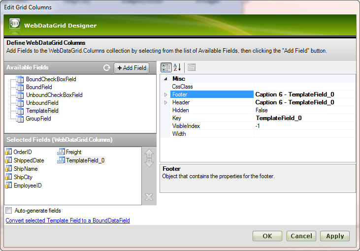
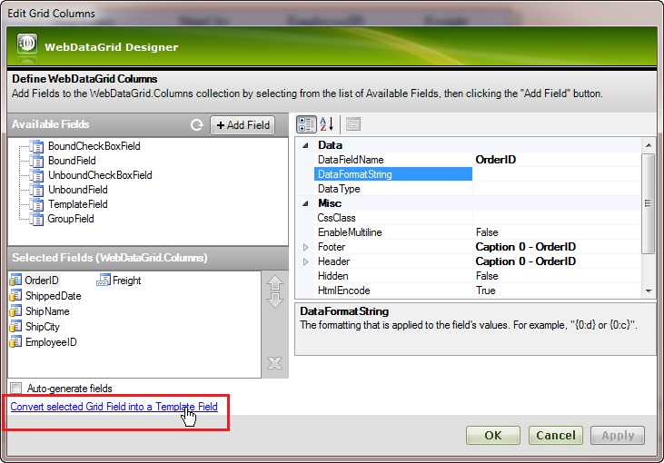
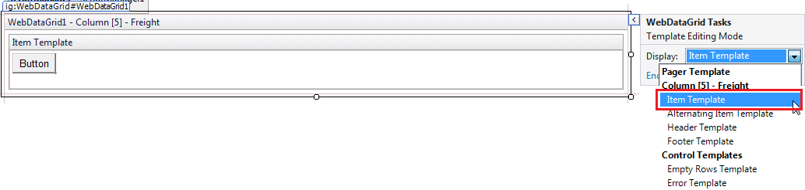
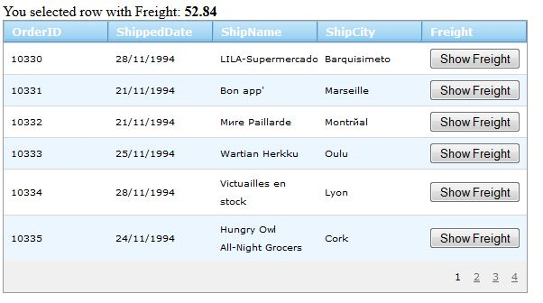

////

|metadata|
{
    "name": "webdatagrid-using-itemcommand-event",
    "controlName": [],
    "tags": [],
    "guid": "0aaae618-060e-4d09-bca3-4116d937500e",  
    "buildFlags": [],
    "createdOn": "2015-02-25T12:55:08.9590417Z"
}
|metadata|
////

= WebDataGrid Using ItemCommand Event

=== Before You Begin

The link:infragistics4.web.v{ProductVersion}~infragistics.web.ui.gridcontrols.webdatagrid~itemcommand_ev.html[ItemCommand] server-side event of WebDataGrid allows you to easily respond to events (e.g., button click) from controls placed inside link:infragistics4.web.v{ProductVersion}~infragistics.web.ui.gridcontrols.templatedatafield.html[TemplateField] column.

=== What You Will Accomplish

This walkthrough demonstrates how to add an ASP.NET button inside an bound TemplatedField column, and handle WebDataGrid's ItemCommand server-side event to display some information when the button is clicked.

=== Follow these Steps

.Note:
[NOTE]
====
This walkthrough assumes you have bound WebDataGrid to a DataSet object at design time. For information on how to populate the WebDataGrid control, see the 
====

== Related Topics
ection at the end of this topic.

[start=1]
. Before you start writing any code, you should place using/Imports directives in your code-behind so you don't need to always type out a member's fully qualified name.

*In Visual Basic:*

[source,vb]
----
Imports Infragistics.Web.UI.GridControls
----

*In C#:*

[source,csharp]
----
using Infragistics.Web.UI.GridControls;
----

[start=2]
. In Design View select the control/component and select Properties.
[start=3]
. In the Properties window, locate the Columns collection, and click the ellipsis button (…).
[start=4]
. Add a TemplateField to the collection.

.. From Available Fields section select TemplateField and click the Add Field Button.
.. New column of type TemplateField will be added to the columns collection.

.. Another way to add TemplateField is to convert Grid Field into a Template Field. Select some Grid field and press “Convert selected Grid Field into a Template Field”.

.. Click OK button to close the Columns Collection Editor

[start=5]
. Add an ASP.NET Button control to the TemplatedField.

.. From the Design view of your page select the WebDataGrid’s smart tag and click on “Edit Templates”
.. After the Template Editing Mode is open find the “Freight” TemplateField.

.. From the toolbox, drag a standard ASP.NET button control into ItemTemplate
.. Select “End Template Editing” to finish the edit.

[start=6]
. Add a server-side event handler to the ItemCommand event (code-behind).

*In Visual Basic:*

[source,vb]
----
Protected Sub WebDataGrid1_ItemCommand(sender As Object, e As HandleCommandEventArgs) 
End Sub
----

*In C#:*

[source,csharp]
----
protected void WebDataGrid1_ItemCommand(object sender, HandleCommandEventArgs e){ }
----

[start=7]
. Add code to the ItemCommand event to retrieve some row information. When a control sends back an event, the server will want to respond that event. The ItemCommand event will capture the event thrown by the control and expose that event to you through the HandleCommandEventArgs object.

*In ASPX:*

----
<ig:TemplateDataField Key="Freight"><ItemTemplate>
      <asp:Button ID="Button1" runat="server" 
            Text="Button" 
            CommandArgument='<%# Eval("Freight") %>' 
            CommandName="Button1Click" />
      </ItemTemplate>
      <Header Text="Freight">
      </Header>
</ig:TemplateDataField>
----

*In Visual Basic:*

[source,vb]
----
Protected Sub WebDataGrid1_ItemCommand(sender As Object, e As HandleCommandEventArgs)
    'e.CommandArgument will give you the value from CommandArgument attribute of the corresponding button
    Dim commandArgument As Object = e.CommandArgument
    'Make some calculations with Freight field value and pass it to a Label
    FreightValueLbl.Text = commandArgument.ToString()
End Sub
----

*In C#:*

[source,csharp]
----
protected void WebDataGrid1_ItemCommand(object sender, HandleCommandEventArgs e)
{
    //e.CommandArgument will give you the value from CommandArgument 
      attribute of the corresponding button
    object commandArgument = e.CommandArgument;
    //Make some calculations with Freight field value and pass it to a Label
    FreightValueLbl.Text = commandArgument.ToString();
}
----

[start=8]
. Run the application. Click one of the buttons, and notice that Freight field value is displayed above the WebDataGrid, as shown in the screen shot below.

.Note:
[NOTE]
====
You can change the button caption to something more appropriate by opening the templated column at design time and changing the button's Text property. In addition, you can add a header caption to the Template Field by selecting the column and selecting its Header's Caption property using the Columns Collection Editor (for more information, see step 3 of this procedure).
====

Related Topics

link:webdatagrid-using-item-template.html[Using Item Templates]

link:webdatagrid-column-templates.html[Column Templates]

link:webhierarchicaldatagrid-data-binding.html[WebHierarchicalDataGrid Data Bindings]

link:webhierarchicaldatagrid-binding-to-xml-data-source.html[Binding WHDG to Xml Data Source]