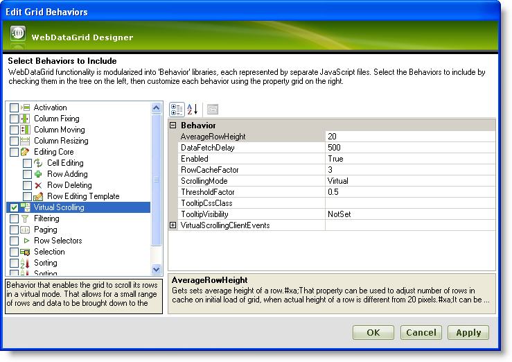

////

|metadata|
{
    "name": "webdatagrid-virtual-scrolling",
    "controlName": ["WebDataGrid"],
    "tags": ["Grids","Virtualization"],
    "guid": "{1AC37B0D-DE85-429D-A595-C7969BFAAFAD}",  
    "buildFlags": [],
    "createdOn": "0001-01-01T00:00:00Z"
}
|metadata|
////

= Virtual Scrolling

WebDataGrid™ supports virtual scrolling which allows it to send partial amounts of data records to the client, and request additional data records on demand as the end-user scrolls through the control. The Virtual Scrolling behavior therefore greatly improves performance by allowing the end-user to navigate through large volumes of data without having to send the entire data source to the client.

== Row Cache and Load Threshold

WebDataGrid allows you to configure the size of the row cache by setting the  pick:[asp-net="link:{ApiPlatform}web{ApiVersion}~infragistics.web.ui.gridcontrols.virtualscrolling.html[VirtualScrolling]"]  object’s  pick:[asp-net="link:{ApiPlatform}web{ApiVersion}~infragistics.web.ui.gridcontrols.virtualscrolling~rowcachefactor.html[RowCacheFactor]"]  property. The number of rows in the cache is equal to the visible rows multiplied by the RowCacheFactor. You can also configure the threshold value which notifies the grid that it has reached a specific point in the row cache and additional rows are required; this functionality can be set through the  pick:[asp-net="link:{ApiPlatform}web{ApiVersion}~infragistics.web.ui.gridcontrols.virtualscrolling~thresholdfactor.html[ThresholdFactor]"]  property.

For example, if WebDataGrid has a view port of 10 rows with the RowCacheFactor set to 3, the row cache equals 30 rows. If you scroll to row 101, you would see rows 101 through 110 in the view port. The additional cached rows out of view are rows 91 through 100 and rows 111-120. If the ThresholdFactor is .5 and the view port contains 10 rows, the threshold is at 5 rows from the end of the row cache. So in this example, the threshold would be at rows 95 and 115. If you scroll to one of these rows WebDataGrid makes a request for additional rows.

WebDataGrid also provides you with an option to adjust the number of rows in the cache on the initial load of the grid, when the actual height of a row is different from 20 pixels. This can be useful in situations when the text in the cells is long, as the height of the rows increase due to the auto-wrap feature of browser. You can set the average height of a row in the cache on initial load by simply setting the AverageRowHeight property. By default, this property is set to 20.

.Note:
[NOTE]
====
If the value of the AverageRowHeight property is significantly different from the actual height of a row, then the scrolling behavior may break. If the value is too big, then the grid will raise frequent asynchronous requests for new rows or the grid may not show all the rows. If the value is too small, then the grid may fail to respond when the scrollbar is moving.
====

== Scrolling Modes

The virtual scrolling mechanism can be operated in two different modes by simply setting the VirtualScrolling object’s  pick:[asp-net="link:{ApiPlatform}web{ApiVersion}~infragistics.web.ui.gridcontrols.virtualscrolling~scrollingmode.html[ScrollingMode]"]  property:

* *Virtual* -- In this mode, the end-user can instantly scroll through the rows that are already cached within the grid. When attempting to scroll beyond the cached records, an AJAX request is made to retrieve the next batch of records that belong within that range.
* *Deferred* -- In this mode, the end-user can scroll through the data records by clicking and dragging the vertical scrollbar. However, the grid will only jump to the records at the scroll bar position once the end-user releases the mouse capture on the scrollbar. While the end-user is scrolling, the index of the first visible row is displayed as a tooltip. The grid uses the selected row as the top most visible row in the grid and resets the cache based on that row.

Scrolling through data that is within the row cache is a smooth process. WebDataGrid exhibits a slight pause if scrolling results in a data request. Since it is possible that the end-user can hold down the scroll bar and drag erratically, a concept known as a data fetch delay has been added to WebDataGrid and exposed as a property that can be configured. The  pick:[asp-net="link:{ApiPlatform}web{ApiVersion}~infragistics.web.ui.gridcontrols.virtualscrolling~datafetchdelay.html[DataFetchDelay]"]  property allows you to specify the amount of time that needs to elapse after the end user stops scrolling. When this time has elapsed WebDataGrid will then initiate its request to fetch the additional rows. You can granularly control and tweak when WebDataGrid requests additional rows.

You can enable the virtual scrolling behavior on WebDataGrid through the designer, through the Microsoft® Visual Studio® Property Window, or by using the following code:

*In Visual Basic:*

----
WebDataGrid1.Behaviors.VirtualScrolling.Enabled = true
----

*In C#:*

----
WebDataGrid1.Behaviors.VirtualScrolling.Enabled = true;
----

== Virtual Scrolling and Paging

WebDataGrid allows you to use the Virtual Scrolling behavior even when the  pick:[asp-net="link:{ApiPlatform}web{ApiVersion}~infragistics.web.ui.gridcontrols.behaviors~paging.html[Paging]"]  behavior is enabled. For example, if the PageSize is set to 500 and the RowCacheFactor is set to 3 with 10 visible rows in the WebDataGrid and when the end-user scrolls to the row beyond the row index 30 or beyond the virtual scrolling threshold, virtual scrolling will be initiated to request more rows from the server. However if the row cache size is greater than the page size, virtual scrolling will not take place as all the rows have already been loaded into the WebDataGrid’s current page.

== Tooltip Visibility

WebDataGrid allows you to configure the visibility of the tooltip when the VirtualScrolling behavior is enabled by simply setting the TooltipVisibility property to a member of the DefaultableBoolean enumeration such as True or False. However by default, this property is set to NotSet which means that the tooltip appears for deferred scrolling mode but not for virtual scrolling mode.

*In Visual Basic:*

----
WebDataGrid1.Behaviors.VirtualScrolling.TooltipVisibility = Infragistics.Web.UI.DefaultableBoolean.True
----

*In C#:*

----
WebDataGrid1.Behaviors.VirtualScrolling.TooltipVisibility = Infragistics.Web.UI.DefaultableBoolean.True;
----

== Enabling Virtual Scrolling

[start=1]
. From the Microsoft® Visual Studio® Toolbox, drag and drop a ScriptManager component and a WebDataGrid control onto the form.
[start=2]
. Bind WebDataGrid to a SqlDataSource component and configure it to retrieve data from the Customers table. For more information on doing this, see the link:webdatagrid-getting-started-with-webdatagrid.html[Getting Started with WebDataGrid] topic.
[start=3]
. In the property window, locate the  pick:[asp-net="link:{ApiPlatform}web{ApiVersion}~infragistics.web.ui.gridcontrols.webdatagrid~behaviors.html[Behaviors]"]  property and click the ellipsis (…) button to launch the Edit Behaviors Dialog.
[start=4]
. Check the Virtual Scrolling Behavior to enable it as shown in the following image:

[start=5]
. Click Apply and OK to close the Edit Grid Behaviors dialog. The following markup gets generated:

*In HTML:*

----
<Behaviors>
    <ig:VirtualScrolling>
    </ig:VirtualScrolling>
</Behaviors>
----

To add sorting behavior from the code-behind, add the following code:

*In Visual Basic:*

----
WebDataGrid1.Behaviors.CreateBehavior(Of Infragistics.Web.UI.GridControls.VirtualScrolling)()
----

*In C#:*

----
WebDataGrid1.Behaviors.CreateBehavior<Infragistics.Web.UI.GridControls.VirtualScrolling>();
----

[start=6]
. Save and run your application. You will observe that you can instantly scroll through the rows that are already cached within the grid; and also a timed delay depending on the  pick:[asp-net="link:{ApiPlatform}web{ApiVersion}~infragistics.web.ui.gridcontrols.virtualscrolling~datafetchdelay.html[DataFetchDelay]"]  property when you try to scroll beyond the cached records.

Virtual Scrolling Limitation

.Note:
[NOTE]
====
Virtual Scrolling cannot be used with template columns, in case where the template is not used just for display, but contains element(s) like a button that has an event attached.
====