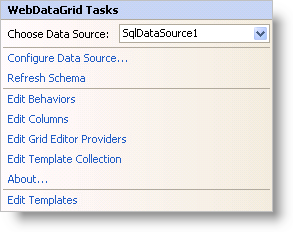

////

|metadata|
{
    "name": "webdatagrid-webdatagrid-smart-tag",
    "controlName": ["WebDataGrid"],
    "tags": ["Grids"],
    "guid": "{238D9D77-C699-486E-A6DB-A6772C614FE8}",  
    "buildFlags": [],
    "createdOn": "0001-01-01T00:00:00Z"
}
|metadata|
////

= WebDataGrid Smart Tag

In Visual Studio 2005/2008/2010 (.NET Framework 2.0/3.5/4.0), each Infragistics ASP.NET control/component is equipped with a Smart Tag. By selecting the control/component, a Smart Tag anchor appears. When you click this anchor, a pop-up panel appears, providing you with quick and easy access to the most common properties and settings of the control/component.

The WebDataGrid™ Smart Tag contains the following items:

* Choose Data Source -- Allows you to choose an existing data source or configure a data source to bind to WebDataGrid.

See the table below for a description of the item, as well as the item's corresponding property in the properties grid.

The WebDataGrid Smart Tag contains the following links:

* Configure Data Source - Links to the data source configuration wizard allowing you to configure the data source to bind to WebDataGrid.
* Refresh Schema - Clicking this refreshes WebDataGrid so that any changes to the data source or the schema are displayed in the designer.
* Edit Behaviors - Brings up the behaviors editor for adding, removing, and configuring WebDataGrid's behaviors.
* Edit Columns - Brings up the columns editor allowing you to add and remove columns or adjust column settings.
* Edit Template Collection - Links to the template collection editor where you can add/remove templates that you can use in WebDataGrid.
* Edit Grid Editor Providers - Links to the editor providers editor to add/remove editor providers for use with WebDataGrid.
* About -- Clicking this opens the WebDataGrid product information. It contains information such as Status, Version, Expiration and Product Key.
* Edit Templates - Clicking this brings up all the available templates you can edit. You can drag and drop controls onto the templates and edit them as you like.

[options="header", cols="a,a,a"]
|====
|Items|Description|CorrespondingProperty

|Choose Data Source
|The dropdown list allows you to select an existing data source or configure a new data source.
|*DataSourceID*

|====