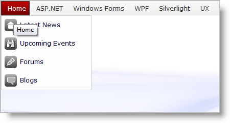

////

|metadata|
{
    "name": "webdatamenu-about-webdatamenu",
    "controlName": ["WebDataMenu"],
    "tags": ["Getting Started"],
    "guid": "{5609022C-2311-4971-8582-89D3D57EBB0F}",  
    "buildFlags": [],
    "createdOn": "0001-01-01T00:00:00Z"
}
|metadata|
////

= About WebDataMenu

WebDataMenu™ is a control that can be used to create sophisticated menu layouts composed of menus and menu items. Menus serve as the basic containers of the control and contain a series of child menu items and menus. WebDataMenu is built using the Infragistics ASP.NET AJAX Framework to leverage a proven code base that promotes a high performance and responsive end-user experience. You can find WebDataMenu in the  pick:[asp-net="link:infragistics4.web.v{ProductVersion}~infragistics.web.ui.navigationcontrols_namespace.html[Infragistics.Web.UI.NavigationControls]"]  namespace.

WebDataMenu includes integrated design-time tools in the form of an advanced Designer UI. This design-time utility helps you quickly and easily set up the control depending on your requirements, providing access to a wide range of WebDataMenu functionality without requiring intensive coding.

Like all Infragistics ASP.NET AJAX controls, WebDataMenu seamlessly integrates into the Infragistics® Application Styling Framework. With CSS based properties, you can manually customize the WebDataMenu by leveraging your existing style sheets.

WebDataMenu also exposes a robust object model within the client-side JavaScript programming environment. The client-side object model (CSOM) consists of full-fledged properties and methods that enable developers to program significant units of functionality pertaining to the WebDataMenu control without need for server-side postbacks.

Some of the WebDataMenu control’s features include :

* *High-Performance* -- Lightweight markup and optimized code improve performance.
* *Powerful Data Binding* -- Allows the developer to connect it to a data source and auto- generate the menu layout.
* *Menu Scrolling* -- Supports intelligent way of scrolling through non-visible items.
* *Context Menu* -- Can be used as context or pop-up menu.
* *Navigation* -- Allows the end-user to navigate through the nodes, both using the mouse and the keyboard.
* *Menu Item States* -- A single menu item can have different states indicated by different visual styles customizable via the AppStylist application.
* *Group-level settings* -- When applied on the Menu, group-level settings have control over all items/child menus that do not have explicit properties set.
* *Hot Tracking* -- Changes the CSS class applied to a menu or a sub-menu item when hovered with the mouse.
* *Auto Positioning* -- WebDataMenu shows the menu items in an intelligent way so that all the items are visible in the browser window.
* *Separators* -- By setting a single property menu-items can be rendered as separators in between other menu-items.

