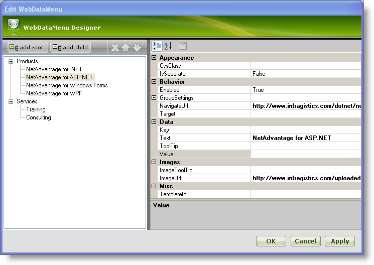
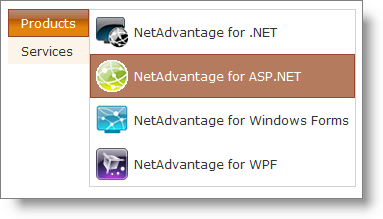

////

|metadata|
{
    "name": "webdatamenu-adding-images-and-navigation-urls-to-menu-items",
    "controlName": ["WebDataMenu"],
    "tags": [],
    "guid": "{9D139506-17A8-4FE6-B4B3-3D9566B488F9}",  
    "buildFlags": [],
    "createdOn": "0001-01-01T00:00:00Z"
}
|metadata|
////

= Adding Images and Navigation Urls to Menu Items

== Before You Begin

WebDataMenu™ allows adding images and navigation urls to the menu items without writing any code.You can easily add images and navigation urls by setting the  pick:[asp-net="link:{ApiPlatform}web{ApiVersion}~infragistics.web.ui.navigationcontrols.navitem~imageurl.html[ImageUrl]"]  and  pick:[asp-net="link:{ApiPlatform}web{ApiVersion}~infragistics.web.ui.navigationcontrols.navitem~navigateurl.html[NavigateUrl]"]  properties of the menu item.

== What You Will Accomplish

You will learn how to add images and navigation urls to the menu items using the designer.

== Follow these Steps

[start=1]
. From the Visual Studio™ Toolbox, drag and drop a ScriptManager component and a WebDataMenu control onto the form.
[start=2]
. Add two root items using the WebDataMenu Designer and set their  pick:[asp-net="link:{ApiPlatform}web{ApiVersion}~infragistics.web.ui.navigationcontrols.navitem~text.html[Text]"]  property to Products and Services. Add four child items to the Products root item and set their Text,NavigateUrl and ImageUrl properties as shown below :

[options="header", cols="a,a,a"]
|====
|Text|NavigateUrl|ImageUrl

|Infragistics
| link:http://www.infragistics.com[http://www.infragistics.com]
|http://www.infragistics.com/uploadedImages/Shared/nadotnet.gif

|ASP.NET
| link:http://www.infragistics.com/products/aspnet[http://www.infragistics.com/products/aspnet]
|http://www.infragistics.com/uploadedImages/Shared/aspNet.gif

|Windows Forms
| link:http://www.infragistics.com/products/windows-forms[http://www.infragistics.com/products/windows-forms]
|http://www.infragistics.com/uploadedImages/Shared/winforms.gif

|WPF
| link:http://www.infragistics.com/products/wpf[http://www.infragistics.com/products/wpf]
|http://www.infragistics.com/uploadedImages/Shared/nawpf.gif

|====

Similarly, add two child items to the Services root item and set the following properties :

[options="header", cols="a,a"]
|====
|Text|NavigateUrl

|Training
|http://www.infragistics.com/services/training.aspx

|Consulting
|http://www.infragistics.com/services/consulting.aspx

|====

For more information on how to add items to WebDataMenu using the designer see the link:webdatamenu-getting-started-with-webdatamenu.html[Getting Started with WebDataMenu] topic.
[start=3]
. At this point your WebDataMenu Designer should look similar to the following image:

[start=4]
. Click Apply and OK to close the WebDataMenu Designer.
[start=5]
. Save and run your application. Your WebDataMenu should look similar to the following image as you hover the mouse over the Products item.

