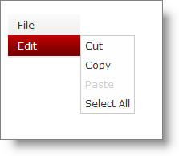

////

|metadata|
{
    "name": "webdatamenu-disabling-menu-items",
    "controlName": ["WebDataMenu"],
    "tags": [],
    "guid": "{A37E1F99-6690-4048-8111-3571EE3BA5E1}",  
    "buildFlags": [],
    "createdOn": "0001-01-01T00:00:00Z"
}
|metadata|
////

= Disabling Menu Items

WebDataMenu™ allows individual items to be disabled. For instance, you may want the end-users not to select or activate certain menu items. You can achieve this functionality by setting the  pick:[asp-net="link:infragistics4.web.v{ProductVersion}~infragistics.web.ui.navigationcontrols.navitem.html[NavItem]"]  object’s  pick:[asp-net="link:infragistics4.web.v{ProductVersion}~infragistics.web.ui.navigationcontrols.navitem~enabled.html[Enabled]"]  property.

== To disable individual menu items :

[start=1]
. Place a ScriptManger component and a WebDataMenu control on the WebForm.
[start=2]
. Add items to WebDataMenu as shown in the link:webdatamenu-getting-started-with-webdatamenu.html[Getting Started with WebDataMenu] topic.
[start=3]
. Select the Paste item under Edit item and set its Enabled property under Behavior to False. You can do this either in the mark-up or set the property in the back-end code.

*In HTML:*

----
    <ig:WebDataMenu ID="WebDataMenu1" runat="server">
        <Items>
            <ig:DataMenuItem Text="File" Key="File">
                <Items>
                    <ig:DataMenuItem Text="New">
                    </ig:DataMenuItem>
                    <ig:DataMenuItem Text="Open">
                    </ig:DataMenuItem>
                    <ig:DataMenuItem Text="Save">
                    </ig:DataMenuItem>
                    <ig:DataMenuItem Text="Exit">
                    </ig:DataMenuItem>
                </Items>
            </ig:DataMenuItem>
            <ig:DataMenuItem Text="Edit" Key="Edit">
                <Items>
                    <ig:DataMenuItem Text="Cut">
                    </ig:DataMenuItem>
                    <ig:DataMenuItem Text="Copy">
                    </ig:DataMenuItem>
                    <ig:DataMenuItem Text="Paste" Key="Paste" Enabled=">
                    </ig:DataMenuItem>
                    <ig:DataMenuItem Text="Select All">
                    </ig:DataMenuItem>
                </Items>
            </ig:DataMenuItem>
        </Items>
    </ig:WebDataMenu>
----

*In C#:*

----
WebDataMenu1.Items.FindDataMenuItemByKey("Edit").Items.FindDataMenuItemByKey("Paste").Enabled = false;
----

*In Visual Basic:*

----
WebDataMenu1.Items.FindDataMenuItemByKey("Edit").Items.FindDataMenuItemByKey("Paste").Enabled = False;
----

[start=4]
. Save and run your application. You will observe that the Edit item cannotbe selected or activated.

