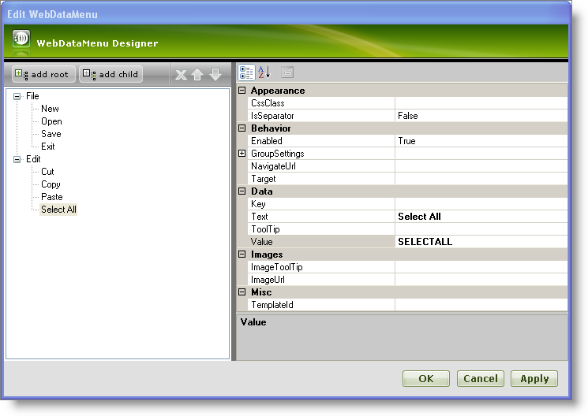
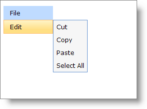

////

|metadata|
{
    "name": "webdatamenu-getting-started-with-webdatamenu",
    "controlName": ["WebDataMenu"],
    "tags": ["Getting Started","Navigation"],
    "guid": "{A1F29E0D-EC26-4028-8223-3E3641DC2F9D}",  
    "buildFlags": [],
    "createdOn": "0001-01-01T00:00:00Z"
}
|metadata|
////

= Getting Started with WebDataMenu

WebDataMenu™ allows you to manually add items using its rich user interface designer. You can customize each item using the WebDataMenu Designer where you set the appearance, behavior and various other properties.

== To add items to WebDataMenu using the Designer :

[start=1]
. From the Visual Studio™ Toolbox, drag and drop the ScriptManager Component and the WebDataMenu control onto your WebForm.
[start=2]
. In the property window, locate the WebDataMenu control’s Items property and click the ellipsis (…) button to launch the WebDataMenu Designer. You can also launch the designer by clicking Edit Items in the WebDataMenu smart tag.
[start=3]
. In the Edit WebDataMenu dialog, click the add root button. This will add a new root item to the items collection. Set the following properties :

[options="header", cols="a,a"]
|====
|Text|Value

|File
|FILE

|====

[start=4]
. Select the item that we just created and click the add child button. This will add a child item to the root item. Set the following properties :

[options="header", cols="a,a"]
|====
|Text|Value

|New
|NEW

|====

Repeat the same to add the following as child items :

[options="header", cols="a,a"]
|====
|Text|Value

|Open
|OPEN

|Save
|SAVE

|Exit
|EXIT

|====

[start=5]
. Add the following as root item and child items as shown in the steps 3 and 4 :

*Root Item :*

[options="header", cols="a,a"]
|====
|Text|Value

|Edit
|EDIT

|====

*Child Items :*

[options="header", cols="a,a"]
|====
|Text|Value

|Cut
|CUT

|Copy
|COPY

|Paste
|PASTE

|Select All
|SELECTALL

|====

[start=6]
. At this point, the Edit WebDataMenu dialog should look like this:

[start=7]
. Click Apply and OK to close the WebDataMenu Designer.
[start=8]
. Save and run your application. Your WebDataMenu should look similar to the following image :

