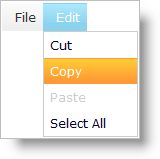

////

|metadata|
{
    "name": "webdatamenu-menu-item-states",
    "controlName": ["WebDataMenu"],
    "tags": [],
    "guid": "{37F8BF49-D4CE-4BAA-8C04-333C74312284}",  
    "buildFlags": [],
    "createdOn": "0001-01-01T00:00:00Z"
}
|metadata|
////

= Menu Item States

WebDataMenu™ can have items with different states that are indicated by different visual styles and individually customizable using the Infragistics® Application Styling Framework. The following are the different states that a single menu item can have:

* *Focused/Activated Item :* -- When the end-user clicks on an item or navigates using the keyboard and hits the Enter key, the menu item gets activated. Upon click, a menu item will be activated as well as selected. If a menu item is activated by the end-user using the keyboard and presses the Enter key, then the item becomes selected;the menu item’s corresponding events will fire.
* *Selected Item :* -- When the end-user clicks on a menu item, the item is selected however if the Enter key is pressed on an item, the item is selected and activated. If navigation is performed using the keyboard and the SPACEBAR key is pressed, then the item is selected, but not activated.
* *Hovered Item (Hot Tracking) :* -- When the end-user hovers the mouse over an item, the hover style is applied on that item. At this state, the item is neither selected nor activated.
* *Disabled Item :* -- If the end-user tries to navigate to a disabled item, the navigation skips over that item. No hover, selection or activation style is applied on that item.

.Note:
[NOTE]
====
Disabled items cannot be selected or activated.
====

This screenshots illustrates some of the states: selected item is in blue, hovered item is in orange.

