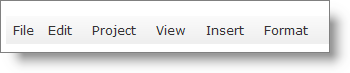
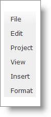
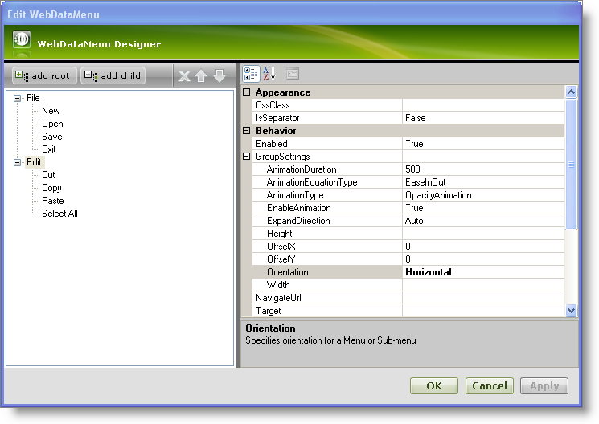
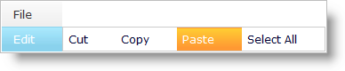

////

|metadata|
{
    "name": "webdatamenu-orientation",
    "controlName": ["WebDataMenu"],
    "tags": [],
    "guid": "{40985087-F1F8-465B-ADF1-628C081673EF}",  
    "buildFlags": [],
    "createdOn": "0001-01-01T00:00:00Z"
}
|metadata|
////

= Orientation

WebDataMenu™ can be oriented horizontally or vertically by setting the  pick:[asp-net="link:infragistics4.web.v{ProductVersion}~infragistics.web.ui.navigationcontrols.datamenugroupsettings.html[DataMenuGroupSettings]"]  object’s  pick:[asp-net="link:infragistics4.web.v{ProductVersion}~infragistics.web.ui.navigationcontrols.datamenugroupsettings~orientation.html[Orientation]"]  property to Vertical or Horizontal. By default, this property is set to Vertical.

The Orientation property can be set using the Microsoft® Visual Studio® Property Window (expand the  pick:[asp-net="link:infragistics4.web.v{ProductVersion}~infragistics.web.ui.navigationcontrols.webdatamenu~groupsettings.html[GroupSettings]"]  property to set the Orientation property) or by using the following code :

*In Visual Basic:*

----
WebDataMenu1.GroupSettings.Orientation = Infragistics.Web.UI.NavigationControls.Orientation.Horizontal
----

*In C#:*

----
WebDataMenu1.GroupSettings.Orientation = Infragistics.Web.UI.NavigationControls.Orientation.Horizontal;
----

*Horizontal Orientation :*

*Vertical Orientation :*

You can also configure WebDataMenu to have a complex orientation, which means you can set the orientation of one item to be horizontal and another item to be vertical.

The following steps shows how to set a different orientation for different items in the WebDataMenu by setting the  pick:[asp-net="link:infragistics4.web.v{ProductVersion}~infragistics.web.ui.navigationcontrols.datamenugroupsettings~orientation.html[Orientation]"]  property on the item level. This overrides the Orientation property that is set on the control level.

[start=1]
. From the Visual Studio™ Toolbox, drag and drop a ScriptManager component and a WebDataMenu control onto the form.
[start=2]
. Add items to WebDataMenu as shown in the link:webdatamenu-getting-started-with-webdatamenu.html[Getting Started with WebDataMenu] topic .
[start=3]
. Select the Edit item in the WebDataMenu designer and expand the  pick:[asp-net="link:infragistics4.web.v{ProductVersion}~infragistics.web.ui.navigationcontrols.webdatamenu~groupsettings.html[GroupSettings]"]  property. Set the Orientation property to Horizontal from the drop-down list. Your WebDataMenu designer now looks similar to the following image:

[start=4]
. Click Apply and OK to close the WebDataMenu Designer.
[start=5]
. Save and run your application. You will observe that orientation of root items and child items under the File item is vertical but the orientation of child items under the Edit item is horizontal similar to the following image:

