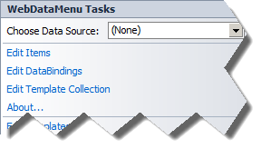
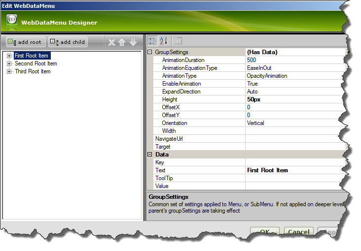
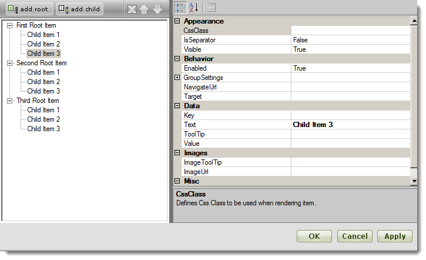
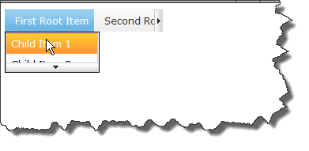

////

|metadata|
{
    "name": "webdatamenu-scrolling-about",
    "controlName": ["WebDataMenu"],
    "tags": ["Getting Started"],
    "guid": "5df496be-498e-4b92-91f8-221000b8fae7",  
    "buildFlags": [],
    "createdOn": "2010-10-01T15:11:21.6862135Z"
}
|metadata|
////

= Scrolling

link:infragistics4.web.v{ProductVersion}~infragistics.web.ui.navigationcontrols.webdatamenu.html[WebDataMenu] now supports Scrolling – which allows you to scroll through the menu items when they do not fit in the browser viewport. Scrolling is supported for both Horizontal and Vertical menus. The feature is always enabled by default. If you want to disable it, set the link:infragistics4.web.v{ProductVersion}~infragistics.web.ui.navigationcontrols.webdatamenu~enablescrolling.html[EnableScrolling] property to false.

The following use cases can be targeted with the link:infragistics4.web.v{ProductVersion}~infragistics.web.ui.navigationcontrols.webdatamenu~enablescrolling.html[EnableScrolling] property:

* link:infragistics4.web.v{ProductVersion}~infragistics.web.ui.navigationcontrols.webdatamenu~enablescrolling.html[EnableScrolling] – False

** If there is height/width set, the scroll container will clip the contents outside the area and no buttons will be shown. If the content is bigger than the screen it will be shown as is and the page will have scrollbars.

* link:infragistics4.web.v{ProductVersion}~infragistics.web.ui.navigationcontrols.webdatamenu~enablescrolling.html[EnableScrolling] – True

** If there is height/width set in the link:infragistics4.web.v{ProductVersion}~infragistics.web.ui.navigationcontrols.webdatamenu~groupsettings.html[GroupSettings] then it will be obeyed, and scroll buttons will be shown if the content is bigger than the height/width specified. If height/width is bigger than screen size, content is fit in the page. Width is applied only when the menu group has horizontal orientation. Height is applied only when the menu group has vertical orientation.
** If there is no height or width set for the group of menu items or if content is bigger than the screen area then content will be fit in the page and scroll buttons will be shown.

The link:infragistics4.web.v{ProductVersion}~infragistics.web.ui.navigationcontrols.webdatamenu~scrollingspeed.html[ScrollingSpeed] property can be used to control how fast the scrollable area will be moved. It has five values that the developer can specify. If you click while scrolling on the scroll button the speed accelerates. The default value for ScrollingSpeed is Normal. Scrolling speed is calculated depending on several variables:
** Pixels to scroll – how many pixels are moved per time.
** Scrolls per time – defines how fast we scroll for a certain period of time (in milliseconds).
** Per items factor – the speed adjusts depending on the number of items. For example, having Normal speed for 100 items will be actually slower when having Normal speed for 1000 items.

In 10.2 the control opens menu items on hover and they close after unhover. The control is not active and does not steal the focus from input fields, for example.

In 10.3 we have added a new property, link:infragistics4.web.v{ProductVersion}~infragistics.web.ui.navigationcontrols.webdatamenu~activateonhover.html[ActivateOnHover]. When the control is hovered it will receive the focus and open the menu items. When the control is unhovered the focus will be returned to the element on the page it was taken from.

Using this property the following scenarios can be achieved:

*** link:infragistics4.web.v{ProductVersion}~infragistics.web.ui.navigationcontrols.webdatamenu~activateonhover.html[ActivateOnHover] is True – the menu keeps track of the currently focused element. Once the menu is hovered over, it takes focus and expands. Keyboard navigation is also possible at this point. If none of the menu items is clicked and mouse is moved out of the menu (unhover) the menu collapses and returns the focus to the previously focused element. If the menu is clicked after expanding, when the mouse is moved out, the menu collapses and the focus goes to the body of the page.
*** link:infragistics4.web.v{ProductVersion}~infragistics.web.ui.navigationcontrols.webdatamenu~activateonhover.html[ActivateOnHover] is False – the top level menu items are only highlighted on hover - without expanding. A mouse click or tabbing in is required to set the focus on the menu and expand the first level submenu. Then keyboard navigation becomes possible. When the mouse is moved away from the menu (unhover) the menu stays opened until the user clicks outside of it or hits the Esc key. This scenario is useful when you want the menu to work as a desktop menu. Usually desktop menus require a click to focus and then start opening. It is also useful when the menu has a lot of items with combination of EnableScrolling set to False. This way the menu will stay opened and you will be able to scroll the page with the page scrollbars and access the items that are out of the visible screen area.

The next example is designed to get you up and running as quickly as possible by describing the basic steps required for running the WebDataMenu Scrolling feature. Make sure you have Infragistics 2010.3 installed on your machine and follow the next steps to create website with WebDataMenu control added with enabled scrolling.

[start=1]
. Open Visual Studio $$->$$ New $$->$$ WebSite.
[start=2]
. Add new aspx page.
[start=3]
. From toolbox of Visual Studio drag and drop WebDataMenu control on the page surface.
[start=4]
. Again from the toolbox drag and drop ASP.NET ScriptManager on the page.
[start=5]
. Switch to Design view.
[start=6]
. You can click on the tooltip of WebDataMenu and select Edit Items:

[start=7]
. In the next window you have to add root items in the menu. Add three of them and change their Text properties as follows – First Root Item, Second Root Item and Third Root Item:

[start=8]
. On every root item, set, in GroupSettings, Height property to 50px.
[start=9]
. For each of the root items, add three children and name them as follows: Child Item1, Child Item2 and Child Item3.

[start=10]
. Click *OK.*
[start=11]
. Add <GroupSettings Orientation=”Horizontal” Width=”150px” /> as shown in the image below. Setting this width will fix the scrollable area to be exactly 150 pixels. This means that when the menu items take more than 150px width (in a horizontal menu), scroll buttons will be shown.
[start=12]
. When you switch to Source View you will see the following markup generated:

*In HTML:*

----
        <ig:WebDataMenu ID="WebDataMenu1" runat="server">
            <GroupSettings Orientation="Horizontal" Width="150px" /><!--Manually added-->
            <Items>
                <ig:DataMenuItem Text="First Root Item ">
                    <Items>
                        <ig:DataMenuItem Text="Child Item 1">
                        </ig:DataMenuItem>
                        <ig:DataMenuItem Text="Child Item 2">
                        </ig:DataMenuItem>
                        <ig:DataMenuItem Text="Child Item 3">
                        </ig:DataMenuItem>
                    </Items>
                    <GroupSettings Height="50px" />
                </ig:DataMenuItem>
                <ig:DataMenuItem Text="Second Root Item">
                    <Items>
                        <ig:DataMenuItem Text="Child Item 1">
                        </ig:DataMenuItem>
                        <ig:DataMenuItem Text="Child Item 2">
                        </ig:DataMenuItem>
                        <ig:DataMenuItem Text="Child Item 3">
                        </ig:DataMenuItem>
                    </Items>
                    <GroupSettings Height="50px" />
                </ig:DataMenuItem>
                <ig:DataMenuItem Text="Third Root Item">
                    <Items>
                        <ig:DataMenuItem Text="Child Item 1">
                        </ig:DataMenuItem>
                        <ig:DataMenuItem Text="Child Item 2">
                        </ig:DataMenuItem>
                        <ig:DataMenuItem Text="Child Item 3">
                        </ig:DataMenuItem>
                    </Items>
                    <GroupSettings Height="50px" />
                </ig:DataMenuItem>
            </Items>
        </ig:WebDataMenu>
----

[start=13]
. When you run the web site and hover over the “First Root Item” you should see the following menu:

Since we added Height of 50px to the group settings object on the “First Root Item”, we see that the children of “First Root Item” take exactly 50 pixels and scrolling is in place. The same is valid for the root level items to which we set 150 pixels of width.