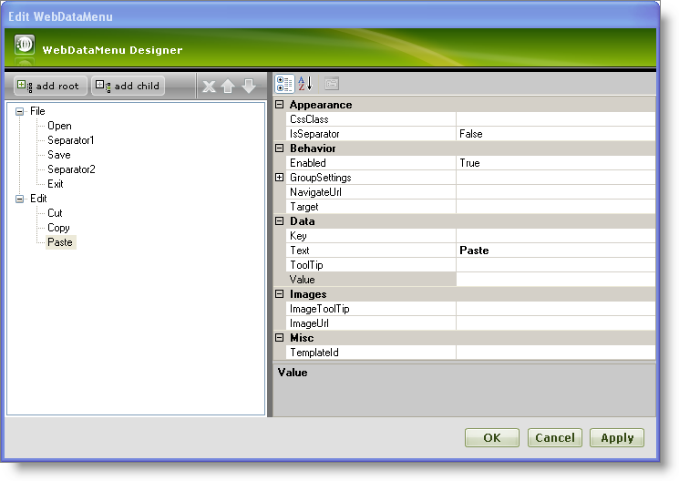
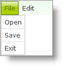

////

|metadata|
{
    "name": "webdatamenu-separators",
    "controlName": ["WebDataMenu"],
    "tags": [],
    "guid": "{BCD3BCF7-5B1C-4341-B35B-C7C82D4FD4AF}",  
    "buildFlags": [],
    "createdOn": "0001-01-01T00:00:00Z"
}
|metadata|
////

= Separators

WebDataMenu™ can have menu- items that can be rendered as a separator by simply setting the  pick:[asp-net="link:infragistics4.web.v{ProductVersion}~infragistics.web.ui.navigationcontrols.datamenuitem.html[DataMenuItem]"]  object’s  pick:[asp-net="link:infragistics4.web.v{ProductVersion}~infragistics.web.ui.navigationcontrols.datamenuitem~isseparator.html[IsSeparator]"]  property to True.

.Note:
[NOTE]
====
When a menu-item’s IsSeparator property is set to True, all other properties are ignored and the item will be rendered as a separator.
====

== To render menu-item as a separator :

[start=1]
. From the Visual Studio™ Toolbox, drag and drop the ScriptManager Component and the WebDataMenu control onto your WebForm.
[start=2]
. Add menu-items to the WebDataMenu through the designer as shown in the following image:

For more information on how to add menu-items to WebDataMenu, see the link:webdatamenu-getting-started-with-webdatamenu.html[Getting Started with WebDataMenu] topic.
[start=3]
. Set the IsSeparator property of Separator1 and Separator2 items to True.
[start=4]
. Click Apply and OK to close the designer.
[start=5]
. The designer generate the following code in the mark-up:

*In HTML:*

----
   <ig:WebDataMenu ID="WebDataMenu1" runat="server">
        <Items>
            <ig:DataMenuItem Text="File">
                <Items>
                    <ig:DataMenuItem Text="Open">
                    </ig:DataMenuItem>
                    <ig:DataMenuItem IsSeparator="True">
                    </ig:DataMenuItem>
                    <ig:DataMenuItem Text="Save">
                    </ig:DataMenuItem>
                    <ig:DataMenuItem IsSeparator="True">
                    </ig:DataMenuItem>
                    <ig:DataMenuItem Text="Exit">
                    </ig:DataMenuItem>
                </Items>
            </ig:DataMenuItem>
            <ig:DataMenuItem Text="Edit">
                <Items>
                    <ig:DataMenuItem Text="Cut">
                    </ig:DataMenuItem>
                    <ig:DataMenuItem Text="Copy">
                    </ig:DataMenuItem>
                    <ig:DataMenuItem Text="Paste">
                    </ig:DataMenuItem>
                </Items>
            </ig:DataMenuItem>
        </Items>
    </ig:WebDataMenu>
----

[start=6]
. Save and run your application. You will observe separators between Open and Save and also between Save and Exit similar to the following image:

