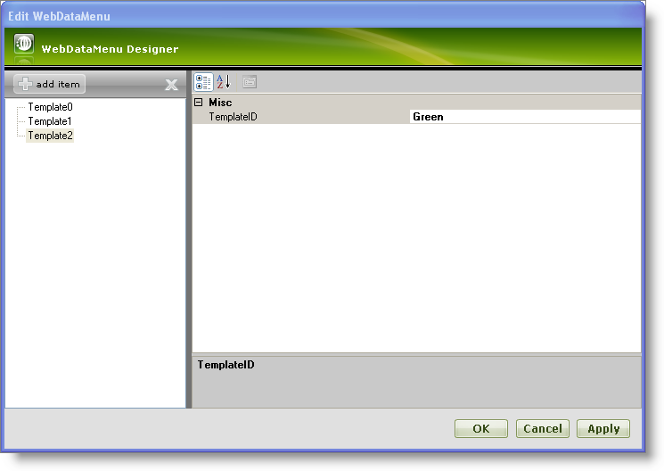
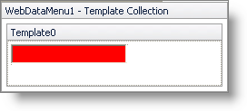
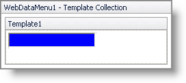
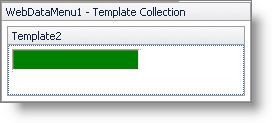
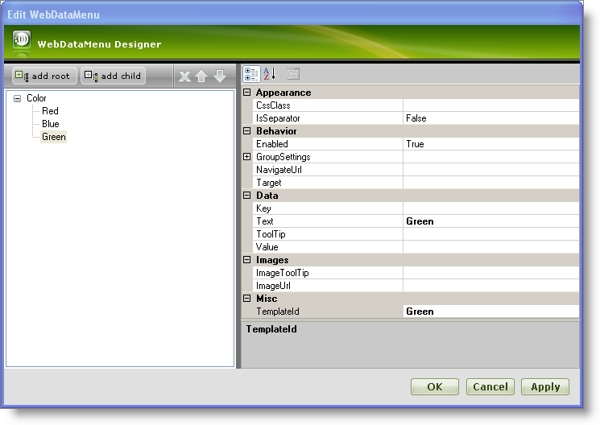
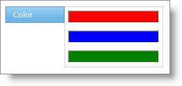

////

|metadata|
{
    "name": "webdatamenu-templating",
    "controlName": ["WebDataMenu"],
    "tags": ["Templating"],
    "guid": "{EE59BDFC-1ABD-45FB-A0A9-EBA1E6461B3E}",  
    "buildFlags": [],
    "createdOn": "0001-01-01T00:00:00Z"
}
|metadata|
////

= Templating

WebDataMenu™ supports templating , which allows you to define an item template that can be used to customize the appearance of menu items. The item template can be defined using the  pick:[asp-net="link:{ApiPlatform}web{ApiVersion}~infragistics.web.ui.navigationcontrols.navcontrol~itemtemplate.html[ItemTemplate]"]  property. The following template methods are supported :

* An individual item can have a specific template associated with it.
* A collection of templates can be created and you can assign templates from this collection to individual items.
* A base template can be created that will be applied to each item in WebDataMenu.

The following steps will teach you how to assign templates to individual items using the templates collection. WebDataMenu™ allows assigning templates to individual items easily through its advanced UI designer. With templating you can customize each individual item’s look and feel depending on your requirements.

[start=1]
. From the Visual Studio™ Toolbox, drag and drop a ScriptManager component and a WebDataMenu control onto the form.
[start=2]
. Click the WebDataMenu control’s smart tag and select Edit Template Collection. This will open the WebDataMenu designer, where you can add new templates.
[start=3]
. Click add item to add new templates to the template collection. Add four templates Template0,Template1,Template2; set their  pick:[asp-net="link:{ApiPlatform}web{ApiVersion}~infragistics.web.ui.itemtemplate~templateid.html[TemplateID]"]  property to Red,Blue and Green respectively. Your WebDataMenu now looks similar to the following image :

[start=4]
. Click Apply and OK to close the WebDataMenu designer.
[start=5]
. In this step, the templates are edited as shown below:

** Click the WebDataMenu control’s smart tag and select Edit Templates. This will show the WebDataMenu in Template Editing Mode.
** Click the WebDataMenu control’s smart tag and select the Template0 from the drop-down list to edit Template0\.
** Drag and drop a standard TextBox from the toolbox onto the Template0 area and set the BackColor property to Red.
** Your WebDataMenu now looks similar to the following image in design mode :

Similarly, edit templates Template1 and Template2 to have a standard TextBox with the BackColor property set to Blue and Green respectively as shown in the following images :

*Template1 :*

*Template2 :*

[start=6]
. Now click the smart tag and select End Template Editing to close the template editing mode of WebDataMenu.
[start=7]
. Add a root item and set its Text property to Color; similarly, add three child items and set their  pick:[asp-net="link:{ApiPlatform}web{ApiVersion}~infragistics.web.ui.navigationcontrols.navitem~text.html[Text]"]  property to Red, Blue and Green. For more information on how to add items, see the link:webdatamenu-getting-started-with-webdatamenu.html[Getting Started with WebDataMenu] topic. Set the  pick:[asp-net="link:{ApiPlatform}web{ApiVersion}~infragistics.web.ui.navigationcontrols.navitem~templateid.html[TemplateId]"]  property of Red , Blue and Green items to Red, Blue and Green respectively.
[start=8]
. Your WebDataMenu Designer now looks similar to the following image :

[start=9]
. Click Apply and OK to close the WebDataMenu Designer.
[start=10]
. Save and run your application. Your WebDataMenu now looks similar to the following image as you hover the mouse over the Color item :

