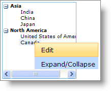

////

|metadata|
{
    "name": "webdatamenu-using-webdatamenu-as-context-menu-on-webdatatree-node",
    "controlName": ["WebDataMenu"],
    "tags": [],
    "guid": "{70C58367-9CA9-4145-95D9-19C6DA3ED035}",  
    "buildFlags": [],
    "createdOn": "0001-01-01T00:00:00Z"
}
|metadata|
////

= Using WebDataMenu as Context menu on WebDataTree Node

== Before You Begin

WebDataMenu™ can also be used as a context menu so that your end-user will see a customized pop-up menu just by right-clicking on the page content or by clicking on some other control. This feature can be enabled on WebDataMenu by simply setting the control’s  pick:[asp-net="link:{ApiPlatform}web{ApiVersion}~infragistics.web.ui.navigationcontrols.webdatamenu~iscontextmenu.html[IsContextMenu]"]  property to True.

In this walkthrough, WebDataMenu is used as pop-up menu on the WebDataTree™ control’s nodes providing the options to edit, expand and collapse nodes.

== What You Will Accomplish

You will learn how to use WebDataMenu as a context menu on WebDataTree nodes.

== Follow these Steps

[start=1]
. From the Visual Studio™ Toolbox, drag and drop a ScriptManager component, a WebDataMenu control and a WebDataTree control onto the form.
[start=2]
. Add two items to WebDataMenu with the following properties :

[options="header", cols="a,a"]
|====
|Text|Key

|Edit
|EDIT

|Expand/Collapse
|ExpandCollapse

|====

For more information on how to add items to WebDataMenu, see the link:webdatamenu-getting-started-with-webdatamenu.html[Getting Started with WebDataMenu] topic.
[start=3]
. Add nodes to WebDataTree as shown in the link:webdatamenu-getting-started-with-webdatamenu.html[Getting Started with WebDataMenu] topic.
[start=4]
. Add the following javascript functions “WebDataMenu1_ItemClick” and “WebDataTree1_NodeClick” for the ItemClick client-side event of WebDataMenu and NodeClick client-side event of WebDataTree respectively :

*In JavaScript:*

----
        //Global variable to hold the node that was last clicked   
        var lastNode = null;
        // The client event ‘ItemClick’ takes two parameters sender and e
        // sender  is the object which is raising the event
        // e is the DataMenuItemCancelEventArgs 
        function WebDataMenu1_ItemClick(sender, e) {
           //Get the Key of the menu item that was clicked
            switch (e.getItem().get_key()) {
                case "EDIT":
                    if (lastNode != null) {
                        //Gets reference to the WebDataTree
                        var tree = $find("WebDataTree1");
                        if (tree != null) {
                            //Gets the nodeEditing object
                            var nodeEditing = tree.getNodeEditing();
                            //Enters into node editing mode
                            nodeEditing.enterNodeEditing(lastNode);
                        }
                    }
                    break;
                case "ExpandCollapse":
                    if (lastNode != null)
                        //Changes the Expanded state of the node to the   opposite value
                        // from what it is currently. If the node is expanded, then it will be 
                        //collapsed. If the node is collapsed, it will be expanded. 
                        lastNode.toggle(true, true);
                    break;
            }
        }
        // The client event ‘ValueChanging’ takes two parameters sender and e
        // sender  is the object which is raising the event
        // e is the DataTreeNodeEventArgs 
        function WebDataTree1_NodeClick(sender, e) {
            lastNode = e.getNode();
            //Gets reference to the WebDataMenu
            var menu = $find("WebDataMenu1");
            if (menu != null && e.get_browserEvent() != null && e.get_browserEvent().button == 2)
            //The showAt method takes three parameters x,y,browserEvent (optional).
            //x -- X axis position for absolute positioning of menu
            //y -- Y axis position for absolute positioning of menu
            //browserEvent --  auto positioning based on browser event   
            menu.showAt(null, null, e.get_browserEvent());
        }
----

In the above code, when a node is right clicked the WebDataTree1_NodeClick event is fired and the pop-up menu appears. Then when an item in the menu is clicked the WebDataMenu1_ItemClick event fires and takes the appropriate action on the node depending on the key of the menu item that was clicked.
[start=5]
. Save and run your application. You will observe a pop-up menu as soon as a node is right clicked similar to the following image :

