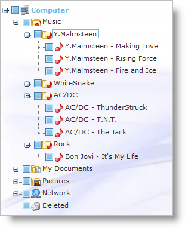

////

|metadata|
{
    "name": "webdatatree-about-webdatatree",
    "controlName": ["WebDataTree"],
    "tags": [],
    "guid": "{70012192-FAF1-4664-A19A-C42FE41083ED}",  
    "buildFlags": [],
    "createdOn": "0001-01-01T00:00:00Z"
}
|metadata|
////

= About WebDataTree

WebDataTree™ is a control that can be used to display hierarchical data, represented by expandable tree nodes. WebDataTree is built using the Infragistics ASP.NET AJAX Framework to leverage a proven code base that promotes a high performance and responsive end-user experience. You can find WebDataTree in the  pick:[asp-net="link:{ApiPlatform}web{ApiVersion}~infragistics.web.ui.navigationcontrols_namespace.html[Infragistics.Web.UI.NavigationControls]"]  namespace.

WebDataTree includes integrated design-time tools in the form of an advanced Designer UI. This design-time utility helps you to quickly and easily set up the control depending on your requirements, providing access to a wide range of functionality without requiring intensive coding.

Like all Infragistics ASP.NET AJAX controls, WebDataTree seamlessly integrates into the Infragistics® Application Styling Framework. With CSS based properties, you can manually customize the WebDataTree by leveraging your existing style sheets.

WebDataTree also exposes a robust object model within the client-side JavaScript programming environment. The client-side object model (CSOM) consists of full-fledged properties and methods that enable developers to program significant units of functionality without the need for server-side postbacks.

Some of the WebDataTree control’s features include :

* *High-Performance* -- Lightweight markup and optimized code improve performance.
* *Powerful Data Binding* -- Allows the developer to connect it to a data source and auto- generate the tree node structure.
* *Navigation* -- Offers the end user several different ways to navigate through the nodes, both using the mouse and the keyboard.
* *Load-on-demand* -- Allows WebDataTree to handle very large amounts of data without incurring any loss in performance.
* *Node Selection* -- Supports different selection modes either using the keyboard and/or the mouse.
* *Node Editing* -- Allows the end-user to edit the node content if node editing is enabled.
* *Node Templating* -- Allows custom node rendering by inserting arbitrary ASP.NET and HTML content into the node template.

This screenshot illustrates WebDataTree used to represent file system hierarchy.

