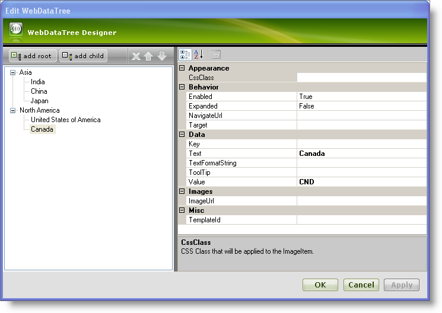
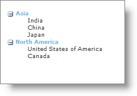

////

|metadata|
{
    "name": "webdatatree-getting-started-with-webdatatree",
    "controlName": ["WebDataTree"],
    "tags": ["Getting Started"],
    "guid": "{1F259CE0-8234-4ED7-A605-720FBFF000D5}",  
    "buildFlags": [],
    "createdOn": "0001-01-01T00:00:00Z"
}
|metadata|
////

= Getting Started with WebDataTree

WebDataTree™ allows you to manually add nodes using its rich user interface designer. You can customize each node using the WebDataTree Designer where you set the appearance, behavior and various other properties.

*To add nodes to WebDataTree using the Designer :*

[start=1]
. From the Visual Studio™ Toolbox, drag and drop the ScriptManager Component and a WebDataTree control onto your WebForm.
[start=2]
. In the property window, locate the Nodes property and click the ellipsis (…) button to launch the WebDataTree Designer. You can also launch the designer by clicking Edit Nodes in the WebDataTree smart tag.
[start=3]
. In the Edit WebDataTree dialog, click the add root button. This will add a new root node to the nodes collection. Set the following properties:

[options="header", cols="a,a"]
|====
|Text|Value

|Asia
|ASIA

|====

[start=4]
. Select the node that we just created and click the add child button. This will add a child node to the root node. Set the following properties :

[options="header", cols="a,a"]
|====
|Text|Value

|India
|IND

|====

Repeat the same to add the following as child nodes:

[options="header", cols="a,a"]
|====
|Text|Value

|China
|CHN

|Japan
|JPN

|====

[start=5]
. Add the following as root node and child nodes as shown in the steps 3 and 4: Root node:

[options="header", cols="a,a"]
|====
|Text|Value

|North America
|NORTHAMERICA

|====

Child nodes:

[options="header", cols="a,a"]
|====
|Text|Value

|United States of America
|USA

|Canada
|CND

|====

[start=6]
. At this point, the Edit WebDataTree dialog should look like this:

[start=7]
. Click OK to close the WebDataTree Designer.
[start=8]
. Save and run the application. Your WebDataTree should look like this:

