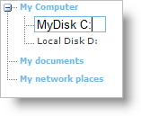

////

|metadata|
{
    "name": "webdatatree-node-editing",
    "controlName": ["WebDataTree"],
    "tags": [],
    "guid": "{A80BA311-D39B-4183-962B-BA4612680A20}",  
    "buildFlags": [],
    "createdOn": "0001-01-01T00:00:00Z"
}
|metadata|
////

= Node Editing

WebDataTree™ allows the end-user to edit nodes if the node editing feature is enabled. The selected node enters edit mode if the end-user presses the F2 keyboard key or if the end-user double clicks the node. Pressing the Enter key will end editing and confirms the new value whereas pressing the Escape key will discard any changes on the node. By default, the node editing feature is disabled in WebDataTree.

The node editing feature in WebDataTree can be enabled by setting the  pick:[asp-net="link:{ApiPlatform}web{ApiVersion}~infragistics.web.ui.navigationcontrols.datatreenodeediting.html[DataTreeNodeEditing]"]  object’s  pick:[asp-net="link:{ApiPlatform}web{ApiVersion}~infragistics.web.ui.navigationcontrols.datatreenodeediting~enabled.html[Enabled]"]  property to True. Setting the DataTreeNodeEditing object’s  pick:[asp-net="link:{ApiPlatform}web{ApiVersion}~infragistics.web.ui.navigationcontrols.datatreenodeediting~enableondoubleclick.html[EnableOnDoubleClick]"]  and  pick:[asp-net="link:{ApiPlatform}web{ApiVersion}~infragistics.web.ui.navigationcontrols.datatreenodeediting~enableonf2.html[EnableOnF2]"]  properties allows you to enter edit mode by double clicking and by pressing the F2 key on a tree node. You can set these properties either by expanding the WebDataTree control’s  pick:[asp-net="link:{ApiPlatform}web{ApiVersion}~infragistics.web.ui.navigationcontrols.webdatatree~nodeediting.html[NodeEditing]"]  property in the Visual Studio® Property Window or by using the following code :

*In Visual Basic:*

----
    WebDataTree1.NodeEditing.Enabled = True
    WebDataTree1.NodeEditing.EnableOnDoubleClick = True
    WebDataTree1.NodeEditing.EnableOnF2 = True
----

*In C#:*

----
    WebDataTree1.NodeEditing.Enabled = True;
    WebDataTree1.NodeEditing.EnableOnDoubleClick = True;
    WebDataTree1.NodeEditing.EnableOnF2 = True;
----

*In Javascript:*

----
    var treeNodeEditing = $util.findControl("WebDataTree1").getNodeEditing();
    treeNodeEditing.set_enabled(true);
    treeNodeEditing.set_enableOnF2(true);
    treeNodeEditing.set_enableOnDoubleClick(true);
----

Additionally each node object has the  pick:[asp-net="link:{ApiPlatform}web{ApiVersion}~infragistics.web.ui.navigationcontrols.datatreenode~editable.html[Editable]"]  property which can be set to override the control’s global editing property. This property can be set to Off/On/Auto to disable/enable/use the parent tree node editing setting and has high priority over the Enabled property. By default, this property is set to Auto.

*In HTML:*

----
   <ig:WebDataTree ID="WebDataTree1" runat="server" Height="500px" Width="300px" 
        EnableConnectorLines="true">
        <Nodes>
            <ig:DataTreeNode Text="My Computer">
                <Nodes>
                    <ig:DataTreeNode Editable="On" Text="Local Disk C:">
                    </ig:DataTreeNode>
                    <ig:DataTreeNode Editable="On" Text="Local Disk D:">
                    </ig:DataTreeNode>
                </Nodes>
            </ig:DataTreeNode>
            <ig:DataTreeNode Text="My documents">
            </ig:DataTreeNode>
            <ig:DataTreeNode Text="My network places">
            </ig:DataTreeNode>
        </Nodes>
        <NodeEditing EnableOnDoubleClick="true" EnableOnF2="true" />
    </ig:WebDataTree>
----

