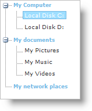
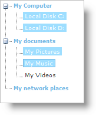
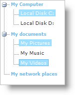

////

|metadata|
{
    "name": "webdatatree-node-selection",
    "controlName": ["WebDataTree"],
    "tags": ["Selection"],
    "guid": "{AB2C00CF-A016-4BDF-A768-B6296C45BF5D}",  
    "buildFlags": [],
    "createdOn": "0001-01-01T00:00:00Z"
}
|metadata|
////

= Node Selection

The WebDataTree™ control supports different types of node selection. Selection can be made either using the keyboard and/or the mouse.You can determine the type of selection on WebDataTree, by setting the control’s  pick:[asp-net="link:{ApiPlatform}web{ApiVersion}~infragistics.web.ui.navigationcontrols.webdatatree~selectiontype.html[SelectionType]"]  property.The following are the different type of selections you can set using the SelectionType property :

* *None* -- Nodes cannot be selected using the UI.
* *Single* -- Only one node can be selected.
* *Multiple* -- Multiple nodes can be selected.

.Note:
[NOTE]
====
By default, SelectionType property is set to None.
====

You can set the SelectionType property either using the Microsoft® Visual Studio® Property Window or by using the following code :

*In Visual Basic:*

----
WebDataTree1.SelectionType = Infragistics.Web.UI.NavigationControls.NodeSelectionTypes.Multiple
----

*In C#:*

----
WebDataTree1.SelectionType = Infragistics.Web.UI.NavigationControls.NodeSelectionTypes.Multiple;
----

*In HTML:*

----
<ig:WebDataTree ID="WebDataTree1" runat="server" Height="500px" Width="300px" 
      SelectionType="Multiple">
</ig:WebDataTree>
----

*In Javascript:*

----
// 0-None, 1-Single, 2-multiple selection
$util.findControl("WebDataTree1").set_selectionType(2);
----

== Single selection

Using single selection, only one tree node can be selected. When using the mouse, the end-user can select a node by simply clicking the left mouse button on a tree node which makes it active and selected. When using the keyboard, the end-user activates and selects a node using the ARROW keys.

== Multiple selection

The multiple selection in WebDataTree is divided into two subtypes :

* *Continuous* -- In this type, a range of nodes are selected. The range is selected by the end-user by selecting a start node and then selecting the end node while simultaneously holding the SHIFT key. All the nodes between the start and end nodes will be added to the selected nodes collection. This selection can also be achieved using the keyboard by selecting the nodes with the ARROW keys while simultaneously holding the SHIFT key.

* *Extended* -- In this type, non-continuous tree nodes are selected. The end-user selects the nodes by clicking on the nodes with the left mouse button while simultaneously holding the CTRL key. Clicking on already selected nodes will unselect the nodes . This selection can also be achieved using the keyboard by navigating the nodes using the ARROW keys and selecting /unselecting the node by pressing the SPACE key while simultaneously holding the CTRL key.

