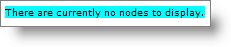
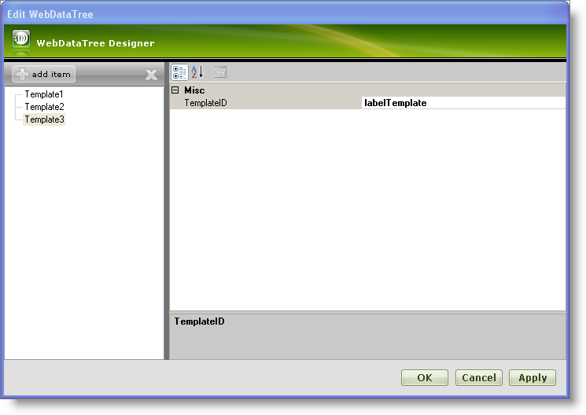
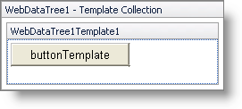
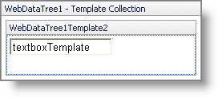
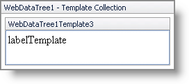
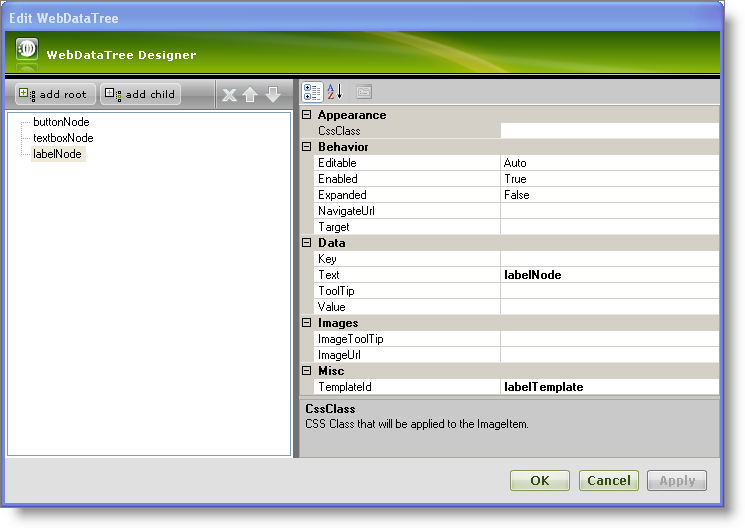
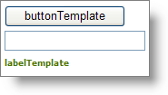

////

|metadata|
{
    "name": "webdatatree-node-templating",
    "controlName": ["WebDataTree"],
    "tags": ["Templating"],
    "guid": "{BEF107E2-B9C2-4B4E-9ED3-57826B9D2B0A}",  
    "buildFlags": [],
    "createdOn": "0001-01-01T00:00:00Z"
}
|metadata|
////

= Node Templating

WebDataTree™ supports node templating allowing you to customize the node rendering by inserting arbitrary ASP.NET and HTML content into the node. The following templating methods are supported:

* An individual node can have a specific template associated with it.
* A collection of templates can be created and you can assign templates from this collection to individual nodes.
* A base template can be created that will be applied to each node in WebDataTree.

WebDataTree also allows you to display a pre-defined message when no nodes exist in the WebDataTree control. For instance , you may want to show a message to the end-user when the WebDataTree controls’s node collection is empty and no data source is bound to it. You can achieve this by including the message you want to display inside the NoNodesTemplate tags.

[start=1]
. From the Visual Studio™ Toolbox, drag and drop a ScriptManager component and a WebDataTree control onto the form.
[start=2]
. In the source code, include the following code between the WebDataTree tags to show the pre-defined message using the  pick:[asp-net="link:{ApiPlatform}web{ApiVersion}~infragistics.web.ui.navigationcontrols.webdatatree~nonodestemplate.html[NoNodesTemplate]"]  tags.

*In HTML :*

----
     <NoNodesTemplate>
        

            There are currently no nodes to display.
        
  
      </NoNodesTemplate>
----

[start=3]
. Save and run your application. Your WebDataTree now displays a message similar to the following image:

In the top of this topic are listed all the methods for customizing nodes that WebDataTree supports. WebDataTree allows assigning templates to individual nodes easily through its advanced UI designer. With templating you can customize each individual node object’s look and feel depending on your requirements. With the next steps, you will learn how to assign templates to individual nodes using the templates collection.

[start=1]
. From the Visual Studio™ Toolbox, drag and drop a ScriptManager component and a WebDataTree control onto the form.
[start=2]
. Click the WebDataTree control’s smart tag and select Edit Template Collection. This will open the WebDataTree designer, where you can add new templates.
[start=3]
. Click add item to add new templates to the template collection. Add three templates Template1,Template2, and Template3;set their  pick:[asp-net="link:{ApiPlatform}web{ApiVersion}~infragistics.web.ui.itemtemplate~templateid.html[TemplateID]"]  property to buttonTemplate, textboxTemplate, and labelTemplate respectively. Your WebDataTree Designer now looks similar to the following image:

[start=4]
. Click Apply and then OK to close the designer.
[start=5]
. In this step, the templates are edited as shown below:

** Click the WebDataTree control’s smart tag and select Edit Templates. This will show the WebDataTree in Template Editing Mode.
** Click the WebDataTree control’s smart tag and select the WebDataTree1Template1 from the drop-down list to edit Template1.
** Drag and drop a standard button from the toolbox onto the WebDataTree1Template1 area and set the Text property of the button to buttonTemplate.
** Your WebDataTree now looks similar to the following image in design mode :

Similarly, edit templates Template2 and Template3 to have a standard TextBox with the Text property set to textboxTemplate and a standard Label with the Text property set to labelTemplate respectively. In design mode, Template2 and Template3 look similar to the following images:

*Template2 :*

*Template3 :*

[start=6]
. Now click the smart tag and select End Template Editing to close the template editing mode of WebDataTree.
[start=7]
. Add three nodes buttonNode, textboxNode, labelNode to the WebDataTree and set their  pick:[asp-net="link:{ApiPlatform}web{ApiVersion}~infragistics.web.ui.navigationcontrols.navitem~templateid.html[TemplateId]"]  property to buttonTemplate, textboxTemplate and labelTemplate respectively. For more information on how to add nodes, see the link:webdatatree-getting-started-with-webdatatree.html[Getting Started with WebDataTree] topic.
[start=8]
. Your WebDataTree Designer now looks similar to the following image :

[start=9]
. Click OK to close the designer.
[start=10]
. Save and run your application. You WebDataTree now looks similar to the following image:

