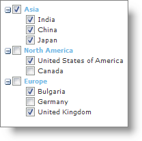
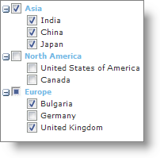

////

|metadata|
{
    "name": "webdatatree-using-checkboxes-in-webdatatree",
    "controlName": ["WebDataTree"],
    "tags": [],
    "guid": "{B0DAFB26-2DB8-4193-A6CA-1C0BDB3EBD30}",  
    "buildFlags": [],
    "createdOn": "0001-01-01T00:00:00Z"
}
|metadata|
////

= Using CheckBoxes in WebDataTree

WebDataTree™ allows using checkboxes to determine whether the child nodes under a root node are all checked or some are checked without even expanding the nodes. For instance, you may want to present a work breakdown structure where you would like to allow the project manager to easily visualize which sub-hierarchy of tasks are completed and which are partially completed without even diving deep into the hierarchy. The checkbox feature in the WebDataTree mainly operates in the following two different states :

* *Bi-State* -- In this state, the checkbox offers two different states: checked and unchecked. In checked state, the root node is checked if all its child nodes are also checked; however in the unchecked state, the root node is unchecked if some or all of its child nodes are unchecked similar to the following image:

You can use checkboxes in bi-state by setting the WebDataTree control’s  pick:[asp-net="link:infragistics4.web.v{ProductVersion}~infragistics.web.ui.navigationcontrols.webdatatree~checkboxmode.html[CheckBoxMode]"]  property to BiState. By default, this property is set to Off. You can set the CheckBoxMode property either using the Microsoft® Visual Studio® Property Window or by using the following code:

*In Visual Basic:*

----
WebDataTree1.CheckBoxMode = Infragistics.Web.UI.CheckBoxMode.BiState
----

*In C#:*

----
WebDataTree1.CheckBoxMode = Infragistics.Web.UI.CheckBoxMode.BiState;
----

*In HTML:*

----
<ig:WebDataTree ID="WebDataTree1" runat="server" Height="500px" Width="300px" 
    CheckBoxMode="BiState">    
</ig:WebDataTree>
----

* *Tri-State* -- In this state, the checkbox offers three different states: checked, unchecked and partial. In checked state, the root node is checked if all its child nodes are checked. In the unchecked state, the root node is unchecked if all of its child nodes are unchecked. In the partial state, the root node has some of its child nodes unchecked similar to the following image :

You can use checkboxes in tri-state by setting the WebDataTree control’s CheckBoxMode property to TriState.

*In Visual Basic:*

----
WebDataTree1.CheckBoxMode = Infragistics.Web.UI.CheckBoxMode.TriState
----

*In C#:*

----
WebDataTree1.CheckBoxMode = Infragistics.Web.UI.CheckBoxMode.TriState;
----

*In HTML:*

----
<ig:WebDataTree ID="WebDataTree1" runat="server" Height="500px" Width="300px" 
     CheckBoxMode="TriState">    
</ig:WebDataTree>
----