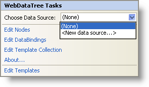

////

|metadata|
{
    "name": "webdatatree-webdatatree-smart-tag",
    "controlName": ["WebDataTree"],
    "tags": ["Design Environment"],
    "guid": "{050EFDD1-A541-445C-91CD-3C537FFE2164}",  
    "buildFlags": [],
    "createdOn": "0001-01-01T00:00:00Z"
}
|metadata|
////

= WebDataTree Smart Tag

In Visual Studio 2005/2008 (.NET Framework 2.0/3.5), each Infragistics ASP.NET control/component is equipped with a Smart Tag. By selecting the control/component, a Smart Tag anchor appears. When you click this anchor, a pop-up panel appears, providing you with quick and easy access to the most common properties and settings of the control/component.

The WebDataTree™ Smart Tag contains the following items:

* Choose Data Source -- Allows you to choose an existing data source or configure a data source to bind to WebDataTree.

The WebDataTree Smart Tag contains the following links:

* Edit Nodes – Brings up the Edit WebDataTree dialog for adding , removing nodes and setting their properties.
* Edit DataBindings -- Brings up the Edit WebDataTree dialog to manage the data bindings of the control.
* Edit Template Collection -- Links to the template collection editor to add/remove templates that you can use in WebDataTree.
* About -- Clicking this opens the WebDataTree product information. It contains information such as Status, Version, Expiration and Product Key.
* Edit Templates -- Clicking this brings up all the available templates you can edit. You can drag and drop controls onto the templates and edit them as you like.

See the table below for a description of the item, as well as the item's corresponding property in the properties grid.

[options="header", cols="a,a,a"]
|====
|Items|Description|CorrespondingProperty

|Choose Data Source
|The drop-down list allows you to select an existing data source or configure a new data source.
|*DataSourceID*

|====