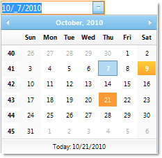

////

|metadata|
{
    "name": "webdatepicker-about-webdatepicker",
    "controlName": ["WebDatePicker"],
    "tags": ["Getting Started","Selection"],
    "guid": "{EDB230B7-D133-4FAA-BE76-AB42BFF4986B}",  
    "buildFlags": [],
    "createdOn": "2009-04-06T11:26:34Z"
}
|metadata|
////

= About WebDatePicker

WebDatePicker™ is a control that provides a date editor along with a drop-down calendar and provides various appearance and behavior based properties. WebDatePicker is built using the Infragistics ASP.NET AJAX Framework to leverage a proven code base that promotes a high performance and responsive end-user experience. You can find WebDatePicker in the  pick:[asp-net="link:{ApiPlatform}web{ApiVersion}~infragistics.web.ui.editorcontrols_namespace.html[Infragistics.Web.UI.EditorControls]"]  namespace.

Like all Infragistics ASP.NET AJAX controls, WebDatePicker seamlessly integrates into the Infragistics® Application Styling Framework. With CSS based properties you can manually customize the WebDatePicker by leveraging your existing style sheets.

WebDatePicker also exposes a robust model within the client-side Javascript programming environment. The client-side object model (CSOM) consists of full-fledged properties and methods that enable developers to program significant units of functionality without the need of server-side postbacks.

Some of the WebDatePicker control’s features include:

* *High-Performance* -- Lightweight markup and optimized code improve performance.
* *Spin Buttons* -- End-users can easily spin through a list of values.
* *Standard Validators support* -- Supports ASP.NET validator controls.
* *Min and Max values* -- You can easily specify the allowable range of dates/times that can be entered into the editor.
* *ReduceDayOnInvalidDate* -- If the end-user enters a value which is greater than the maximum day in the month, then the value can be automatically reduced.
* *ShowPatternOnFocus* -- In edit mode, the displayed string (input pattern) can be built dynamically with cut-off prompts and literal characters on the right side of the caret.
* *SelectionOnFocus* -- You can set different selection types for whenever entering edit mode.
* *Culture* -- You can set the CultureInfo object used by the control for localized formatting.
* *Custom drop-down Calendar* -- A custom drop-down calendar can be set to the control to use.
* *UseLastGoodDate* -- Ability to automatically use the last good date value when the control loses focus and has invalid values of date fields.
* *YearToFillCentury* -- Autofills year field to the 20th or 21st century, if only 1 or 2 digits are entered by the end-user.
* *EnsureSharedCalendar* -- Ensures you that the shared default calendar is created and added to form.
* *FindSharedCalendar* -- Allows you to find the reference to the shared drop-down calendar.