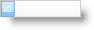

////

|metadata|
{
    "name": "webdatepicker-using-custom-button-in-webdatepicker",
    "controlName": ["WebDatePicker"],
    "tags": ["How Do I","Styling"],
    "guid": "{22ACA8D2-DBA8-49E2-B77C-D09258523D6B}",  
    "buildFlags": [],
    "createdOn": "0001-01-01T00:00:00Z"
}
|metadata|
////

= Using Custom Button in WebDatePicker

WebDatePicker™ allows you to have a customized button mainly to raise client and server events. These events can be used to implement custom actions like showing alerts, dialogs, and drop-downs or perform validations, raise postbacks etc. You can display the custom button on the left or on the right by simply setting the  pick:[asp-net="link:{ApiPlatform}web{ApiVersion}~infragistics.web.ui.editorcontrols.texteditorbuttons~custombuttondisplay.html[CustomButtonDisplay]"]  property. By default, the custom button is displayed on the right. A list of key actions that trigger the custom button click event can be set by using the control's  pick:[asp-net="link:{ApiPlatform}web{ApiVersion}~infragistics.web.ui.editorcontrols.texteditorbuttons~custombuttonhotkeys.html[CustomButtonHotKeys]"]  property.

*In Visual Basic:*

----
WebDatePicker1.Buttons.CustomButtonDisplay = Infragistics.Web.UI.EditorControls.ButtonDisplay.OnLeft
----

*In C#:*

----
WebDatePicker1.Buttons.CustomButtonDisplay = Infragistics.Web.UI.EditorControls.ButtonDisplay.OnLeft;
----

You can also set various properties like text, images, tooltip for the custom button by using the  pick:[asp-net="link:{ApiPlatform}web{ApiVersion}~infragistics.web.ui.editorcontrols.texteditorbuttons~custombutton.html[CustomButton]"]  property.

*In Visual Basic:*

----
WebDatePicker1.Buttons.CustomButton.Text = "IG"
----

*In C#:*

----
WebDatePicker1.Buttons.CustomButton.Text = "IG";
----

