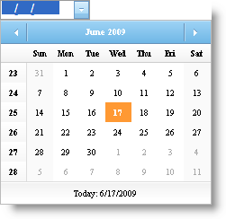

////

|metadata|
{
    "name": "webdatepicker-using-webmonthcalendar-as-webdatepickers-dropdown-calendar",
    "controlName": ["WebDatePicker"],
    "tags": ["Patterns and Practices","Styling","Tips and Tricks"],
    "guid": "{79518DF7-8E85-47E3-B83A-C236AE8AA8B3}",  
    "buildFlags": [],
    "createdOn": "0001-01-01T00:00:00Z"
}
|metadata|
////

= Using WebMonthCalendar as WebDatePicker's Drop-Down Calendar

WebDatePicker™ comes equipped with a standard drop-down calendar control to allow your end-user to pick dates when editing data. However, if you wanted to provide your end-users with a more robust, feature-rich drop-down calendar, WebDatePicker allows you to use WebMonthCalendar™ as its drop-down calendar. You can associate WebMonthCalendar to WebDatePicker in one of two ways:

* *Controls exist in same container* -- When both controls exist in the same container, you can set the WebDatePicker control’s  pick:[asp-net="link:infragistics4.web.v{ProductVersion}~infragistics.web.ui.editorcontrols.webdatepicker~dropdowncalendarid.html[DropDownCalendarID]"]  property to the WebMonthCalendar control’s link:http://msdn.microsoft.com/query/dev10.query?appId=Dev10IDEF1&l=EN-US&k=k(System.Web.UI.Control.ID)&rd=true[ID] property.
* *Controls exist in different containers* If one control exists in a different container than the other control, you can set the WebDatePicker control’s DropDownCalendarID property to the WebMonthCalendar control’s link:http://msdn.microsoft.com/query/dev10.query?appId=Dev10IDEF1&l=EN-US&k=k(System.Web.UI.Control.ClientID)&rd=true[ClientID] property instead so that WebDatePicker can find the correct instance of WebMonthCalendar. In this case, you should also ensure the following style attributes for the WebMonthCalendar:

display:none;

visibility:hidden;

.Note:
[NOTE]
====
It is not recommended to set the DropDownCalendarID property after the Page_Load event.
====

== To set WebMonthCalendar as the WebDatePicker control’s drop-down calendar

[start=1]
. From the Microsoft® Visual Studio® Toolbox, drag and drop a ScriptManager component, a WebDatePicker control and a WebMonthCalendar control onto the form.
[start=2]
. Customize the WebMonthCalendar depending on your requirements. For this example, enable the week numbers for WebMonthCalendar.

*In Visual Basic:*

----
WebMonthCalendar1.EnableWeekNumbers = true
----

*In C#:*

----
WebMonthCalendar1.EnableWeekNumbers = true;
----

[start=3]
. Set the WebDatePicker control’s DropDownCalendarID property to the WebMonthCalendar control’s Id property either through the Microsoft® Visual Studio® Property Window, or by using the following code:

*In Visual Basic:*

----
WebDatePicker1.DropDownCalendarID = WebMonthCalendar1.ID
----

*In C#:*

----
WebDatePicker1.DropDownCalendarID = WebMonthCalendar1.ID;
----

[start=4]
. Run the application and you will observe the WebMonthCalendar as the WebDatePicker control’s drop-down calendar.

