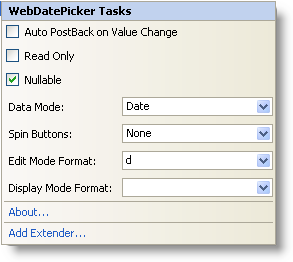

////

|metadata|
{
    "name": "webdatepicker-webdatepicker-smart-tag",
    "controlName": ["WebDatePicker"],
    "tags": ["Design Environment"],
    "guid": "{F0810714-729D-4ED5-B2AE-634B7A16C423}",  
    "buildFlags": [],
    "createdOn": "2009-04-06T11:27:17Z"
}
|metadata|
////

= WebDatePicker Smart Tag

In Visual Studio 2005/2008 (.NET Framework 2.0/3.5), each Infragistics ASP.NET control/component is equipped with a Smart Tag. By selecting the control/component, a Smart Tag anchor appears. When you click this anchor, a pop-up panel appears, providing you with quick and easy access to the most common properties and settings of the control/component.

The WebDatePicker™ Smart Tag contains the following items:

* Auto PostBack on Value Change -- Allows you to set auto postback options applied to ValueChanged event.
* Read Only -- Allows you to configure whether the end-user can edit the text of the control.
* Nullable -- Provides the ability to support null value and use System.Nullable for the Value property.
* Data Mode -- Allows you to set the type of object to wrap the value in the editor.
* Spin Buttons -- Allows you to set the visibility and location of the spin buttons.
* Edit Mode Format -- Allows you to set the format of date used for edit mode when control gains focus.
* Display Mode Format -- Allows you to set the format of date used to display when the control loses focus.

The WebDatePicker Smart Tag contains the following links:

* About -- Clicking this opens the WebDatePicker product information. It contains information such as Status, Version, Expiration and Product Key.
* Add Extender -- Clicking this will bring up a dialog that shows all of the control extenders that can be used with the WebDatePicker.

See the table below for a description of the item, as well as the item's corresponding property in the properties grid.

[options="header", cols="a,a,a"]
|====
|Items|Description|CorrespondingProperty

|Auto PostBack On Value Change
|Gets/Sets auto postback options applied to the ValueChanged event.
|*ValueChanged (AutoPostBackFlags)*

|Read Only
|Gets/Sets the ability for the end-user to edit the text of the control.
|*ReadOnly*

|Nullable
|Gets/Sets the ability to support null value and use System.Nullable for the Value property.
|*Nullable*

|Data Mode
|Gets/Sets the type of object that is used to wrap the Value property.
|*DataMode*

|Spin Buttons
|Gets/Sets the visibility and location of spin buttons.
|*SpinButtonsDisplay (Buttons)*

|Edit Mode Format
|Gets/Sets the format of date used for edit mode when the control has input focus.
|*EditModeFormat*

|Display Mode Format
|Gets/Sets the format of date used for display mode when the control does not have input focus.
|*DisplayModeFormat*

|====