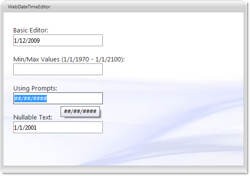

////

|metadata|
{
    "name": "webdatetimeeditor-about-webdatetimeeditor",
    "controlName": ["WebDateTimeEditor"],
    "tags": ["Editing","Getting Started"],
    "guid": "{6E9E8424-1880-4C6B-9DF2-B048120E048F}",  
    "buildFlags": [],
    "createdOn": "2009-04-06T17:04:59Z"
}
|metadata|
////

= About WebDateTimeEditor

WebDateTimeEditor™ is an editor control which allows date/time editing functionality and provides various appearance and behavior based properties. WebDateTimeEditor is built using the Infragistics ASP.NET AJAX Framework to leverage a proven code base that promotes a high performance and responsive end-user experience. You can find WebDateTimeEditor in the  pick:[asp-net="link:infragistics4.web.v{ProductVersion}~infragistics.web.ui.editorcontrols_namespace.html[Infragistics.Web.UI.EditorControls]"]  namespace.

Like all Infragistics ASP.NET AJAX controls, WebDateTimeEditor seamlessly integrates into the Infragistics® Application Styling Framework. With CSS based properties you can manually customize the WebDateTimeEditor by leveraging your existing style sheets.

WebDateTimeEditor also exposes a robust model within the client-side Javascript programming environment. The client-side object model (CSOM) consists of full-fledged properties and methods that enable developers to program significant units of functionality without the need of server-side postbacks.

Some of the WebDateTimeEditor control’s features include:

* *High-Performance* -- Lightweight markup and optimized code improve performance.
* *Spin Buttons* -- End-users can easily spin through a list of values.
* *Standard Validators support* -- Supports ASP.NET validator controls.
* *Min and Max values* -- You can easily specify the allowable range of dates/times that can be entered into the editor.
* *ReduceDayOnInvalidDate* -- If the end-user enters a value which is greater than the maximum day in the month, then the value can be automatically reduced.
* *ShowPatternOnFocus* -- In edit mode, the displayed string (input pattern) can be built dynamically with cut-off prompts and literal characters on the right side of the caret.
* *SelectionOnFocus* -- You can set different selection types for whenever entering edit mode.
* *Culture* -- You can set the CultureInfo object used by the control for localized formatting.