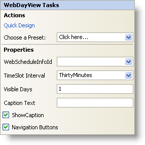

////
|metadata|
{
    "name": "webdayview-smart-tag",
    "controlName": ["WebSchedule"],
    "tags": ["Design Environment","Scheduling"],
    "guid": "{97A0794C-E9CF-4A1C-BF16-2F4E40F01758}",
    "buildFlags": [],
    "createdOn": "2005-04-11T00:00:00Z"
}
|metadata|
////

////

|metadata|
{
    "name": "webdayview-smart-tag",
    "controlName": ["WebSchedule"],
    "tags": ["Design Environment","Scheduling"],
    "guid": "{97A0794C-E9CF-4A1C-BF16-2F4E40F01758}",  
    "buildFlags": [],
    "createdOn": "2005-04-11T00:00:00Z"
}
|metadata|
////

= WebDayView Smart Tag

In Visual Studio 2005 (.NET Framework 2.0), each Infragistics ASP.NET control/component is equipped with a Smart Tag. By simply selecting the control/component, a Smart Tag anchor appears. When you click this anchor, a pop-up panel appears, providing you with quick and easy access to the most common properties and settings of the control/component.

The WebDayView™ Smart Tag contains the following sections:

* Actions -- Lets you perform common tasks (i.e., accessing the Quick Designer and loading presets).
* Properties -- Provides easy access to common properties such as Visible Days.

See below for a description of the item (e.g., field, drop-down list, checkbox) in each section, as well as the item's corresponding property in the properties grid.

[options="header", cols="a,a,a"]
|====
|Actions|Description|CorrespondingProperty

|Quick Design
|Click Quick Design to access the Quick Designer. This is the same functionality as if you right-clicked on the control and selected Quick Design from the context menu.
|n/a

|Choose a Preset
|Click the "Click here" link and quickly select a preset for UltraWebTab. This is the same functionality as if you opened the Quick Designer, expanded Presets, and clicked on Manage Presets.
|n/a

|====

[options="header", cols="a,a,a"]
|====
|Properties|Description|CorrespondingProperty

|WebScheduleInfoID
|Each view in WebSchedule requires a WebScheduleInfo to function properly. If you already have a WebScheduleInfo on your web form, then it will be visible in the WebScheduleInfoID drop-down.
| pick:[asp-net="link:{ApiPlatform}webui.webschedule{ApiVersion}~infragistics.webui.webschedule.webscheduleviewbase~webscheduleinfo.html[WebScheduleInfoID]"] 

|TimeSlot Interval
|The WebDayView is divided into intervals of time. The default interval is thirty minutes; therefore, you see two sections of time between each hour.
| pick:[asp-net="link:{ApiPlatform}webui.webschedule{ApiVersion}~infragistics.webui.webschedule.webdayview~timeslotinterval.html[TimeSlotInterval]"] 

|Visible Days
|This property determines how many days you want to show in the WebDayView. You can show a maximum of 14 days and a minimum of one day.
| pick:[asp-net="link:{ApiPlatform}webui.webschedule{ApiVersion}~infragistics.webui.webschedule.webdayview~visibledays.html[VisibleDays]"]

|====

= WebDayView Smart Tag

In Visual Studio 2005 (.NET Framework 2.0), each Infragistics ASP.NET control/component is equipped with a Smart Tag. By simply selecting the control/component, a Smart Tag anchor appears. When you click this anchor, a pop-up panel appears, providing you with quick and easy access to the most common properties and settings of the control/component.

The WebDayView™ Smart Tag contains the following sections:

* Actions -- Lets you perform common tasks (i.e., accessing the Quick Designer and loading presets).
* Properties -- Provides easy access to common properties such as Visible Days.

See below for a description of the item (e.g., field, drop-down list, checkbox) in each section, as well as the item's corresponding property in the properties grid.

[options="header", cols="a,a,a"]
|====
|Actions|Description|CorrespondingProperty

|Quick Design
|Click Quick Design to access the Quick Designer. This is the same functionality as if you right-clicked on the control and selected Quick Design from the context menu.
|n/a

|Choose a Preset
|Click the "Click here" link and quickly select a preset for UltraWebTab. This is the same functionality as if you opened the Quick Designer, expanded Presets, and clicked on Manage Presets.
|n/a

|====

[options="header", cols="a,a,a"]
|====
|Properties|Description|CorrespondingProperty

|WebScheduleInfoID
|Each view in WebSchedule requires a WebScheduleInfo to function properly. If you already have a WebScheduleInfo on your web form, then it will be visible in the WebScheduleInfoID drop-down.
| link:{ApiPlatform}webui.webschedule{ApiVersion}~infragistics.webui.webschedule.webscheduleviewbase~webscheduleinfo.html[WebScheduleInfoID]

|TimeSlot Interval
|The WebDayView is divided into intervals of time. The default interval is thirty minutes; therefore, you see two sections of time between each hour.
| link:{ApiPlatform}webui.webschedule{ApiVersion}~infragistics.webui.webschedule.webdayview~timeslotinterval.html[TimeSlotInterval]

|Visible Days
|This property determines how many days you want to show in the WebDayView. You can show a maximum of 14 days and a minimum of one day.
| link:{ApiPlatform}webui.webschedule{ApiVersion}~infragistics.webui.webschedule.webdayview~visibledays.html[VisibleDays]

|Caption Text
|If you are showing a caption, this is where you can set the text for it.
| link:{ApiPlatform}webui.webschedule{ApiVersion}~infragistics.webui.webschedule.webdayview~captionheadertext.html[CaptionHeaderText]

|Show Caption
|Clicking the check box will cause the caption to be visible.
| link:{ApiPlatform}webui.webschedule{ApiVersion}~infragistics.webui.webschedule.webscheduleviewbase~captionheadervisible.html[CaptionHeaderVisible]

|Navigation Buttons
|This option will show or hide the month navigation buttons at the top of the calendar.
| link:{ApiPlatform}webui.webschedule{ApiVersion}~infragistics.webui.webschedule.webscheduleviewbase~navigationbuttonsvisible.html[NavigationButtonsVisible]

|Caption Text
|If you are showing a caption, this is where you can set the text for it.
| pick:[asp-net="link:{ApiPlatform}webui.webschedule{ApiVersion}~infragistics.webui.webschedule.webdayview~captionheadertext.html[CaptionHeaderText]"] 

|Show Caption
|Clicking the check box will cause the caption to be visible.
| pick:[asp-net="link:{ApiPlatform}webui.webschedule{ApiVersion}~infragistics.webui.webschedule.webscheduleviewbase~captionheadervisible.html[CaptionHeaderVisible]"] 

|Navigation Buttons
|This option will show or hide the month navigation buttons at the top of the calendar.
| pick:[asp-net="link:{ApiPlatform}webui.webschedule{ApiVersion}~infragistics.webui.webschedule.webscheduleviewbase~navigationbuttonsvisible.html[NavigationButtonsVisible]"] 

|====