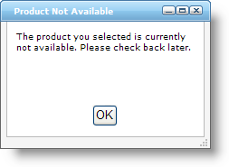
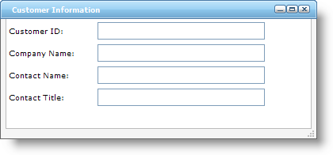

////

|metadata|
{
    "name": "webdialogwindow-about-webdialogwindow",
    "controlName": ["WebDialogWindow"],
    "tags": ["How Do I"],
    "guid": "{C3B2E1AE-55FE-4172-96C1-2EEFD29C669E}",  
    "buildFlags": [],
    "createdOn": "0001-01-01T00:00:00Z"
}
|metadata|
////

= About WebDialogWindow

The WebDialogWindow™ control is able to bypass several pop-up blockers in modern browser by displaying as a simple 
 section in your web page, but appearing as a pop-up window. WebDialogWindow allows you to easily add dialog box functionality to any web application. The WebDialogWindow's content area, being a 
 itself, can contain any HTML or ASP.NET object. You can display WebDialogWindow as either a modal or non-modal dialog box.

WebDialogWindow seamlessly integrates into the Infragistics Application Styling framework. With CSS based properties, you can manually customize the WebDialogWindow control by leveraging your existing style sheets.

== WebDialogWindow supports the following features:

* *Modal/Non-Modal Modes* - WebDialogWindow allows you to set whether the control displays as modal or non-modal. Choosing the right mode can control the flow of your application and guarantee an action from your end user when you need one.
* *Header* - WebDialogWindow displays a header area, which can contain text as well as several buttons including close, minimize, and maximize to control the dialog window.
* *Resizing* - When necessary, your end user can resize WebDialogWindow at run time.
* *Location* - You can either manually set WebDialogWindow's start location or allow it to display automatically in the center of your application.
* *Window State* - Your end user can minimize or maximize WebDialogWindows, or you can hide it from your end user altogether.