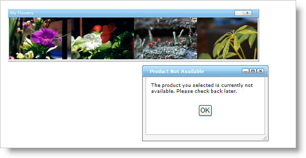

////

|metadata|
{
    "name": "webdialogwindow-displaying-the-webdialogwindow-client-side",
    "controlName": ["WebDialogWindow"],
    "tags": ["Events"],
    "guid": "{F289D506-9953-43F8-8C18-A1D743137151}",  
    "buildFlags": [],
    "createdOn": "0001-01-01T00:00:00Z"
}
|metadata|
////

= Displaying the WebDialogWindow Client Side

== Before You Begin

The WebDialogWindow™ control can display a notification in response to a user's action. Using the WebDialogWindow Client-Side Object Model, you can easily respond to user's actions while providing prompt feedback. For example, if a user selected a sold-out product from a collection of products, you might need to display a notification to inform that customer that the item they have selected is sold out.

== What You Will Accomplish

You will learn how to display the WebDialogWindow control using the client-side object model. You will create a dialog box that will display informative text and a close button. The dialog box displays when the end user selects a specific image from WebImageViewer.

== Follow these Steps:

[start=1]
. Create a new ASP.NET AJAX-Enabled Web Site. When Visual Studio creates the new Web Site, ensure that it places an instance of ScriptManager on the WebForm (added by default).
[start=2]
. Ensure that Infragistics Application Styling is enabled for the application. For information on how to do this, see link:web-enabling-application-styling-using-the-web-config-file.html[Enabling Application Styling Using the web.config File].
[start=3]
. Add a WebImageViewer control to the WebForm. You will need a few images in WebImageViewer, see link:webimageviewer-getting-started-with-the-webimageviewer.html[Getting Started with the WebImageViewer] for more information.
[start=4]
. Place a WebDialogWindow on the form
[start=5]
. Place an HTML Table inside the WebDialogWindow's content area
[start=6]
. Change the HTML table to contain only two rows and one column.
[start=7]
. Place an ASP.NET Label in the top row of the HTML table.
[start=8]
. Set the Label's Text property to "The product you have selected is currently not available. Please check back later.".
[start=9]
. Place an HTML Button in the second row of the HTML table.
[start=10]
. Set the Value property to "OK", and set the ID property to "btnDialogWindow".
[start=11]
. In Source view, navigate to the HTML table inside the WebDialogWindow control.
[start=12]
. Modify the <TD> tag surrounding the Button input so it matches the following code example.

*In HTML:*

----
<td align="center" valign="middle">
        ...
</td>
----

[start=13]
. On the HTML button's input, create the onclick property and set it to "javascript:btnDialogWindow_onClick()". You will define this JavaScript function later in the Walkthrough.
[start=14]
. In Design view, select the WebDialogWindow control.
[start=15]
. Locate the WebDialogWindow control's  pick:[asp-net="link:infragistics4.web.v{ProductVersion}~infragistics.web.ui.layoutcontrols.webdialogwindow~header.html[Header]"]  property, and expand it. Find the Header property's  pick:[asp-net="link:infragistics4.web.v{ProductVersion}~infragistics.web.ui.layoutcontrols.layoutheader~captiontext.html[CaptionText]"]  property and set it to "Product Not Available Dialog".
[start=16]
. Set WebDialogWindow's  pick:[asp-net="link:infragistics4.web.v{ProductVersion}~infragistics.web.ui.layoutcontrols.webdialogwindow~initiallocation.html[InitialLocation]"]  property to Centered. If you wish, you can resize the dialog so it's only as large as its content.
[start=17]
. When the application first runs, you will want the WebDialogWindow control hidden - do this by setting the  pick:[asp-net="link:infragistics4.web.v{ProductVersion}~infragistics.web.ui.layoutcontrols.webdialogwindow~windowstate.html[WindowState]"]  property to Hidden.
[start=18]
. Create the WebImageViewer's ImageClick client-side event. For information on creating client-side events, see link:setting-up-a-client-side-event.html[Setting Up a Client Side Event].
[start=19]
. Inside the WebImageViewer's ImageClick event is where you can test the selected image's URL and decide if WebDialogWindow should display. The following code example demonstrates the ImageClick event.

.Note:
[NOTE]
====
You will need to modify this code to make it work with your image's URL.
====

*In JavaScript:*

----
function WebImageViewer1_ImageClick(sender, imageArgs){
        var imgSelected = imageArgs.getImageItem();
        if(imgSelected.get_imageUrl() == "./images/spikes.jpg")
        {
                var dialog = $find("WebDialogWindow1");
                dialog.show();
        }           
}
----

[start=20]
. Create a function called btnDialogWindow_onClick. This function is called when the user selects the OK button on the dialog box. This function will hide the dialog box. Use the following code to close the dialog box.

*In JavaScript:*

----
function btnDialogWindow_onClick(){
        var dialog = $find("WebDialogWindow1");
        dialog.hide();
}
----

[start=21]
. Build and run the application. When you click on the image of the sold-out product, the dialog box appears. Click the OK button to dismiss the dialog box.

