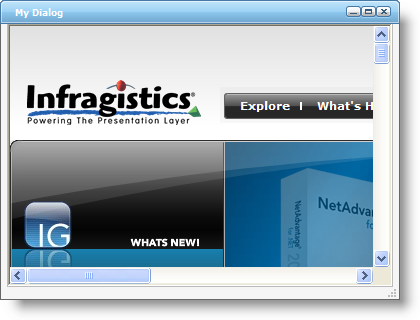

////

|metadata|
{
    "name": "webdialogwindow-getting-started-with-the-webdialogwindow",
    "controlName": ["WebDialogWindow"],
    "tags": ["Getting Started"],
    "guid": "{D9EAB48E-71EE-44EB-83F5-7C61FB6BB967}",  
    "buildFlags": [],
    "createdOn": "2008-12-01T21:00:19Z"
}
|metadata|
////

= Getting Started with the WebDialogWindow

== Before You Begin

The following steps will show you how to get started with WebDialogWindow™. You will complete a series of steps in order to become familiar with the control's object model.

*Assumptions for the following steps:*

* You have already created a new ASP.NET AJAX-Enabled Web Site named Getting_Started_with_the_WebDialogWindow.
* You have an ASP.NET Ajax ScriptManager instance on the WebForm.
* You have enabled the Infragistics Application Styling for this application and you are using the Default Style. For information on how to do this, see link:web-enabling-application-styling-using-the-web-config-file.html[Enabling Application Styling Using the web.config File].

== What You Will Accomplish

When you finish reading, you will have successfully created your first application that leverages the WebDialogWindow control.

== Follow these Steps:

[start=1]
. In the Visual Studio Toolbox, locate the WebDialogWindow control and double click it to get an instance on your WebForm.
[start=2]
. Click the WebDialogWindow control and in the Property Window, locate the  pick:[asp-net="link:infragistics4.web.v{ProductVersion}~infragistics.web.ui.layoutcontrols.webdialogwindow~header.html[Header]"]  property and expand it.
[start=3]
. Within the Header property, locate the  pick:[asp-net="link:infragistics4.web.v{ProductVersion}~infragistics.web.ui.layoutcontrols.layoutheader~captiontext.html[CaptionText]"]  property and set it to My Dialog.
[start=4]
. Scroll down and locate the  pick:[asp-net="link:infragistics4.web.v{ProductVersion}~infragistics.web.ui.layoutcontrols.layoutheader~maximizebox.html[MaximizeBox]"]  property and expand it. Set its Visible property to true.
[start=5]
. Scroll down and locate the  pick:[asp-net="link:infragistics4.web.v{ProductVersion}~infragistics.web.ui.layoutcontrols.layoutheader~minimizebox.html[MinimizeBox]"]  property and expand it. Set its Visible property to true.
[start=6]
. Now we can go back to the top most level of WebDialogWindow properties. Scroll down and locate the  pick:[asp-net="link:infragistics4.web.v{ProductVersion}~infragistics.web.ui.layoutcontrols.webdialogwindow~modal.html[Modal]"]  property and set it to true.
[start=7]
. Locate the  pick:[asp-net="link:infragistics4.web.v{ProductVersion}~infragistics.web.ui.layoutcontrols.webdialogwindow~resizer.html[Resizer]"]  property and expand it. Locate the  pick:[asp-net="link:infragistics4.web.v{ProductVersion}~infragistics.web.ui.layoutcontrols.resizer~enabled.html[Enabled]"]  property and set it to true.
[start=8]
. At this point, you can place content inside of the ContentPane's Template. This means you can drag and drop any control into this area, usually located towards the top of the WebDialogWindow control. Alternatively, you can also specify a URL which will allow you to show any resource within the ContentPane of the WebDialogWindow control.
[start=9]
. Now you can go back to the top most level of WebDialogWindow properties and locate the  pick:[asp-net="link:infragistics4.web.v{ProductVersion}~infragistics.web.ui.layoutcontrols.webdialogwindow~windowstate.html[WindowState]"]  property and set its value to Hidden.
[start=10]
. In this particular example, we will use a URL to show the main Infragistics web site within the dialog. Click the WebDialogWindow control and in the property window, locate and expand the  pick:[asp-net="link:infragistics4.web.v{ProductVersion}~infragistics.web.ui.layoutcontrols.webdialogwindow~contentpane.html[ContentPane]"]  property. Locate the  pick:[asp-net="link:infragistics4.web.v{ProductVersion}~infragistics.web.ui.layoutcontrols.contentpane~contenturl.html[ContentUrl]"]  property and set its value to http://www.infragistics.com

.Note:
[NOTE]
====
In order for WebDialogWindow to render IFrames with content, you must set the ContentURL property to a valid value, otherwis the IFrames will not render with the content. It will instead render as a content panel.
====

[start=11]
. Place a standard Button onto the WebForm.

.Note:
[NOTE]
====
You can also avoid a postback by placing an HTML button on the form. For more information on using WebDialogWindow's Client-Side Object Model to display the dialog window, see link:webdialogwindow-displaying-the-webdialogwindow-client-side.html[Displaying the WebDialogWindow Client Side].
====

[start=12]
. Click the Button control and in the property window, change the ID property to btnShow and then change the Text property to Show.
[start=13]
. Next double click the Button in order to add an event handler for its Click event. In the event handler, add the following code:

*In Visual Basic:*

----
Protected Sub btnShow_Click(ByVal sender As Object, _
  ByVal e As System.EventArgs) Handles btnShow.Click
	Select Case Me.WebDialogWindow1.WindowState
		Case Infragistics.Web.UI.LayoutControls.DialogWindowState.Hidden
			Me.WebDialogWindow1.WindowState = _
			  Infragistics.Web.UI.LayoutControls.DialogWindowState.Normal
	End Select
End Sub
----

*In C#:*

----
protected void btnShow_Click(object sender, EventArgs e)
{
	switch (this.WebDialogWindow1.WindowState)
	{
		case Infragistics.Web.UI.LayoutControls.DialogWindowState.Hidden:
			this.WebDialogWindow1.WindowState = 
			  Infragistics.Web.UI.LayoutControls.DialogWindowState.Normal;
			break;
	}
}
----

[start=14]
. Save and run the application. When the WebForm loads, click the Show button to make the WebDialogWindow control visible. The following image shows the WebForm with the WebDialogWindow that was just configured:

You can experiment by clicking the various button elements located at the top of WebDialogWindow.

* The Maximize button will cause WebDialogWindow to take the entire size of the Page.
* The Minimize button will cause WebDialogWindow to shrink down to a small size and then move towards the top left of the browser window.
* You can move the WebDialogWindow control by clicking and holding down the mouse button on the header and dragging it towards whichever position you require.
* You can also resize WebDialogWindow by clicking and dragging the Resizer element located towards the lower right hand side of the control.
* The Close button towards the top essentially hides the dialog from view.