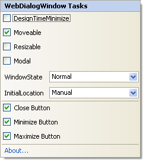

////

|metadata|
{
    "name": "webdialogwindow-smart-tag",
    "controlName": ["WebDialogWindow"],
    "tags": ["How Do I"],
    "guid": "{7246B970-EFF0-4803-A84F-2AB9B7B9C686}",  
    "buildFlags": [],
    "createdOn": "0001-01-01T00:00:00Z"
}
|metadata|
////

= WebDialogWindow Smart Tag

In Visual Studio 2005/2008 (.NET Framework 2.0/3.5), each Infragistics ASP.NET control/component is equipped with a Smart Tag. By simply selecting the control/component, a Smart Tag anchor appears. When you click this anchor, a pop-up panel appears, providing you with quick and easy access to the most common properties and settings of the control/component.

See the table below for a description of each item (e.g., field, drop-down list, checkbox) in the smart tag, as well as the item's corresponding property in the properties window.

[options="header", cols="a,a,a"]
|====
|Item|Description|Corresponding Property

|DesignTimeMinimize
|Selecting this check box will minimize the dialog window in the design-time editor. This property is only available at design time.
|DesignTimeMinimize

|Moveable
|Deselecting this check box will prevent your end user from moving the dialog window.
| pick:[asp-net="link:{ApiPlatform}web{ApiVersion}~infragistics.web.ui.layoutcontrols.webdialogwindow~moveable.html[Movable]"] 

|Resizable
|Selecting this check box will allow your end user to resize the dialog window.
| pick:[asp-net="link:{ApiPlatform}web{ApiVersion}~infragistics.web.ui.layoutcontrols.resizer~enabled.html[Resizer.Enabled]"] 

|Modal
|Selecting this check box will turn the dialog window into a modal dialog box.
| pick:[asp-net="link:{ApiPlatform}web{ApiVersion}~infragistics.web.ui.layoutcontrols.webdialogwindow~modal.html[Modal]"] 

|WindowState
|Select from the drop-down list whether you want the dialog window to be visible, minimized, maximized, or hidden when the page first loads.
| pick:[asp-net="link:{ApiPlatform}web{ApiVersion}~infragistics.web.ui.layoutcontrols.webdialogwindow~windowstate.html[WindowState]"] 

|InitialLocation
|Choose Centered from the drop-down list if you would like the dialog window to always appear in the center of the web page.
| pick:[asp-net="link:{ApiPlatform}web{ApiVersion}~infragistics.web.ui.layoutcontrols.webdialogwindow~initiallocation.html[InitialLocation]"] 

|Close Button
|Selecting this check box will display the close button to the right of the header area.
| pick:[asp-net="link:{ApiPlatform}web{ApiVersion}~infragistics.web.ui.layoutcontrols.restoredialogbutton~visible.html[Header.CloseBox.Visible]"] 

|Minimize Button
|Selecting this check box will display the minimize button to the right of the header area.
| pick:[asp-net="link:{ApiPlatform}web{ApiVersion}~infragistics.web.ui.layoutcontrols.restoredialogbutton~visible.html[Header.MinimizeBox.Visible]"] 

|Maximize Button
|Selecting this check box will display the maximize button to the right of the header area.
| pick:[asp-net="link:{ApiPlatform}web{ApiVersion}~infragistics.web.ui.layoutcontrols.restoredialogbutton~visible.html[Header.MaximizeBox.Visible]"] 

|====