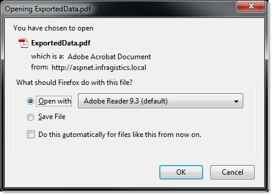

////

|metadata|
{
    "name": "webdocumentexporter-getting-started-with-webdocumentexporter",
    "controlName": ["WebDocumentExporter"],
    "tags": ["Exporting","Getting Started","Grids"],
    "guid": "0c0bd092-2e5f-4365-a495-67c325cbcda7",  
    "buildFlags": [],
    "createdOn": "2010-09-29T07:58:05.3227056Z"
}
|metadata|
////

= Getting Started with WebDocumentExporter

== What You Will Accomplish

You will learn how to set up and use WebDocumentExporter to export WebDataGrid / WebHierarchicalDataGrid data into a PDF or XPS document file format.

== Follow these steps:

[start=1]
. Bind the WebDataGrid retrieving data from Customers table of Northwind.
[start=2]
. Drag a WebDocumentExporter control from the Visual Studio Toolbox onto your page:

.. Set the WebDocumentExporter’s link:infragistics4.web.v{ProductVersion}~infragistics.web.ui.gridcontrols.baseexporter~exportmode.html[ExportMode] property to Download.
.. Set the control’s ID property to WebDocumentExporter.
.. Set the control’s link:infragistics4.web.v{ProductVersion}~infragistics.web.ui.gridcontrols.baseexporter~downloadname.html[DownloadName] property to “ExportedData”.

*In HTML:*

[source]
----
<ig:WebDocumentExporter  runat="server" ID="WebDocumentExporter"
----

[source]
----
ExportMode ="Download" DownloadName="ExportedData" />
----

.Note:
[NOTE]
====
by default, WebDocumentExporter exports the data in PDF document format. If you want to export in XPS document, you need to set the link:infragistics4.web.v{ProductVersion}~infragistics.web.ui.gridcontrols.webdocumentexporter~format.html[Format] property to XPS.
====

[start=3]
. Drag a Button control from Visual Studio Toolbox onto your page:

.. Set the button’s ID property to btnExport.
.. Set the control’s Text property to “Export Data”.
.. Set the control’s OnClick to “btnExport_Click”.
.. Define the “btnExport_Click” handler in the code-behind and call WebDocumentExporter's link:infragistics4.web.v{ProductVersion}~infragistics.web.ui.gridcontrols.webdocumentexporter~export.html[Export] method.

*In HTML:*

----
<asp:Button runat="server" ID="btnExport" Text="Export Data" OnClick="btnExport_Click" />
----

[cols="a"]
|====
|In Code Behind (C#):

|protected void btnExport_Click(object sender, EventArgs e) 

{ 

this.WebDocumentExporter.Export(this.whdgCustomers); 

}

|====

[start=4]
. Run the application.
[start=5]
. Click the “Export Data” button.

After clicking the “Export Data” button, your browser will ask you whether you want to open or save the file named “ExportedData.pdf”.

.Note:
[NOTE]
====
The ExportedData.pdf file will only contain the grid’s visible data. If you want to export all the data in the data source, please refer to Exporting All Data in Data Source.
====

== Related Topics

link:webdocumentexporter-about-webdocumentexporter.html[About WebDocumentExporter]

link:webexcelexporter-saving-all-data-in-the-data-source.html[Saving all Data in the Data Source]

link:webexcelexporter-saving-exported-data-on-the-server.html[Saving Exported Data on the Server]