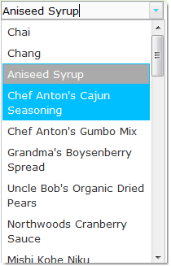

////

|metadata|
{
    "name": "webdropdown-about-webdropdown",
    "controlName": ["WebDropDown"],
    "tags": [],
    "guid": "{BFC0E9C7-7A92-4C2D-A09B-0AD9010168AC}",  
    "buildFlags": [],
    "createdOn": "0001-01-01T00:00:00Z"
}
|metadata|
////

= About WebDropDown

WebDropDown™ is a control that allows the end-user to select single or multiple items from a drop-down list. WebDropDown is built on top of the Infragistics ASP.NET AJAX Framework to leverage a proven code base that promotes a high performance and responsive end-user experience. You can find the WebDropDown in the  pick:[asp-net="link:{ApiPlatform}web{ApiVersion}~infragistics.web.ui.listcontrols_namespace.html[Infragistics.Web.UI.ListControls]"]  namespace.

In general, the WebDropDown consists of two main entities – Value Display for user input and a drop-down container that holds the items. WebDropDown includes integrated design-time tools in the form of an advanced Designer UI. This design-time utility helps you to quickly and easily set up the control depending on your requirements, providing access to a wide range of functionality without requiring intensive coding.

Like all Infragistics ASP.NET AJAX controls, WebDropDown seamlessly integrates into the Infragistics® Application Styling Framework. With CSS based properties, you can manually customize the WebDropDown by leveraging your existing stylesheets.

WebDropDown also exposes a robust object model within the client-side JavaScript programming environment. The client-side object model (CSOM) consists of full-fledged properties and methods that enable developers to program significant units of functionality without the need for server-side postbacks.

Some of the the WebDropDown control’s features include:

* *High-Performance* -- Lightweight markup and optimized code improve performance.
* *Powerful Data Binding* -- Allows the developer to connect it to a data source and auto-generate the drop-down list.
* *Auto complete* -- Increases the user experience by suggesting the items in the drop-down list that begin with the prefix typed in the Value Display.
* *Multi-mode support* -- Different modes on how to display the WebDropDown.
* *Selection of Items* -- Single and multiple selection of items from the drop-down container.
* *Load-on-demand* -- Enables the WebDropDown to handle very large amounts of data without incurring any loss in performance.
* *Templates* -- Allows the developer to define an item template that can be used to customize the appearance of value items.