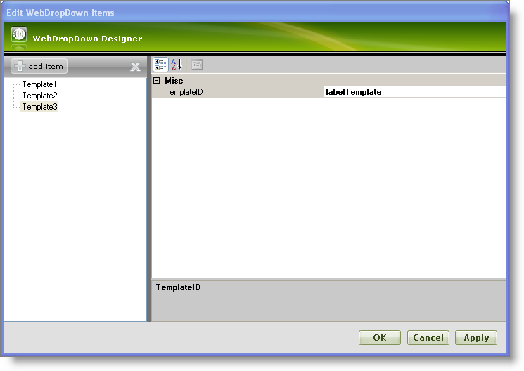
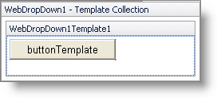
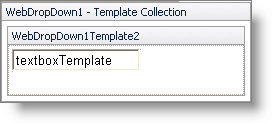
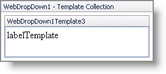
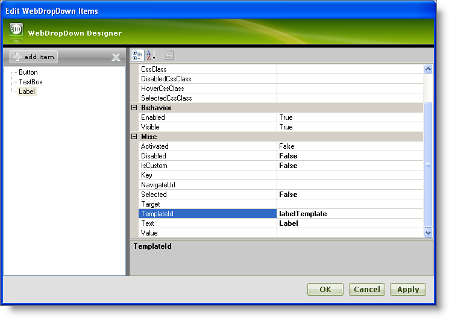
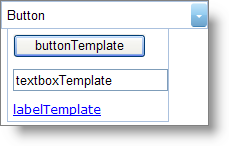

////

|metadata|
{
    "name": "webdropdown-assigning-templates-to-individual-items-using-the-templates-collection",
    "controlName": ["WebDropDown"],
    "tags": ["Templating"],
    "guid": "{D933D043-70EC-4FFB-9B4E-37C8A811BACF}",  
    "buildFlags": [],
    "createdOn": "0001-01-01T00:00:00Z"
}
|metadata|
////

= Assigning templates to individual items using the templates collection

== Before You Begin

WebDropDown™ allows assigning templates to individual items easily through its advanced UI designer. With templating you can customize each individual item’s look and feel depending on your requirements.

== What You Will Accomplish

You will learn how to assign templates to individual items using the templates collection.

== Follow these Steps

[start=1]
. From the Visual Studio™ Toolbox, drag and drop a ScriptManager component and a WebDropDown control onto the form.
[start=2]
. Click the WebDropDown control’s smart tag and select Edit Template Collection. This will open the WebDropDown designer, where you can add new templates.
[start=3]
. Click add item to add new templates to the template collection. Add three templates Template1,Template2, and Template3; set their  pick:[asp-net="link:infragistics4.web.v{ProductVersion}~infragistics.web.ui.itemtemplate~templateid.html[TemplateID]"]  property to buttonTemplate, textboxTemplate, and labelTemplate respectively. Your WebDropDown Designer now looks similar to the following image:

[start=4]
. Click Apply and then OK to close the designer.
[start=5]
. In this step, the templates are edited as shown below:

** Click the WebDropDown control’s smart tag and select Edit Templates. This will show the WebDropDown in Template Editing Mode.
** Click the WebDropDown control’s smart tag and select the WebDropDown1Template1 from the drop-down list to edit Template1.
** Drag and drop a standard button from the toolbox onto the WebDropDown1Template1 area and set the Text property of the button to buttonTemplate.
** Your WebDropDown now looks similar to the following image in design mode :

Similarly, edit templates Template2 and Template3 to have a standard TextBox with the Text property set to textboxTemplate and a standard Label with the Text property set to labelTemplate respectively. In design mode, Template2 and Template3 look similar to the following images:

*Template2 :*

*Template3 :*

[start=6]
. Now click the smart tag and select End Template Editing to close the template editing mode of WebDropDown.
[start=7]
. Add three items Button, TextBox, Label to the drop-down list and set their TemplateId property to buttonTemplate, textboxTemplate and lalbelTemplate respectively. For more information on how to add items, see the link:webdropdown-getting-started-with-webdropdown.html[Adding Items to WebDropDown using the Designer] topic.
[start=8]
. Your WebDropDown Designer now looks similar to the following image :

[start=9]
. Click Apply and OK to close the designer.
[start=10]
. Save and run your application. Your WebDropDown now looks similar to the following image:

