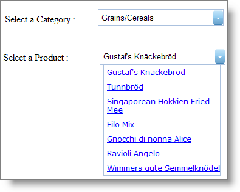

////

|metadata|
{
    "name": "webdropdown-cascading-webdropdown-controls",
    "controlName": ["WebDropDown"],
    "tags": [],
    "guid": "{D771B0DA-1C4C-4CE4-9B99-0CC10478BAEF}",  
    "buildFlags": [],
    "createdOn": "0001-01-01T00:00:00Z"
}
|metadata|
////

= Cascading WebDropDown Controls

== Before You Begin

A Cascading List is any set of multiple lists that work together. The end user will first select an item from the first list. This action will cause the second list to be filtered based on the selection of the first list. Subsequent selections will cause subsequent lists to be filtered accordingly. You can cascade any number of WebDropDown™ controls using the WebDropDown control’s  pick:[asp-net="link:infragistics4.web.v{ProductVersion}~infragistics.web.ui.listcontrols.dropdownclientevents~selectionchanging.html[SelectionChanging]"]  or  pick:[asp-net="link:infragistics4.web.v{ProductVersion}~infragistics.web.ui.listcontrols.dropdownclientevents~selectionchanged.html[SelectionChanged]"]  client events.

In this walkthrough, a WebDropDown control which is bound to the Products table of the Northwind database filters its value list depending on the selected item of another WebDropDown which is bound to the Categories table of the Northwind database.

== What You Will Accomplish

You will learn how to cascade two WebDropDown controls.

== Follow these Steps

[start=1]
. From the Visual Studio™ Toolbox, drag and drop a ScriptManager component , two WebDropDown controls ,two standard Label controls and two SqlDataSource components onto the form. Set the link:http://msdn.microsoft.com/query/dev10.query?appId=Dev10IDEF1&l=EN-US&k=k(System.Web.UI.Control.ID)&rd=true[ID] property of the WebDropDown controls as "categoryDropDown" and "productDropDown". Set the Text property of Label1 and Label2 as "Select a Category :" and "Select a Product:" respectively.
[start=2]
. Place the controls on the designer such that categoryDropDown is next to the Select a Category Label and productsDropDown is next to the Select a Product Label.
[start=3]
. Bind the categoryDropDown to the Categories table of the Northwind database using SqlDataSource1 ; set the  pick:[asp-net="link:infragistics4.web.v{ProductVersion}~infragistics.web.ui.listcontrols.webdropdown~textfield.html[TextField]"]  property to CategoryName and the  pick:[asp-net="link:infragistics4.web.v{ProductVersion}~infragistics.web.ui.listcontrols.webdropdown~valuefield.html[ValueField]"]  property to CategoryID . Similarly, bind the productDropDown to the Products table of the Northwind database using SqlDataSource2; set the TextField property to ProductName and ValueField property to ProductID. For more information on how to bind WebDropDown to SqlDataSource see the link:webdropdown-binding-webdropdown-to-a-sql-data-source.html[Binding WebDropDown to a Sql Data Source] topic.
[start=4]
. Add a javascript function "categoryChanged" for the categoryDropDown control’s SelectionChanged client-side event.

*In JavaScript:*

----
        // The client event 'SelectionChanged' takes two parameters sender and e
        // sender  is the object which is raising the event
        // e is the DropDownSelectionEventArgs
        function categoryChanged(sender, e) {
            //Gets reference to the productDropDown
            var productDropDown = $find("productDropDown");
            productDropDown.loadItems(e.getNewSelection()[0].get_value());
           }
----

In the above code, link:webdropdown~infragistics.web.ui.webdropdown~loaditems.html[loadItems] method fires the productDropDown control’s  pick:[asp-net="link:infragistics4.web.v{ProductVersion}~infragistics.web.ui.listcontrols.webdropdown~itemsrequested_ev.html[ItemsRequested]"]  server-side event (implemented in the next step) to filter the items in the productDropDown depending on the value of the newly selected categoryDropDown control’s item.
[start=5]
. Add the following code to the productDropDown’s ItemsRequested server-side event :

*In Visual Basic:*

----
         productDropDown.Items.Clear()
         SqlDataSource2.SelectCommand =
 "SELECT * FROM [Products] where [CategoryID] = '" & DirectCast(e.Value, String) & 
"'"
         productDropDown.DataBind()      
----

*In C#:*

----
         productDropDown.Items.Clear();
         SqlDataSource2.SelectCommand = "SELECT * FROM [Products] where [CategoryID] = \'" + (string)e.Value + "\'";
         productDropDown.DataBind();
----

In the above code , filtering is done on productDropDown by selecting the items that have the CategoryID equal to the value of the selected item in the categoryDropDown using the SelectCommand.
[start=6]
. Save and run your application. Select Grains/Cereals category and your WebForm now looks similar to the following image :

