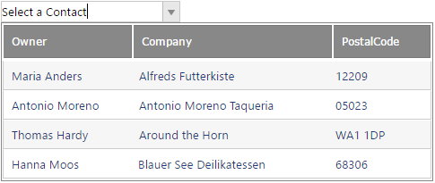

////

|metadata|
{
    "name": "webdropdown-create-a-multi-column-webdropdown-using-templates",
    "controlName": ["WebDropDown"],
    "tags": ["Templating"],
    "guid": "{4EF4680F-F1CA-4209-8D1B-CC64958A7DDB}",  
    "buildFlags": [],
    "createdOn": "0001-01-01T00:00:00Z"
}
|metadata|
////

= Create a Multi-Column WebDropDown using Templates

== Before You Begin

The WebDropDown™ control’s template feature provides you with great flexibility of using different controls inside the drop-down container so that your end-users can select items from the control of your choice. WebDropDown displays one column from your data model by default. However, you can show multi-columns in the drop-down container by using the template feature along with HTML Table placed within the template.

In this walkthrough, we take advantage of both HeaderTemplate and ItemTemplate exposed by the WebDropDown™. HTML Table will be used for each of these. This approach will help to structure a rendered columns heading separately from the column items. It will help to style the header differently from the data items and achieve a more grid like look. As you select a row in the multi-column WebDropDown™, the contact name of the selected row is displayed in the WebDropDown control’s value display.

.Note:
[NOTE]
====
Controls can be placed within the WebDropDown™ template as well. Keep in mind only one control can be placed within the WebDropDown template at a time.
====

== What You Will Accomplish

You will learn how to show a grid like structure in the drop-down container of a WebDropDown control.

== Follow these Steps

[start=1]
. From the Visual Studio™ Toolbox, drag and drop a ScriptManager component and a WebDropDown control onto the form. Set the WebDropDown control’s  pick:[asp-net="link:{ApiPlatform}web{ApiVersion}~infragistics.web.ui.listcontrols.webdropdown~currentvalue.html[CurrentValue]"] property to “Select Owner”. This will be the text initially displayed in the WebDropDown™ input prior to making a selection from the list.
[start=2]
. Set the pick:[asp-net="link:{ApiPlatform}web{ApiVersion}~infragistics.web.ui.listcontrols.dropdownitem~textfield.html[textfield]"] property to “Name”. It lets you choose the column name you want to show in the value display. Link the WebDropDown™ DataSource to the GetGridData() method supplied at step 10.
[start=3]
. Set the following WebDropDown properties.
pick:[asp-net="link:{ApiPlatform}web{ApiVersion}~infragistics.web.ui.listcontrols.webdropdown~enableanimations.html[EnableAnimations]"] ="false".
pick:[asp-net="link:{ApiPlatform}web{ApiVersion}~infragistics.web.ui.listcontrols.webdropdown~DropDownContainerHeight.html[DropDownContainerHeight]"] ="135px".
pick:[asp-net="link:{ApiPlatform}web{ApiVersion}~infragistics.web.ui.listcontrols.webdropdown~DropDownContainerWidth.html[DropDownContainerWidth]"] ="480px".
[start=4]
. Click Edit Templates from the smart tag of the WebDropDown. This will show the WebDropDown in the Template Editing Mode.
[start=5]
. From the Template Editing Mode smart tag, select Item Templates from the drop-down list.
[start=6]
. Paste the following HTML Table:
[source]
----
<table style="width: 100%" cellspacing="0" cellpadding="4">
    <tr>
        <td style="width: 140px;">
            <%# DataBinder.Eval(Container.DataItem, "Name")%>
        </td>
        <td style="width: 220px;">
            <%# DataBinder.Eval(Container.DataItem, "Company")%>
        </td>
        <td style="width: 100px;">
            <%# DataBinder.Eval(Container.DataItem, "PostalCode")%>
        </td>
    </tr>
</table>
----

[start=7]
. From the Template Editing Mode smart tag, select HeaderTemplate.
[start=8]
. Paste the following HTML Table for the header:
[source]
----
<table id="TemplateContainer">
    <tr class="custom_Header">
        <td class="igg_HeaderCaption" style="width: 140px;">Owner</td>
        <td class="igg_HeaderCaption" style="width: 220px;">Company</td>
        <td class="igg_HeaderCaption" style="width: 100px;">PostalCode</td>
    </tr>
</table>
----

[start=9]
. Add some css styling.
[source]
----

----

[start=10]
. Add the required server side data and bind the WebDropDown list items to it. For this walkthrough, a simple table is used. You can refer to the following link: http://www.infragistics.com/samples/aspnet/drop-down/templates[following online sample], in case you want to see the same example but illustrating how to attach to an existing database instead. 
[source]
----
	//generate a table to be used as data source
	private DataTable GetGridData()
	{
		DataTable DS = new DataTable("TestData");
		DataColumn col = DS.Columns.Add("ID", typeof(int));
		DS.Columns.Add("Name", typeof(string));
		DS.Columns.Add("Company", typeof(string));
		DS.Columns.Add("PostalCode", typeof(string));
		DS.PrimaryKey = new DataColumn[] { col };
		DS.Rows.Add(new Object[] { 1, "Maria Anders", "Alfreds Futterkiste", "12209" });
		DS.Rows.Add(new Object[] { 2, "Antonio Moreno", "Antonio Moreno Taqueria", "05023" });
		DS.Rows.Add(new Object[] { 3, "Thomas Hardy", "Around the Horn", "WA1 1DP" });
		DS.Rows.Add(new Object[] { 4, "Hanna Moos", "Blauer See Deilikatessen", "68306" });
		return DS;
	}
----

The above steps can be performed through the following code:

*Markup:*
[source]
----
<ig:WebDropDown ID="webDropDown1" runat="server" Width="200px">
    <HeaderTemplate>
        <table id="TemplateContainer">
            <tr class="custom_Header">
                <td class="igg_HeaderCaption" style="width: 140px;">Owner</td>
                <td class="igg_HeaderCaption" style="width: 220px;">Company</td>
                <td class="igg_HeaderCaption" style="width: 100px;">PostalCode</td>
            </tr>
        </table>
    </HeaderTemplate>
    <ItemTemplate>
        <table style="width: 100%" cellspacing="0" cellpadding="4">
            <tr>
                <td style="width: 140px;">
                    <%# DataBinder.Eval(Container.DataItem, "Name")%>
                </td>
                <td style="width: 220px;">
                    <%# DataBinder.Eval(Container.DataItem, "Company")%>
                </td>
                <td style="width: 100px;">
                    <%# DataBinder.Eval(Container.DataItem, "PostalCode")%>
                </td>
            </tr>
        </table>
    </ItemTemplate>
</ig:WebDropDown>
----

*In C#:*

[source]
----

	protected void Page_Load(object sender, EventArgs e)
	{
		//set a data source to bind to
		this.webDropDown1.DataSource = this.GetGridData();
		//Set which column to display in the input upon selection
		this.webDropDown1.TextField = "Name";
		//Set the current value 
		this.webDropDown1.CurrentValue = "Select a Contact";
		this.webDropDown1.EnableAnimations = false;
		this.webDropDown1.DropDownContainerHeight = 135;
		this.webDropDown1.DropDownContainerWidth = 480;
	}

	//generate a table to be used as data source
	private DataTable GetGridData()
	{
		DataTable DS = new DataTable("TestData");
		DataColumn col = DS.Columns.Add("ID", typeof(int));
		DS.Columns.Add("Name", typeof(string));
		DS.Columns.Add("Company", typeof(string));
		DS.Columns.Add("PostalCode", typeof(string));
		DS.PrimaryKey = new DataColumn[] { col };
		DS.Rows.Add(new Object[] { 1, "Maria Anders", "Alfreds Futterkiste", "12209" });
		DS.Rows.Add(new Object[] { 2, "Antonio Moreno", "Antonio Moreno Taqueria", "05023" });
		DS.Rows.Add(new Object[] { 3, "Thomas Hardy", "Around the Horn", "WA1 1DP" });
		DS.Rows.Add(new Object[] { 4, "Hanna Moos", "Blauer See Deilikatessen", "68306" });
		return DS;
	}
----

*In Visual Basic:*
[source]
----
	Protected Sub Page_Load(sender As Object, e As EventArgs)
		'set a data source to bind to
		Me.WebDropDown1.DataSource = Me.GetGridData()
		'Set which column to display in the input upon selection
		Me.WebDropDown1.TextField = "Name"
		'Set the current value 
		Me.WebDropDown1.CurrentValue = "Select a Contact"
		Me.WebDropDown1.EnableAnimations = False
		Me.WebDropDown1.DropDownContainerHeight = 135
		Me.WebDropDown1.DropDownContainerWidth = 480
		Me.WebDropDown1.DataBind()
	End Sub

	'generate a table to be used as data source
	Private Function GetGridData() As DataTable
		Dim DS As New DataTable("TestData")
		Dim col As DataColumn = DS.Columns.Add("ID", GetType(Integer))
		DS.Columns.Add("Name", GetType(String))
		DS.Columns.Add("Company", GetType(String))
		DS.Columns.Add("PostalCode", GetType(String))
		DS.PrimaryKey = New DataColumn() {col}
		DS.Rows.Add(New [Object]() {1, "Maria Anders", "Alfreds Futterkiste", "12209"})
		DS.Rows.Add(New [Object]() {2, "Antonio Moreno", "Antonio Moreno Taqueria", "05023"})
		DS.Rows.Add(New [Object]() {3, "Thomas Hardy", "Around the Horn", "WA1 1DP"})
		DS.Rows.Add(New [Object]() {4, "Hanna Moos", "Blauer See Deilikatessen", "68306"})
		Return DS
	End Function
----

[start=11]
. Save and run your application.You will observe that as you click a row in the drop-down container, the text in the value display is changed to the owner name from the row.

*Alternative:*
Instead of using the above approach and specifying all of the templates via the Markup, it is possible to set the HTML tables and the corresponding styling in code behind as well. It will require to implement ITemplate for both HeaderTemplate and ItemTemplate though. The following sample code assumes there is a plain WebDropDown with ID of WebDropDown1 already defined in Markup.

*In C#:*

[source]
----
	//ensure these objects are created prior Page_Load event fires
	protected override void OnInit(EventArgs e)
	{
		this.WebDropDown1.HeaderTemplate = new HeaderTemplate();
		this.WebDropDown1.ItemTemplate = new ItemTemplate();
	}
    //helper variable
    private static string[] ColumnsArr = new string[] { "Name", "Company", "PostalCode" };

	//add a content and styling for the HeaderTemplate
	private class HeaderTemplate : ITemplate
	{
		public void InstantiateIn(Control container)
		{
			HtmlTable table = new HtmlTable();
			table.Style.Add(HtmlTextWriterStyle.Height, "25px");
			table.Style.Add(HtmlTextWriterStyle.BackgroundColor, "#888888");
			table.Style.Add(HtmlTextWriterStyle.Color, "#FFFFFF");
			table.Style.Add(HtmlTextWriterStyle.FontSize, "12px");
			table.Style.Add(HtmlTextWriterStyle.FontWeight, "normal");
			table.CellSpacing = 0;
			table.CellPadding = 4;
			HtmlTableRow row = new HtmlTableRow();
			table.Controls.Add(row);

			for (int i = 0; i < 3; i++)
			{
				HtmlTableCell cell = new HtmlTableCell();
				cell.Attributes.Add("class", "igg_HeaderCaption");

				cell.InnerText = ColumnsArr[i].ToString();
				if (cell.InnerText == "Name")
				{
					cell.Style.Add(HtmlTextWriterStyle.Width, "140px");
				}
				if (cell.InnerText == "Company")
				{
					cell.Style.Add(HtmlTextWriterStyle.Width, "220px");
				}
				if (cell.InnerText == "PostalCode")
				{
					cell.Style.Add(HtmlTextWriterStyle.Width, "100px");
				}
				row.Cells.Add(cell);
			}
			container.Controls.Add(table);
		}
	}

	//add a content and styling for the ItemTemplate
	private class ItemTemplate : ITemplate
	{
		public void InstantiateIn(Control container)
		{
			HtmlTable table = new HtmlTable();
			table.CellSpacing = 0;
			table.CellPadding = 4;
			HtmlTableRow row = new HtmlTableRow();
			table.Controls.Add(row);
			for (int i = 0; i < 3; i++)
			{
				HtmlTableCell cell = new HtmlTableCell();
				TemplateContainer templateContainer = container as TemplateContainer;
				DataRowView dataRow = templateContainer.DataItem as DataRowView;

				cell.InnerText = ColumnsArr[i].ToString();
				if (cell.InnerText == "Name")
				{
					cell.InnerText = dataRow["Name"].ToString();
					cell.Style.Add(HtmlTextWriterStyle.Width, "140px");
				}
				if (cell.InnerText == "Company")
				{
					cell.InnerText = dataRow["Company"].ToString();
					cell.Style.Add(HtmlTextWriterStyle.Width, "220px");
				}
				if (cell.InnerText == "PostalCode")
				{
					cell.InnerText = dataRow["PostalCode"].ToString();
					cell.Style.Add(HtmlTextWriterStyle.Width, "100px");
				}
				row.Cells.Add(cell);
			}
			container.Controls.Add(table);
		}
	}

    **Add the same Page_Load and GetGridData method from above for a complete runable sample.
----

*In Visual Basic:*

[source]
----

Protected Overrides Sub OnInit(e As EventArgs)
    Me.WebDropDown1.HeaderTemplate = New HeaderTemplate()
    Me.WebDropDown1.ItemTemplate = New ItemTemplate()
End Sub

Private Shared ColumnsArr As String() = New String() {"Name", "Company", "PostalCode"}
	Private Class HeaderTemplate
		Implements ITemplate
		Public Sub InstantiateIn(container As Control) Implements ITemplate.InstantiateIn
			Dim table As New HtmlTable()
			table.Style.Add(HtmlTextWriterStyle.Height, "25px")
			table.Style.Add(HtmlTextWriterStyle.BackgroundColor, "#888888")
			table.Style.Add(HtmlTextWriterStyle.Color, "#FFFFFF")
			table.Style.Add(HtmlTextWriterStyle.FontSize, "12px")
			table.Style.Add(HtmlTextWriterStyle.FontWeight, "normal")
			table.CellSpacing = 0
			table.CellPadding = 4
			Dim row As New HtmlTableRow()
			table.Controls.Add(row)

			For i As Integer = 0 To 2
				Dim cell As New HtmlTableCell()
				cell.Attributes.Add("class", "igg_HeaderCaption")

				cell.InnerText = ColumnsArr(i).ToString()
				If cell.InnerText = "Name" Then
					cell.Style.Add(HtmlTextWriterStyle.Width, "140px")
				End If
				If cell.InnerText = "Company" Then
					cell.Style.Add(HtmlTextWriterStyle.Width, "220px")
				End If
				If cell.InnerText = "PostalCode" Then
					cell.Style.Add(HtmlTextWriterStyle.Width, "100px")
				End If
				row.Cells.Add(cell)
			Next
			container.Controls.Add(table)
		End Sub
	End Class

	Private Class ItemTemplate
		Implements ITemplate
		Public Sub InstantiateIn(container As Control) Implements ITemplate.InstantiateIn
			Dim table As New HtmlTable()
			table.CellSpacing = 0
			table.CellPadding = 4
			Dim row As New HtmlTableRow()
			table.Controls.Add(row)
			For i As Integer = 0 To 2
				Dim cell As New HtmlTableCell()
				Dim templateContainer As TemplateContainer = TryCast(container, TemplateContainer)
				Dim dataRow As DataRowView = TryCast(templateContainer.DataItem, DataRowView)

				cell.InnerText = ColumnsArr(i).ToString()
				If cell.InnerText = "Name" Then
					cell.InnerText = dataRow("Name").ToString()
					cell.Style.Add(HtmlTextWriterStyle.Width, "140px")
				End If
				If cell.InnerText = "Company" Then
					cell.InnerText = dataRow("Company").ToString()
					cell.Style.Add(HtmlTextWriterStyle.Width, "220px")
				End If
				If cell.InnerText = "PostalCode" Then
					cell.InnerText = dataRow("PostalCode").ToString()
					cell.Style.Add(HtmlTextWriterStyle.Width, "100px")
				End If
				row.Cells.Add(cell)
			Next
			container.Controls.Add(table)
		End Sub
	End Class

    **Add the same Page_Load and GetGridData method from above (step 10) for a complete runable sample.
----
