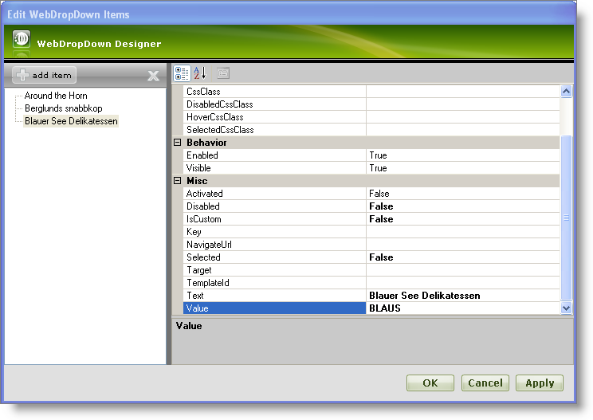
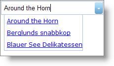

////

|metadata|
{
    "name": "webdropdown-getting-started-with-webdropdown",
    "controlName": ["WebDropDown"],
    "tags": ["Getting Started"],
    "guid": "{5AA76B6C-08D2-4CF0-84D5-444BBB478382}",  
    "buildFlags": [],
    "createdOn": "0001-01-01T00:00:00Z"
}
|metadata|
////

= Getting Started with WebDropDown

WebDropDown™ allows you to manually add items to the drop-down container using its rich user interface designer. You can customize each drop-down item using the WebDropDown Designer where you set the appearance, behavior and various other properties.

*To add items to WebDropDown using the Designer :*

[start=1]
. From the Visual Studio™ Toolbox, locate the WebDropDown control and drag and drop it onto your WebForm.
[start=2]
. In the property window, locate the Items property and click the ellipsis (…) button to launch the WebDropDown Designer. You can also launch the designer by clicking Edit Items… in the WebDropDown smart tag.
[start=3]
. In the Edit WebDropDown Items dialog, click the Add Item button. This will add a new list item to the items collection. Set the following properties:

[options="header", cols="a,a"]
|====
|Text|Value

|Around the Horn
|AROUT

|====

[start=4]
. Repeat the previous step to add two more items using the following data:

[options="header", cols="a,a"]
|====
|Text|Value

|Berglunds snabbkop
|BERGS

|Blauer See Delikatessen
|BLAUS

|====

[start=5]
. At this point, the Edit WebDropDown Items dialog should look like this:

[start=6]
. Save and run the application. Your WebDropDown should look like this:

