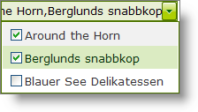

////

|metadata|
{
    "name": "webdropdown-multiple-selection",
    "controlName": ["WebDropDown"],
    "tags": ["Selection"],
    "guid": "{31AD416E-2CAF-4C93-9D11-59F1DC7DEC64}",  
    "buildFlags": [],
    "createdOn": "0001-01-01T00:00:00Z"
}
|metadata|
////

= Multiple Selection

WebDropDown™ allows the end user to perform single and multiple item selection from its dropdown container. By default, single selection is enabled ; in order to enable multiple selection the  pick:[asp-net="link:infragistics4.web.v{ProductVersion}~infragistics.web.ui.listcontrols.webdropdown~displaymode.html[DisplayMode]"]  property should be set to either *DropDown* or *DropDownList* and the  pick:[asp-net="link:infragistics4.web.v{ProductVersion}~infragistics.web.ui.listcontrols.webdropdown~enablemultipleselection.html[EnableMultipleSelection]"]  property must be set to true.

When items are selected, what the end-user sees in the Value Display component is formed by concatenating the display values of all selected items by using a predefined delimiter. By default the delimiter is set to comma. However we can change the delimiter by setting the WebDropDown control’s  pick:[asp-net="link:infragistics4.web.v{ProductVersion}~infragistics.web.ui.listcontrols.webdropdown~multiselectvaluedelimiter.html[MultiSelectValueDelimiter]"]  property.

Multiple-Selection can be performed by either using the checkbox or keyboard by setting the WebDropDown control’s  pick:[asp-net="link:infragistics4.web.v{ProductVersion}~infragistics.web.ui.listcontrols.webdropdown~multipleselectiontype.html[MultipleSelectionType]"]  property.

== Multiple Selection using CheckBoxes.

WebDropDown allows multiple selection using CheckBoxes. You can enable multiple selection using checkboxes by setting the WebDropDown control’s  pick:[asp-net="link:infragistics4.web.v{ProductVersion}~infragistics.web.ui.listcontrols.webdropdown~multipleselectiontype.html[MultipleSelectionType]"]  property to Checkbox. This will render a checkbox in front of every list item.

== To select multiple items from the drop-down list using checkboxes:

[start=1]
. From the Visual Studio toolbox, drag and drop an instance of WebDropDown onto the form and add items to the items collection. For more information on adding items, see link:webdropdown-getting-started-with-webdropdown.html[Getting Started with WebDropDown].
[start=2]
. To enable multiple selection on WebDropDown , you must set the EnableMultipleSelection property to true either using the Microsoft® Visual Studio® Property Window or by using the following code :

*In Visual Basic:*

[source]
----
WebDropDown1.EnableMultipleSelection = true
----

*In C#:*

[source]
----
WebDropDown1.EnableMultipleSelection = true;
----

[start=3]
. In order to select multiple items using checkboxes you must set the MultipleSelectionType property to Checkbox either using the Property Window or by using the following code:

*In Visual Basic:*

[source]
----
WebDropDown1.MultipleSelectionType = DropDownMultipleSelectionType.Checkbox
----

*In C#:*

[source]
----
WebDropDown1.MultipleSelectionType = DropDownMultipleSelectionType.Checkbox;
----

[start=4]
. Save and run the application. As you select the checkboxes from the drop-down, you will see that the items are displayed in the Value Display separated by the default delimiter.

== Multiple Selection using the Keyboard

Multiple selection can also be performed using the keyboard. Holding the CTRL/SHIFT key(s) will allow multiple selection the same fashion that exists in Windows Explorer. Multiple selection is performed by holding the CTRL/SHIFT key(s) and clicking on the items or navigating with the UP/DOWN Arrow keys . When items are selected, the end-user sees a delimited set of values in the Value Display component; this display is formed by concatenating the display values of all selected items by using the predefined delimiter, which is comma by default.

You can enable keyboard multiple selection by setting the WebDropDown control’s  pick:[asp-net="link:infragistics4.web.v{ProductVersion}~infragistics.web.ui.listcontrols.webdropdown~multipleselectiontype.html[MultipleSelectionType]"]  property to Keyboard.

== To select multiple items from the drop-down list using the keyboard:

[start=1]
. From the Visual Studio toolbox, drag and drop an instance of WebDropDown onto the form and add items to the items collection. For more information on adding items, see link:webdropdown-getting-started-with-webdropdown.html[Adding Items to WebDropDown using the Designer].
[start=2]
. To enable multiple selection on WebDropDown, you must set the EnableMultipleSelection property to true either using the Microsoft® Visual Studio® Property Window or by using the following code :

*In Visual Basic:*

[source]
----
WebDropDown1.EnableMultipleSelection = true
----

*In C#:*

[source]
----
WebDropDown1.EnableMultipleSelection = true;
----

[start=3]
. In order to select multiple items using keyboard you must set the MultipleSelectionType property to Keyboard either using the Property Window or by using the following code:

*In Visual Basic:*

----
WebDropDown1.MultipleSelectionType = DropDownMultipleSelectionType.Keyboard
----

*In C#:*

----
WebDropDown1.MultipleSelectionType = DropDownMultipleSelectionType.Keyboard;
----

[start=4]
. Save and run the application. You will observe that when you hold the CTRL/SHIFT key and navigate with the UP/Down ARROW keys from the dropdown, you will see that the selected items are displayed in the Value Display separated by comma.