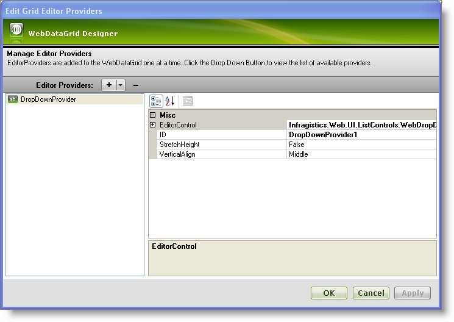
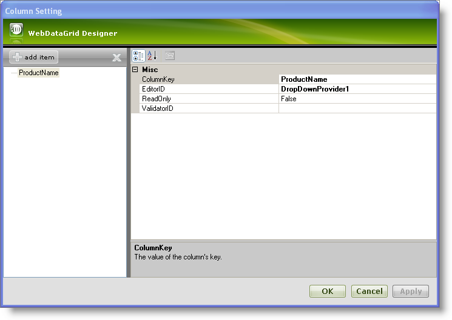
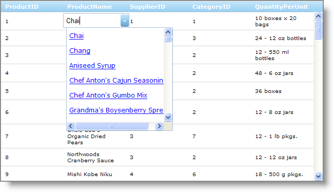

////

|metadata|
{
    "name": "webdropdown-using-webdropdown-as-an-editor-provider-for-webdatagrid",
    "controlName": ["WebDropDown"],
    "tags": [],
    "guid": "{AD8C6A53-D966-445B-80AA-A0ABC1DA41C7}",  
    "buildFlags": [],
    "createdOn": "0001-01-01T00:00:00Z"
}
|metadata|
////

= Using WebDropDown as an editor provider for WebDataGrid

== Before You Begin

WebDropDown™ can be used as an editor provider for WebDataGrid™ to show a drop-down list of items for cell values with all other WebDropDown features.

== What You Will Accomplish

You will learn how to use WebDropDown as the  pick:[asp-net="link:{ApiPlatform}web{ApiVersion}~infragistics.web.ui.gridcontrols.dropdownprovider.html[DropDownProvider]"]  in WebDataGrid.

== Follow these Steps

[start=1]
. From the Visual Studio™ Toolbox, drag and drop a ScriptManager component , a SqlDataSource component and a WebDataGrid control onto the form.
[start=2]
. Bind the WebDataGrid to ProductID, ProductName, SupplierID,CategoryID and QuantityPerUnit of Products table of the Northwind database using SqlDataSource1. For more information on doing this, see the link:webdatagrid-getting-started-with-webdatagrid.html[Getting Started with WebDataGrid] topic.
[start=3]
. In the Visual Studio property window, locate the  pick:[asp-net="link:{ApiPlatform}web{ApiVersion}~infragistics.web.ui.gridcontrols.webdatagrid~editorproviders.html[EditorProviders]"]  property and click the ellipsis (…) button to launch the Edit Grid Editor Providers Designer.
[start=4]
. Click the + button and select DropDownProvider from the drop-down list of editor providers available.
[start=5]
. Leave the ID for the editor as DropDownProvider1. You will need this ID later when setting the editor for a column.

[start=6]
. Expand the EditorControl property and set the following properties :

[options="header", cols="a,a"]
|====
|Property|Value

|DataSourceID
|SqlDataSource1

|DropDownOrientation
|BottomLeft

|TextField
|ProductName

|ValueField
|ProductID

|====

[start=7]
. Click Apply and OK to close the designer.
[start=8]
. Locate the  pick:[asp-net="link:{ApiPlatform}web{ApiVersion}~infragistics.web.ui.gridcontrols.webdatagrid~behaviors.html[Behaviors]"]  property and click the ellipsis (…) button to launch the Edit Grid Behaviors dialog.
[start=9]
. Check the Cell Editing behavior in the list on the left to enable editing.
[start=10]
. Locate the  pick:[asp-net="link:{ApiPlatform}web{ApiVersion}~infragistics.web.ui.gridcontrols.cellediting~columnsettings.html[ColumnSettings]"]  property in the property grid on the right and click the ellipsis (…) button to launch the Column Setting dialog.
[start=11]
. Configure WebDataGrid to use the DropDownProvider for editing of the ProductName column.

** Add a column setting by clicking the add item button.
** Set the  pick:[asp-net="link:{ApiPlatform}web{ApiVersion}~infragistics.web.ui.gridcontrols.columnsetting~columnkey.html[ColumnKey]"]  property as ProductName.
** Set the  pick:[asp-net="link:{ApiPlatform}web{ApiVersion}~infragistics.web.ui.gridcontrols.columneditsetting~editorid.html[EditorID]"]  property to DropDownProvider1 from the drop-down list of available providers.
** Click Apply and OK to close the Column Setting dialog.
** Click Apply and OK to close the Edit Grid Behaviors dialog.

[start=12]
. Save and run your application. You will observe that when you enter edit mode in a cell of the ProductName column you will see a drop-down list of items similar to the following image:

