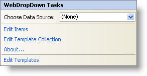

////

|metadata|
{
    "name": "webdropdown-webdropdown-smart-tag",
    "controlName": ["WebDropDown"],
    "tags": ["Design Environment"],
    "guid": "{34941237-8F8E-4F75-A76F-3ED5573E1DCC}",  
    "buildFlags": [],
    "createdOn": "0001-01-01T00:00:00Z"
}
|metadata|
////

= WebDropDown Smart Tag

In Visual Studio 2005/2008 (.NET Framework 2.0/3.5), each Infragistics ASP.NET control/component is equipped with a Smart Tag. By selecting the control/component, a Smart Tag anchor appears. When you click this anchor, a pop-up panel appears, providing you with quick and easy access to the most common properties and settings of the control/component.

The WebDropDown™ Smart Tag contains the following items:

* Choose Data Source -- Allows you to choose an existing data source or configure a data source to bind to WebDropDown.

See the table below for a description of the item, as well as the item's corresponding property in the properties grid.

The WebDropDown Smart Tag contains the following links:

* Edit Items – Brings up the Edit WebDropDown dialog for adding , removing items and setting their properties.
* Edit Template Collection -- Links to the template collection editor to add/remove templates that you can use in WebDropDown.
* About -- Clicking this opens the WebDropDown product information. It contains information such as Status, Version, Expiration and Product Key.
* Edit Templates -- Clicking this brings up all the available templates you can edit. You can drag and drop controls onto the templates and edit them as you like.

[options="header", cols="a,a,a"]
|====
|Items|Description|CorrespondingProperty

|Choose Data Source
|The dropdown list allows you to select an existing data source or configure a new data source.
|*DataSourceID*

|====