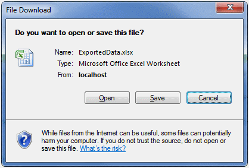

////

|metadata|
{
    "name": "webexcelexporter-exporting-data-into-different-file-formats",
    "controlName": ["WebExcelExporter"],
    "tags": ["Data Presentation","Exporting","Grids","Persistence"],
    "guid": "f7dd65a2-b52a-4369-aa83-40e5b4baca8f",  
    "buildFlags": [],
    "createdOn": "2010-06-06T07:54:42.6126939Z"
}
|metadata|
////

= Exporting Data into Different File Formats

== What You Will Accomplish

You will learn how to set up and use WebExcelExporter to export WebDataGrid / WebHierarchicalDataGrid data into different Excel™ file formats.

== Before You Begin

In order to compile and run the samples illustrated here, you will need to install Infragistics ASP.NET v. 10.2. You will also need a running instance of SQL Server (either Express or any other edition), and you will need to have the NorthWind data base attached to your SQL Server instance. You can either install the NorthWind data base following instructions at: link:http://msdn.microsoft.com/en-us/library/aa276825%28SQL.80%29.aspx[http://msdn.microsoft.com/en-us/library/aa276825%28SQL.80%29.aspx] or download the data base directly from: link:http://www.microsoft.com/downloads/details.aspx?familyid=06616212-0356-46a0-8da2-eebc53a68034&displaylang=en[http://www.microsoft.com/downloads/details.aspx?familyid=06616212-0356-46a0-8da2-eebc53a68034&displaylang=en]

WebExcelExporter creates Microsoft Office Excel97-2003 file format. However you can use the same control to export data in Microsoft Office Excel™ 2007 (or later) file format.

== Exporting Data in Microsoft Office Excel 2007 Format

Follow these steps to export data in Microsoft Office Excel™ 2007 file format.

[start=1]
. Create a web page (ASP.NET Web Form) with WebHierarchicalDataGrid bound to some WebHierarchicalDataSource Control.

*In HTML:*

----
<ig:WebHierarchicalDataGrid runat="server" ID="wdgEmpoyees" 
            DataSourceID="whdsEmployees" 
            DataKeyFields="EmployeeID" 
            AutoGenerateColumns="true"
            >
</ig:WebHierarchicalDataGrid>
<asp:SqlDataSource ID="SqlDsEmployees" runat="server" 
    ConnectionString="<%$ ConnectionStrings:NorthwindConnectionString %>" 
    SelectCommand="SELECT [EmployeeID], [LastName], [FirstName], [Title], [ReportsTo] FROM [Employees]">
</asp:SqlDataSource>
<ig:WebHierarchicalDataSource ID="whdsEmployees" runat="server">
    <DataViews>
        <ig:DataView ID="vEmployees" DataSourceID="SqlDsEmployees" />
    </DataViews>
    <DataRelations>
        <ig:DataRelation          ChildDataViewID="vEmployees" ChildColumns="ReportsTo"          ParentDataViewID="vEmployees" ParentColumns="EmployeeID" />
    </DataRelations>
</ig:WebHierarchicalDataSource>
----

[start=2]
. Drag a WebExcelExporter control from the Visual Studio Toolbox onto your page:

.. Set the WebExcelExporter’s property ExportMode to Download
.. Set the control’s ID property to WebExcelExporter
.. Set the control’s DownloadName property to “ExportedData”

*In HTML:*

----
<ig:WebExcelExporter runat="server" ID="WebExcelExporter" ExportMode ="Download" DownloadName="ExportedData" />
----

[start=3]
. Drag a Button control from Visual Studio Toolbox onto your page:

.. Set the button’s ID property to btnExport
.. Set the control’s Text property to Export Data
.. Set the control’s OnClick to btnExport_Click
.. Define the btnExport_Click handler in the code-behind and call one of the WebExcelExporter’s Export() method overloads

[cols="a"]
|====
|In Code Behind (C#):

|protected void btnExport_Click(object sender, EventArgs e) 

{ 

Infragistics.Documents.Excel.WorkbookFormat excelFormat = Infragistics.Documents.Excel.WorkbookFormat.Excel2007; 

Infragistics.Documents.Excel.Workbook wBook = new Infragistics.Documents.Excel.Workbook(excelFormat); 

this.WebExcelExporter.Export(this.wdgEmpoyees, wBook); 

}

|====

*In HTML:*

----
<asp:Button runat="server" ID="btnExport" Text="Export Data" OnClick="btnExport_Click" />
----

[start=4]
. Run the application.
[start=5]
. Click the “Export Data” button.

After clicking the “Export Data” button, your browser will ask you whether you want to open or save file named “ExportedData.xls”:

.Note:
[NOTE]
====
The ExportedData.xlsx file will only contain the grid’s visible data.
====