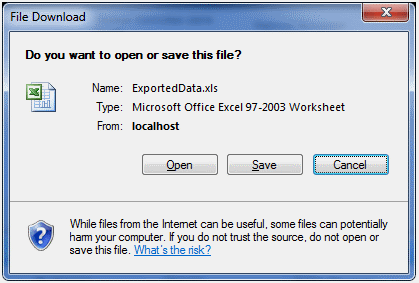

////

|metadata|
{
    "name": "webexcelexporter-exporting-multiple-grids-with-webexcelexporter",
    "controlName": ["WebExcelExporter"],
    "tags": ["Exporting","Grids","Grouping"],
    "guid": "8a983da0-c879-45ac-a427-bc666808fc85",  
    "buildFlags": [],
    "createdOn": "2010-06-06T07:56:24.2216939Z"
}
|metadata|
////

= Exporting Multiple Grids with WebExcelExporter

== What You Will Accomplish

You will learn how to set up and use WebExcelExporter to export data from more than one WebDataGrid / WebHierarchicalDataGrid data into an Excel™ file format.

== Before You Begin

In order to compile and run the samples illustrated here, you will need to install Infragistics ASP.NET v. 10.2. You will also need a running instance of SQL Server (either Express or any other edition), and you will need to have the NorthWind data base attached to your SQL Server instance. You can either install the NorthWind data base following instructions at: link:http://msdn.microsoft.com/en-us/library/aa276825%28SQL.80%29.aspx[http://msdn.microsoft.com/en-us/library/aa276825%28SQL.80%29.aspx] or download the data base directly from: link:http://www.microsoft.com/downloads/details.aspx?familyid=06616212-0356-46a0-8da2-eebc53a68034&displaylang=en[http://www.microsoft.com/downloads/details.aspx?familyid=06616212-0356-46a0-8da2-eebc53a68034&displaylang=en]

== Exporting Multiple Grids into a Single Worksheet

Follow these steps to export two grids into a single file, with each grid in a separate Worksheet.

[start=1]
. Create a web page (ASP.NET Web Form) with two WebDataGrid controls bound to some Data Source.

*In HTML:*

----
<ig:WebDataGrid runat="server" ID="wdgCustomers" 
        DataSourceID="SqlDsCustomers" 
        DataKeyFields="CustomerID" 
        AutoGenerateColumns="
        >
            <Columns>
                <ig:BoundDataField Key="Country" DataFieldName="Country" Header-Text="Country" />
                <ig:BoundDataField Key="City" DataFieldName="City" Header-Text="City" />
                <ig:BoundDataField Key="CompanyName" DataFieldName="CompanyName" Header-Text="Company" />
                <ig:BoundDataField Key="ContactName" DataFieldName="ContactName" Header-Text="Contact" />
                <ig:BoundDataField Key="Phone" DataFieldName="Phone" Header-Text="Phone" />
            </Columns>
        </ig:WebDataGrid>
<ig:WebDataGrid runat="server" ID="wdgEmpoyees" 
            DataSourceID="SqlDsEmployees" 
            DataKeyFields="EmployeeID" 
            AutoGenerateColumns="true"
            >
            </ig:WebDataGrid>
        <asp:SqlDataSource runat="server"ID="SqlDsCustomers"ConnectionString="<%$ ConnectionStrings:NorthwindConnectionString %>" SelectCommand="SELECT * FROM [Customers] ORDER BY [Country]">
        </asp:SqlDataSource>
<asp:SqlDataSource ID="SqlDsEmployees" runat="server" 
            ConnectionString="<%$ ConnectionStrings:NorthwindConnectionString %>" 
            SelectCommand="SELECT [EmployeeID], [TitleOfCourtesy], [LastName], [FirstName], [Title], [Country] FROM [Employees] ORDER BY [Country], [LastName]">
        </asp:SqlDataSource>
----

[start=2]
. Drag a WebExcelExporter control from the Visual Studio Toolbox onto your page:

.. Set the WebExcelExporter’s property ExportMode to Download
.. Set the control’s ID property to WebExcelExporter
.. Set the control’s DownloadName property to “ExportedData”

*In HTML:*

----
<ig:WebExcelExporter runat="server" ID="WebExcelExporter" ExportMode ="Download" DownloadName="ExportedData" />
----

[start=3]
. Drag a Button control from Visual Studio Toolbox onto your page:

.. Set the button’s ID property to btnExport
.. Set the control’s Text property to “Export Data”
.. Set the control’s OnClick to “btnExport_Click”
.. Define the “btnExport_Click” handler in the code-behind and call one of the WebExcelExporter Export() method overloads

[cols="a"]
|====
|In Code Behind (C#):

|protected void btnExport_Click(object sender, EventArgs e) 

{ 

this.WebExcelExporter.Export(this.wdgCustomers, this.wdgEmpoyees); 

}

|====

*In HTML:*

----
<asp:Button runat="server" ID="btnExport" Text="Export Data" OnClick="btnExport_Click" />
----

[start=4]
. Run the application.
[start=5]
. Click the “Export Data” button.

After clicking the “Export Data” button, your browser will ask you whether you want to open or save file named “ExportedData.xls”:

== Exporting Multiple Grids into Separate Worksheets

The only thing you have to change from the previous example in order to export multiple grids into separate worksheets, is to change the WebExcelExporter’s Export() method’s overload you are using. There is a specific overload which accepts a Boolean parameter (exportSingleGridPerSheet) first. So, the event handler that you created in step (3.d) will have to be changed in the following way:

[cols="a"]
|====
|In code-behind (C#):

|protected void btnExport_Click(object sender, EventArgs e) 

{ 

this.WebExcelExporter.Export(true, this.wdgCustomers, this.wdgEmpoyees); 

}

|====

Run your application once again and click the “Export Data” button. The file will now have two Worksheets.

.Note:
[NOTE]
====
The ExportedData.xlsx file will only contain the grid’s visible data.
====