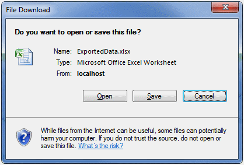

////

|metadata|
{
    "name": "webexcelexporter-saving-all-data-in-the-data-source",
    "controlName": ["WebExcelExporter"],
    "tags": ["Data Binding","Exporting","Grids","Persistence"],
    "guid": "338c111b-d40b-44b7-8572-658f68b77058",  
    "buildFlags": [],
    "createdOn": "2010-06-06T07:51:53.0296939Z"
}
|metadata|
////

= Saving all Data in the Data Source

== What You Will Accomplish

You will learn how to set up and use WebExcelExporter to export WebDataGrid / WebHierarchicalDataGrid data into Excel™ file format using the full data source. This is suitable for scenarios where you have enabled Paging or Virtual Scrolling, but you want to export the whole data in data source, instead of current page only (which is default mode).

== Before You Begin

In order to compile and run the samples illustrated here, you will need to install Infragistics ASP.NET v. 10.2. You will also need a running instance of SQL Server (either Express or any other edition), and you will need to have the NorthWind data base attached to your SQL Server instance. You can either install the NorthWind data base following instructions at: link:http://msdn.microsoft.com/en-us/library/aa276825%28SQL.80%29.aspx[http://msdn.microsoft.com/en-us/library/aa276825%28SQL.80%29.aspx] or download the data base directly from: link:http://www.microsoft.com/downloads/details.aspx?familyid=06616212-0356-46a0-8da2-eebc53a68034&displaylang=en[http://www.microsoft.com/downloads/details.aspx?familyid=06616212-0356-46a0-8da2-eebc53a68034&displaylang=en]

== Exporting Full Data Source Data in Microsoft Office Excel 2003 Format

Follow these steps to export all data from data source into Microsoft Office Excel™ 2003 file format.

[start=1]
. Create a web page (ASP.NET Web Form) with WebDataGrid bound to SqlDataSource control. Enable Paging behavior for that grid.

*In HTML:*

----
<ig:WebDataGrid runat="server" ID="wdgCustomers" 
        DataSourceID="SqlDsCustomers" 
        DataKeyFields="CustomerID" 
        AutoGenerateColumns="
        >
            <Columns>
                <ig:BoundDataField Key="Country" DataFieldName="Country" Header-Text="Country" />
                <ig:BoundDataField Key="City" DataFieldName="City" Header-Text="City" />
                <ig:BoundDataField Key="CompanyName" DataFieldName="CompanyName" Header-Text="Company" />
                <ig:BoundDataField Key="ContactName" DataFieldName="ContactName"Header-Text="Contact" />
                <ig:BoundDataField Key="Phone" DataFieldName="Phone" Header-Text="Phone" />
            </Columns>
            <Behaviors>
                <ig:Paging PageSize="5" QuickPages="3"                  Enabled="true" PagerMode="NumericFirstLast" />
            </Behaviors>
        </ig:WebDataGrid>
----

[start=2]
. Drag a WebExcelExporter control from the Visual Studio Toolbox onto your page:

.. Set the WebExcelExporter’s property ExportMode to Download
.. Set the control’s ID property to WebExcelExporter
.. Set the control’s DownloadName property to ExportedData
.. Set the control’s DataExportMode property to AllDataInDataSource

*In HTML:*

----
<ig:WebExcelExporter runat="server" ID="WebExcelExporter" ExportMode ="Download" DownloadName="ExportedData" DataExportMode="AllDataInDataSource"
 />
----

[start=3]
. Drag a Button control from Visual Studio Toolbox onto your page:

.. Set the button’s ID property to btnExport
.. Set the control’s Text property to Export Data
.. Set the control’s OnClick to btnExport_Click
.. Define the btnExport_Click handler in the code-behind and call one of the WebExcelExporter’s Export() method overloads

[cols="a"]
|====
|In Code Behind (C#):

|protected void btnExport_Click(object sender, EventArgs e) 

{ 

this.WebExcelExporter.Export(this.wdgCustomers); 

}

|====

*In HTML:*

----
<asp:Button runat="server" ID="btnExport" Text="Export Data" OnClick="btnExport_Click" />
----

[start=4]
. Run the application.
[start=5]
. Click the “Export Data” button.

After clicking the “Export Data” button, your browser will ask you whether you want to open or save file named “ExportedData.xls”:

When you open the file, you will see the whole data exported, rather than the currently visible data in the grid (current page).