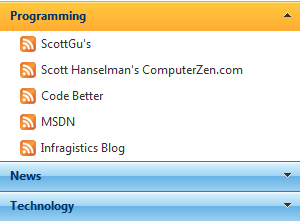

////

|metadata|
{
    "name": "webexplorerbar-about-webexplorerbar",
    "controlName": ["WebExplorerBar"],
    "tags": ["Getting Started","How Do I","Layouts"],
    "guid": "{323A9523-C5EB-4E4D-9695-3D24E9D3E782}",  
    "buildFlags": [],
    "createdOn": "2010-01-03T22:49:02Z"
}
|metadata|
////

= About WebExplorerBar

The WebExplorerBar™ control provides functionality much like that found in the Windows Explorer bar: items are contained in groups and each group may be expanded or collapsed. You can use each item or group to navigate to a URL of your choice, allowing for a simple yet effective navigational layout.

The following lists the various features of WebExplorerBar:

* *Data Binding --* efficient data-binding support to hierarchical data.
* *Load on Demand* -- Only load what is needed by end users.
* *Customizable Modes* -- Support for different expandable modes.

The following screenshot displays the WebExplorerBar control and labels its major parts.

== Related Topics

link:webexplorerbar-smart-tag.html[WebExplorerBar Smart Tag]

link:webexplorerbar-getting-started-with-webexplorerbar.html[Getting Started with WebExplorerBar]

link:webexplorerbar-using-webexplorerbar.html[Using WebExplorerBar]